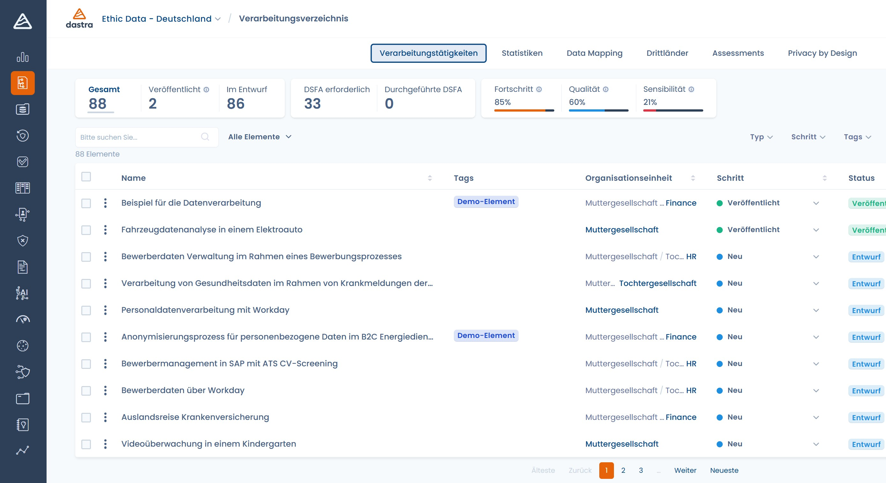

# Einführung in Dastra

## Einführung in Dastra

**Dastra** ist eine umfassende Plattform für Compliance-Management und Governance von Daten und Künstlicher Intelligenz.\
Sie ermöglicht es Datenschutz-, Rechts-, Technik- und Fachteams, **sämtliche Pflichten der DSGVO und der KI-Verordnung** in einer kollaborativen, ergonomischen und geführten Umgebung zu steuern.

***

### 🎯 Unsere Mission

Wir helfen Organisationen dabei:

* Das gesamte Unternehmen für Datenschutz und KI-Governance zu **sensibilisieren**,
* Die **Erfahrung** der DSGVO- und KI-Verordnung-Compliance zu **verbessern**,
* Governance- und Audit-Prozesse zu **automatisieren**,
* Die Compliance in einer einzigen, integrierten Lösung zu **zentralisieren**.

Unser Ziel: **Compliance und Governance von Daten und KI einfach, nützlich und operationell machen.**

***

### 💡 Unser Ansatz

* Eine **intuitive Oberfläche**, angepasst an Datenschutzbeauftragte, Juristen, CISOs, Data Manager und AI Officers.
* Eine **reibungslose Zusammenarbeit** zwischen Fachabteilungen, IT und Governance.
* Eine **einheitliche Sicht** auf die Compliance: Daten, KI, Sicherheit und Risiken.
* Ein **geführter Ansatz**, der auch Nicht-Experten Schritt für Schritt begleitet.
* Eine **offene Plattform** (API, Konnektoren, Webhooks) zur Integration in Ihre bestehenden Tools.

> Bei Dastra sind wir der Überzeugung, dass Compliance nicht nur eine regulatorische Pflicht ist:\
> Sie ist ein Hebel für **Transparenz, Vertrauen und verantwortungsvolle Innovation.**

Weitere Informationen finden Sie in unserer [Mission](https://www.dastra.eu/de/mission).

***

### ⚙️ Mit Dastra können Sie:

#### 🧭 1. **Ihre personenbezogenen Daten kartieren**

Erstellen und pflegen Sie Ihr **Verarbeitungsverzeichnis** mithilfe von:

* einer flexiblen und intuitiven Oberfläche,
* wiederverwendbaren Referenzdaten und Bibliotheken,
* konfigurierbaren Fragebögen und Vorlagen,
* automatischen Exporten (Excel, JSON, PDF).

<figure><figcaption>
Modul Verarbeitungsverzeichnis
</figcaption></figure>

***

#### 🧮 2. **Ihre Risiken bewerten und Audits durchführen**

Identifizieren, bewerten und priorisieren Sie Risiken im Zusammenhang mit Datenverarbeitungen oder KI-Systemen.\
Führen Sie interne, externe oder automatisierte Audits durch und verfolgen Sie die zugehörigen Maßnahmenpläne.

<figure><figcaption>
Modul Risikomanagement und Audits
</figcaption></figure>

***

#### 🧱 3. **Ihre DSGVO-Compliance-Prozesse umsetzen**

Implementieren Sie die regulatorischen Prozesse:

* **Betroffenenanfragen (DSR)**: Vollständige Verwaltung des Lebenszyklus der Anfragen,
* **Datenschutzvorfälle**: Erfassung, Qualifizierung, Meldung an die Aufsichtsbehörde,
* **Cookie-Einwilligung**: Konfigurierbares Banner, Einwilligungsnachweis, TCF-Konformität.

<figure><figcaption>
Modul Betroffenenrechte
</figcaption></figure>

***

#### 🤖 4. **Ihre Systeme der Künstlichen Intelligenz steuern**

Dastra integriert ein **Verzeichnis der KI-Systeme** gemäß der europäischen KI-Verordnung.\
Dieses Verzeichnis ermöglicht es Ihnen:

* **Alle Ihre KI-Systeme zu erfassen**, ob intern entwickelt oder von Dritten integriert (Anbieter, APIs, Open-Source-Modelle).
* **Deren Risikostufe zu qualifizieren** (Systeme mit minimalem, begrenztem, hohem oder verbotenem Risiko).
* **Zwecke, Datenquellen, Risikobewertungen und Kontrollmaßnahmen zu dokumentieren.**
* **Die fortlaufende Compliance** der Modelle durch regelmäßige Audits und Maßnahmenpläne sicherzustellen.
* **KI und Datenverarbeitungen zu verknüpfen**: Einheitliche DSGVO-/KI-Verordnung-Kartierung.

<figure><figcaption>
Modul Verzeichnis der KI-Systeme
</figcaption></figure>

<figure><figcaption></figcaption></figure>


Dastra unterstützt Sie dabei, die Compliance mit der **KI-Verordnung** vorausschauend umzusetzen, indem die geforderte Dokumentation zentralisiert wird (Systemdatenblätter, Protokolle, Risikobewertungen, Nutzungshinweise, Bias-Kontrollen usw.).


***

#### 📋 5. **Maßnahmenpläne erstellen und verfolgen**

Erstellen Sie Compliance-Maßnahmenpläne, weisen Sie Aufgaben zu, setzen Sie Fristen und verfolgen Sie den Fortschritt.\
Visualisieren Sie die Abhängigkeiten zwischen Verarbeitungen, KI-Systemen und Korrekturmaßnahmen.

<figure><figcaption>
Modul Kanban-Board
</figcaption></figure>

***

#### 🧩 6. **Ihre Governance strukturieren**

* Verwalten Sie Ihre **Entitäten**, **Abteilungen** und **Teams**.
* Weisen Sie **Rollen und Berechtigungen** nach Geltungsbereichen zu (Organisation, Mandant, Einheit).
* Verfolgen Sie die Verantwortlichkeit für Verarbeitungen, KI-Systeme und zugehörige Risiken.

***

#### 📁 7. **Ihre Dokumentation zentralisieren**

Speichern und verknüpfen Sie Ihre Compliance-Dokumente (Richtlinien, Verträge, Nachweise, Berichte, Bewertungen).\
Jede Datei kann einer Verarbeitung, einem Risiko, einer Aufgabe oder einem KI-System zugeordnet werden.

***

#### 📊 8. **Compliance analysieren und steuern**

Erstellen Sie indivuduelle Berichte: DSGVO-Fortschritt, KI-Governance, Risiken, Maßnahmenpläne, Audits.\
Dynamische Dashboards, Filter und Exporte (PDF, Excel, CSV).

***

#### ⚙️ 9. **Ihre Prozesse automatisieren und integrieren**

* **Automatisierte Workflows**: Auslöser, Erinnerungen, Nachfassaktionen, Massenaktionen.
* **REST-API & Webhooks** zur Anbindung von Dastra an Ihre internen Tools.
* **Native Konnektoren**: Slack, Microsoft Teams, Zapier usw.
* **Integrierte KI**: Generierung von Datenblättern, Risikovorschläge, automatische Klassifizierung.

***

#### 🔐 10. **Sicherheit und Compliance gewährleisten**

* Starke Authentifizierung (2FA), SSO, SCIM
* Fein abgestufte Rollen- und Zugriffsverwaltung
* Aktivitätsprotokollierung und vollständiger Audit-Trail
* 100 % europäisches Hosting (DSGVO, ISO 27001)
* Datenschutz durch Technikgestaltung und datenschutzfreundliche Voreinstellungen

***

### 🧭 Dastra entdecken

Beginnen Sie jetzt mit der Erkundung von Dastra:

***

### 📚 Weiterführende Informationen
