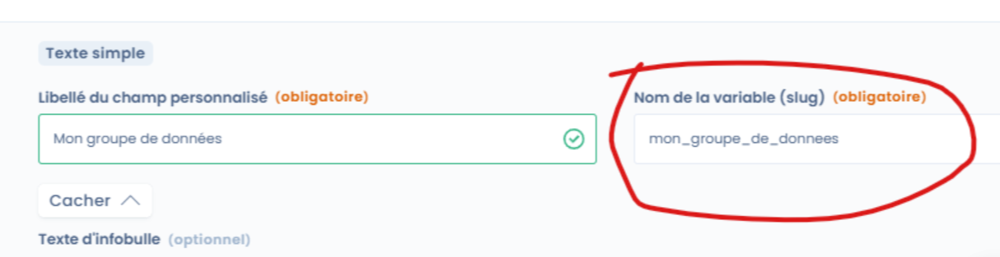

# API-Konfiguration

### APIs in Dastra konfigurieren&#x20;

API steht für _**Application Programming Interface**_ (Programmierschnittstelle).&#x20;

APIs ermöglichen es, die Dastra-Plattform mit anderen externen Tools zu verbinden.&#x20;

Die Möglichkeiten sind vielfältig: Verbindung mit einer CRM-Software zur automatisierten Übernahme von Beteiligten, Synchronisation eines Tools zur Verwaltung von Betroffenenrechten mit dem Dastra-Modul usw.

Dastra basiert auf dem Standard **API-Rest** und insbesondere auf den folgenden HTTP-Anfragen:&#x20;

| URI                                                                      | GET                                                                                                  | POST                                                                                                                                                                                                                                                     | PUT                                                                                                                                                                                                     | PATCH                                                                                                                                                                                                                       | DELETE                                                                                        |
| ------------------------------------------------------------------------ | ---------------------------------------------------------------------------------------------------- | -------------------------------------------------------------------------------------------------------------------------------------------------------------------------------------------------------------------------------------------------------- | ------------------------------------------------------------------------------------------------------------------------------------------------------------------------------------------------------- | --------------------------------------------------------------------------------------------------------------------------------------------------------------------------------------------------------------------------- | --------------------------------------------------------------------------------------------- |
| Sammlungsressource, wie `http://api.beispiel.com/collection/`            | _Ruft_ die URIs der Mitgliedsressourcen der Sammlungsressource im Antwortkörper ab.                  | _Erstellt_ eine Mitgliedsressource in der Sammlungsressource unter Verwendung der Anweisungen des Anfragekörpers. Die URI der erstellten Mitgliedsressource wird _automatisch zugewiesen_ und im _Location_-Header-Feld der Antwort zurückgegeben.        | _Ersetzt_ alle Darstellungen der Mitgliedsressourcen der Sammlungsressource durch die Darstellung im Anfragekörper oder _erstellt_ die Sammlungsressource, wenn sie nicht existiert.                     | _Aktualisiert_ alle Darstellungen der Mitgliedsressourcen der Sammlungsressource unter Verwendung der Anweisungen des Anfragekörpers oder _erstellt gegebenenfalls_ die Sammlungsressource, wenn sie nicht existiert.        | _Löscht_ alle Darstellungen der Mitgliedsressourcen der Sammlungsressource.                   |
| Mitgliedsressource, wie `http://api.beispiel.com/collection/item3`       | _Ruft_ eine Darstellung der Mitgliedsressource im Antwortkörper ab.                                 | _Erstellt_ eine Mitgliedsressource in der Mitgliedsressource unter Verwendung der Anweisungen des Anfragekörpers. Die URI der erstellten Mitgliedsressource wird _automatisch zugewiesen_ und im _Location_-Header-Feld der Antwort zurückgegeben.        | _Ersetzt_ alle Darstellungen der Mitgliedsressource oder _erstellt_ die Mitgliedsressource, wenn sie nicht existiert, durch die Darstellung im Anfragekörper.                                           | _Aktualisiert_ alle Darstellungen der Mitgliedsressource oder _erstellt gegebenenfalls_ die Mitgliedsressource, wenn sie nicht existiert, unter Verwendung der Anweisungen des Anfragekörpers.                              | _Löscht_ alle Darstellungen der Mitgliedsressource.                                          |

&#x20;Quelle: [_Wikipedia_](https://fr.wikipedia.org/wiki/Representational\_state\_transfer)&#x20;

Mit Dastra ist es möglich, mehrere APIs zu konfigurieren. Die Liste der APIs ist hier verfügbar: [https://api.dastra.eu/swagger/index.html](https://api.dastra.eu/swagger/index.html)

### Einschränkungen&#x20;

Ein HTTP-Anfragelimit ist auf 500/Min. oder 10.000/10 Min. festgelegt.

Die Sicherheitsoptionen (insbesondere IP-Filterung) gelten nicht für APIs.&#x20;

### Bereitstellung benutzerdefinierter Felder in der Dastra-API&#x20;

In Dastra ist es möglich, [benutzerdefinierte Felder](../features/generalites/custom-fields.md), die in Ihrem Dastra-Mandanten erstellt wurden, über die API bereitzustellen.&#x20;

Benutzerdefinierte Felder sind für jeden Mandanten spezifisch. Um sie in der Dastra-API zu berücksichtigen, muss zunächst der Variablenname in der Definition des benutzerdefinierten Feldes festgelegt werden:&#x20;

<figure><figcaption></figcaption></figure>


[custom-fields.md](../features/generalites/custom-fields.md)


Die meisten über die API bearbeitbaren Entitäten stellen ein Feld namens "**customFields**" bereit, das Sie ändern können.&#x20;

Wenn Sie die Felder mit den folgenden Variablennamen in Ihrem Mandanten definieren:&#x20;

* mein\_string\_feld: ein "Text"-Feld
* mein\_boolean\_feld: ein "Kontrollkästchen"-Feld
* mein\_numerisches\_feld: ein "Zahl"-Feld
* mein\_checkbox\_feld: ein "Kontrollkästchen"-Feld (Mehrfachauswahl)

Dann können diese Informationen wie folgt geändert werden

```json
{ 
  "label": "Google Analytics 4",
  ...
  "customFields": {
     "mon_champ_string": "Valeur de mon champ",
     "mon_champ_booleen": true,
     "mon_champ_numeric": 1,
     "mon_champ_checkbox"!:["Pomme","Banane"],
     ...a
  }
}
```

### Der Fall der Tags

Um Tags in der Dastra-API bereitzustellen, müssen Sie diese zunächst über den Tags-Endpunkt abrufen: /v1/ws/{workspaceId}/Tags


**HINWEIS**: Verwenden Sie APIs nur, wenn Sie wissen, was Sie tun!


Die API-Verwaltungsoberfläche in Dastra finden Sie unter dieser Adresse: [https://app.dastra.eu/general-settings/api](https://app.dastra.eu/general-settings/api)
