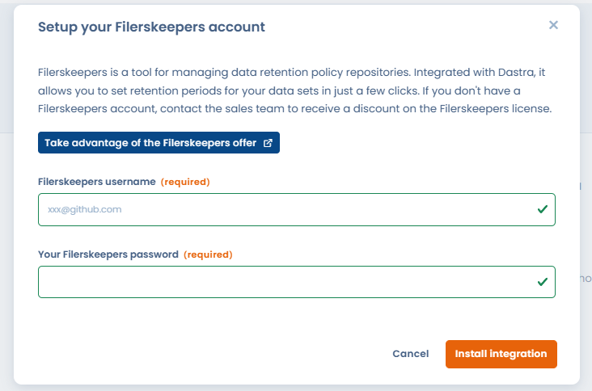
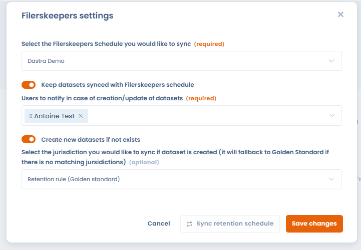
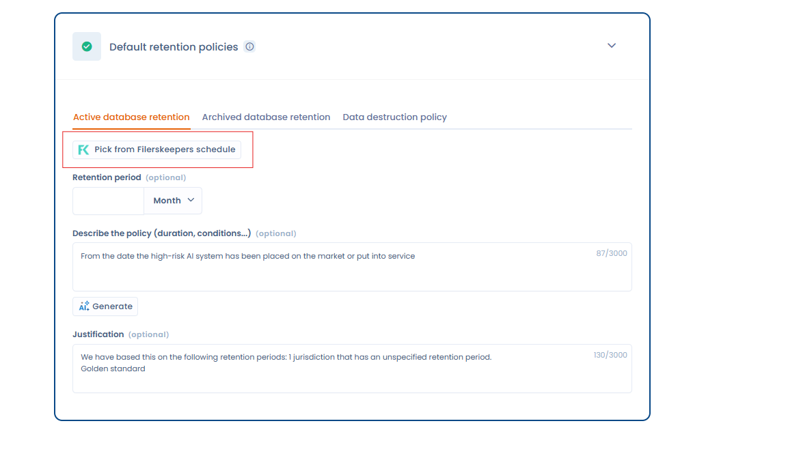
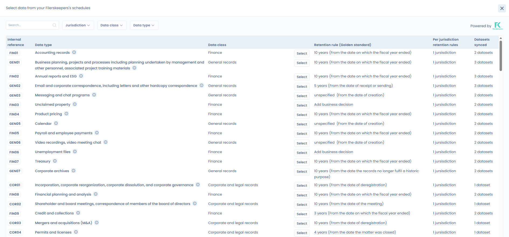
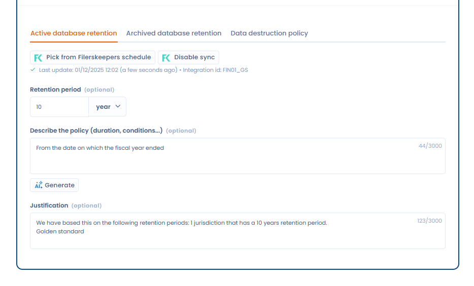

# Filerskeepers

### Was ist Filerskeepers?

[Filerskeepers](https://www.filerskeepers.co/) ist ein Dienst, der einsatzbereite **Datenaufbewahrungspläne** (Retention Schedules) bereitstellt, die die gesetzlichen Pflichten weltweit abdecken.\
Er hilft Unternehmen dabei, **festzustellen, wie lange jede Art von Daten aufbewahrt oder gelöscht werden muss**, um die Vorschriften einzuhalten.

### Voraussetzungen

* Eine kostenpflichtige Dastra-Lizenz besitzen
* Ein Filerskeepers-Konto haben. Wenn Sie noch keines haben und bereits Dastra-Kunde sind, können Sie [mit unserem Vertriebsteam sprechen](https://meetings-eu1.hubspot.com/yann-forveille/rendez-vous-avec-un-expert?message=Filerskeepers+Integration), das Ihnen vorteilhafte Konditionen anbieten kann&#x20;
* Einen Aufbewahrungsfristen-Referenzkatalog (Schedule) in der Filerskeepers-Software eingerichtet haben. Die Integration benötigt diesen Referenzkatalog, um auf die Katalogdaten zugreifen zu können.

### Installation

Der Einrichtungsprozess ist sehr einfach:&#x20;

* **Rufen Sie die Seite der Filerskeepers-Integration im** Dastra-Integrations-Marketplace auf: [https://app.dastra.eu/workspace/0/settings/integrations/filerskeepers](https://app.dastra.eu/workspace/0/settings/integrations/filerskeepers)
* Klicken Sie auf die Schaltfläche **"Installieren"**.
*   **Geben Sie Ihre Anmeldedaten** Ihres Filerskeepers-Administratorkontos ein (E-Mail + Passwort). Diese Anmeldedaten ermöglichen es uns, einen Zugriffstoken für die Filerskeepers-API zu generieren. 

    <figure><figcaption></figcaption></figure>
* Ein Konfigurationsfenster wird angezeigt. Diese Konfiguration ist obligatorisch, um die Installation abzuschließen. Wählen Sie in diesem Formular den "Schedule" aus, den Sie mit Dastra konfigurieren möchten.

<figure><figcaption></figcaption></figure>

### Konfiguration

* Wählen Sie das Filerskeepers-Referenzverzeichnis aus, das Sie mit Dastra synchronisieren möchten
* Entscheiden Sie, ob Sie die Synchronisierung der Aufbewahrungsfristen einrichten möchten. (Die mit Filerskeepers synchronisierten Datensätze werden jede Nacht um 00:00 UTC aktualisiert)
* Wählen Sie die Personen aus, die bei Änderung/Erstellung von Aufbewahrungsfristen in den Datensätzen benachrichtigt werden sollen. Die Person erhält eine Benachrichtigungs-E-Mail mit Informationen über die aktualisierten Datensätze.
* Das Aktivieren von "Create new datasets if not exists" hat zur Folge, dass für jeden in Ihrem Filerskeepers-Konto deklarierten Datentyp ein Datensatz erstellt wird.&#x20;


Achtung: Wenn Sie dieses Kontrollkästchen aktivieren, wird eine große Anzahl von Datensätzen automatisch in Ihrem Mandanten erstellt.


### Auswahl der Aufbewahrungsrichtlinie

Der Filerskeepers-Konnektor hat mehrere Betriebsmodi:&#x20;

* Anzeige der Aufbewahrungsfristen-Auswahl aus Ihrem Aufbewahrungsfristen-Referenzverzeichnis. In der Software als "Schedule" bezeichnet&#x20;

Wenn Sie nun einen Datensatz aufrufen, wird im Abschnitt "Aufbewahrungsrichtlinien" eine Schaltfläche zur Auswahl der Aufbewahrungsrichtlinie angezeigt

<figure><figcaption></figcaption></figure>

Durch Klicken auf diese Schaltfläche können Sie direkt einen Datensatz aus Ihrem Filerskeepers-Referenzverzeichnis auswählen. **Diese Aufbewahrungsfrist wird automatisch** mit Dastra synchronisiert, wenn Sie diese Option in der Konnektor-Konfiguration aktiviert haben.

<figure><figcaption></figcaption></figure>

Wählen Sie einen Datensatz aus, indem Sie auf die Schaltfläche "Select" klicken

Sobald Sie die Aufbewahrungsfrist ausgewählt haben, schließt sich das Fenster und folgende Informationen werden angezeigt:  

<figure><figcaption></figcaption></figure>


Nur Aufbewahrungsfristen in der aktiven Basis werden synchronisiert


### Wie werden die Daten zwischen Dastra und Filerskeepers synchronisiert?

Eine Reihe von Feldern aus Filerskeepers werden automatisch auf Ihre Aufbewahrungsfrist gemappt:&#x20;

* **Die Aufbewahrungsdauer** (from)
* **Die Beschreibung der Aufbewahrungsregel**
* **Die Rechtsgrundlage, der Link und die betroffene Rechtsordnung** werden im Feld Begründung zusammengefasst
