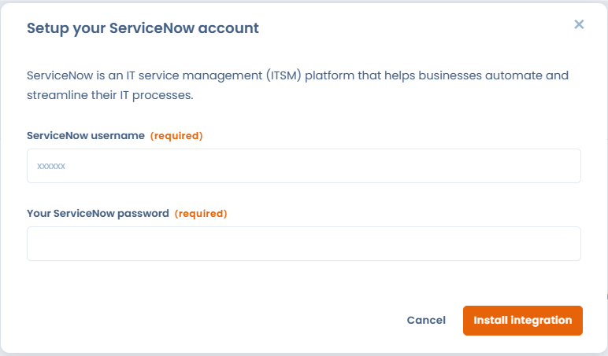
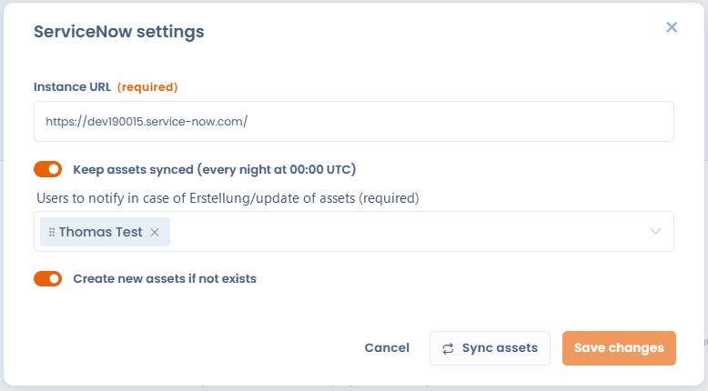

# ServiceNow

### Was ist ServiceNow?

Die [ServiceNow](https://www.servicenow.com/)-Integration ermöglicht die **automatische Synchronisierung von Geschäftsanwendungen** aus der ServiceNow-CMDB direkt in Dastra.

Sie ermöglicht:

* die Vermeidung von Doppelerfassungen;
* die Zentralisierung der in der gesamten Organisation verwendeten technischen Assets;
* die Nutzung dieser Assets in Ihren **Verarbeitungsverzeichnissen**, **Datensätzen**, **Datenschutz-Folgenabschätzungen**, **Risikoanalysen**, **Audits** usw.
* die Sicherstellung, dass die Informationen aus ServiceNow in Dastra **aktuell** bleiben.

### Voraussetzungen

* **Eine kostenpflichtige Dastra-Lizenz besitzen**, die den Zugang zum Integrations-/Konnektoren-Modul umfasst.
* **Ein ServiceNow-Konto haben** mit:
  * Einer zugänglichen Instanz (z. B. `https://ihre-instanz.service-now.com`)
  * Einem **API-Nutzer** mit Leserechten auf `cmdb_ci_business_app`.
* Sicherstellen, dass Ihre ServiceNow-Instanz **REST-API-Aufrufe** von extern erlaubt.

### Installation

Der Einrichtungsprozess ist sehr einfach:

1. Rufen Sie die Seite der **ServiceNow**-Integration im Dastra-Integrations-Marketplace auf.\
   Beispiel:\
   `https://app.dastra.eu/workspace/0/settings/integrations/servicenow`
2. Klicken Sie auf die Schaltfläche **"Installieren"**.
3.  Geben Sie die **Verbindungsinformationen** Ihres ServiceNow-Kontos ein:

    * Benutzername
    * Passwort

    Diese Informationen ermöglichen es Dastra, einen gesicherten Zugriffstoken für die Kommunikation mit Ihrer ServiceNow-Instanz zu generieren.
4.

    <figure><figcaption></figcaption></figure>

4. Nach der Validierung wird ein Konfigurationsfenster angezeigt. Dieser Schritt ist **obligatorisch**, um die Installation abzuschließen.

<figure><figcaption></figcaption></figure>

### Konfiguration

* Geben Sie die **URL Ihrer ServiceNow-Instanz** ein
* Entscheiden Sie, ob Sie die Synchronisierung der Assets einrichten möchten. (Die mit ServiceNow synchronisierten Assets werden jede Nacht um 00:00 UTC aktualisiert)
* Wählen Sie die Personen aus, die bei Änderung/Erstellung von Assets benachrichtigt werden sollen. Die Person erhält eine Benachrichtigungs-E-Mail mit Informationen über die aktualisierten Assets.
* Das Aktivieren von "Create new assets if not exists" hat zur Folge, dass ein Asset erstellt wird, wenn es in Dastra nicht vorhanden ist, basierend auf der externen Referenz.&#x20;


Achtung: Wenn Sie dieses Kontrollkästchen aktivieren, wird eine große Anzahl von Assets automatisch in Ihrem Mandanten erstellt. Stellen Sie sicher, dass die externen Referenzen korrekt angegeben sind.


### Wie werden die Daten zwischen Dastra und ServiceNow synchronisiert?

Bei jeder Synchronisierung werden mehrere Felder aus ServiceNow automatisch in Ihr Dastra-Asset-Referenzverzeichnis gemappt. Folgende Informationen werden abgerufen und aktualisiert:

* **Bezeichnung** des Assets
* **Beschreibung** (Short Description aus ServiceNow)
* **Anwendungstyp**
* **Installations-Status/Zustand**
* **Asset-Typ** (wird systematisch als _Software_ importiert)
* **Zone/Bereich** (AreaId)
* **Zugehörige Tags**
* **Externe ServiceNow-Kennung** (`sys_id`)
* **Externe Quelle** (`ServiceNow`)
* **Datum der letzten Synchronisierung**
* **Eigentümer** des Assets

Alle diese Daten ermöglichen eine zuverlässige und aktuelle Verbindung zwischen Ihrer ServiceNow-CMDB und Ihrem Dastra-Referenzverzeichnis.

#### Verwaltung gelöschter Assets auf ServiceNow-Seite

Wenn Dastra feststellt, dass ein zuvor synchronisiertes Asset **in ServiceNow nicht mehr existiert**, wird es in Dastra **nicht automatisch gelöscht**.\
Stattdessen fügt Dastra dem Asset **einen automatischen Tag** hinzu, der anzeigt, dass es in _ServiceNow gelöscht_ wurde.

Dieses Verhalten ermöglicht:

* die Beibehaltung der Historie in Dastra,
* die Vermeidung unbeabsichtigter Löschungen,
* die erleichterte manuelle Überprüfung veralteter Assets.
