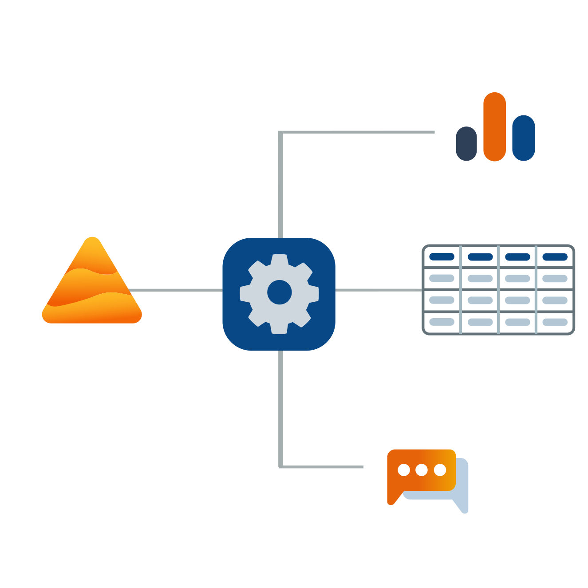

# Zapier

Richten Sie Konnektoren zwischen Dastra und Ihren anderen Lieblingsanwendungen ein, um Ihre Arbeitsabläufe zu automatisieren und Zeit zu sparen.


[Zur Dastra-Seite im Zapier-Katalog](https://zapier.com/apps/dastra/integrations)


### Vorstellung von Zapier

Zapier ist ein Online-Automatisierungstool, das Ihre Anwendungen und Dienste miteinander verbindet. Sie können zwei oder mehr Anwendungen verbinden, um wiederkehrende Aufgaben zu automatisieren, ohne programmieren zu müssen oder Entwickler für die Integration beauftragen zu müssen.

Mit Zapier richten Sie Zaps (oder Integrationen) ein.

Ein Zap ist ein automatisierter Workflow, der Ihre Anwendungen und Dienste miteinander verbindet. Jeder Zap besteht aus einem Trigger und einer oder mehreren Aktionen. Wenn Sie Ihren Zap aktivieren, führt er die Aktionsschritte jedes Mal aus, wenn das Trigger-Ereignis eintritt.

### Die drei wichtigsten Konzepte: 

* **Trigger:**\
  Ein Ereignis, das einen Zap startet. Wenn Sie beispielsweise jedes Mal eine SMS senden möchten, wenn Sie eine E-Mail erhalten, ist der Trigger "neue E-Mail im Posteingang".
* **Aktion:**\
  Ein Ereignis, das ein Zap nach dem Auslösen ausführt. Wenn Sie beispielsweise jedes Mal eine SMS senden möchten, wenn Sie eine E-Mail erhalten, ist die Aktion "Textnachricht senden".
* **Zap:**\
  Ein Trigger und eine Reihe von Aktionen, die zusammen einen automatisierten Workflow darstellen. Zum Beispiel: jedes Mal eine SMS senden, wenn Sie eine E-Mail erhalten.

### Vorlagen für eine blitzschnelle Konfiguration

Wir haben automatisierte Workflow-Vorlagen vorkonfiguriert, die Sie mit wenigen Klicks einrichten können. Etwa zehn Vorlagen sind bereits verfügbar und zugänglich über unsere [Integrationsseite](https://www.dastra.eu/de/integrations) oder direkt im [Integrationsbereich](https://app.dastra.eu/workspace/0/settings/integrations) der Dastra-Webanwendung.

Wir werden regelmäßig neue Vorlagen veröffentlichen, um Ihren Automatisierungsbedarf zu decken und Ihnen wertvolle Zeit zu sparen. Zögern Sie nicht, uns auch Ihre Ideen für automatisierte Workflows zu übermitteln, damit wir diese als Vorlagen anbieten können.

### Ein vollständig anpassbarer Integrationseditor 

Wenn Sie einen Workflow automatisieren möchten, für den wir noch keine Vorlage anbieten (oder eine bestehende Vorlage leicht an Ihren Anwendungsfall anpassen möchten), können Sie den [Zapier Zap-Editor](https://zapier.com/apps/dastra/integrations) verwenden.

Der Zap-Editor ermöglicht es Ihnen, einen Zap von Grund auf zu erstellen, ohne eine einzige Zeile Code schreiben zu müssen.

Wählen Sie die Anwendung aus, die Sie mit Dastra im [Zapier-Katalog](https://zapier.com/apps) verbinden möchten, konfigurieren Sie einen Trigger und wählen Sie die auszuführende Aktion. Sie können Aktionen in einer Drittanwendung aufgrund eines Ereignisses in Dastra auslösen oder eine Aktion in Dastra aufgrund eines Ereignisses in einer Drittanwendung auslösen. Mit mehr als 4000 Zapier-kompatiblen Anwendungen sind die Automatisierungsmöglichkeiten grenzenlos.

### Welche Dastra-Funktionen sind derzeit über Zapier automatisierbar? 

Wie Sie verstanden haben, besteht eine Integration aus einem Trigger-Element und einer oder mehreren Aktionen. Bisher haben wir 2 Trigger und 6 Aktionen auf der Dastra-Seite eingerichtet (Es ist wichtig zu verstehen, dass Sie hinsichtlich der Trigger und Aktionen auf das beschränkt sind, was die Herausgeber der Zapier-kompatiblen Anwendungen Ihnen zur Verfügung stellen). Wir werden diese Liste in Zukunft erweitern, um Ihnen die Automatisierung möglichst vieler Dastra-Funktionen zu ermöglichen.

* **Bestehende Trigger:**

1. Neuer Betroffenenrechte-Antrag erstellt
2. Neue Aufgabe erstellt

* **Bestehende Aktionen:**

1. Eine Aufgabe erstellen
2. Einen Akteur erstellen
3. Einen Betroffenenrechte-Antrag erstellen
4. Einen Akteur an eine bestehende Verarbeitung anhängen
5. Einen Akteur suchen
6. Einen Akteur finden oder erstellen, wenn nicht vorhanden

Sie können von einem der beiden Dastra-Trigger ausgehen, um Aufgaben in Drittanwendungen auszuführen, oder von einem Trigger einer Drittanwendung ausgehen, um eine der sechs möglichen Aktionen in Dastra auszuführen.


[Den gesamten Zapier-Anwendungskatalog hier einsehen.](https://zapier.com/apps)



Die [Zapier-Dokumentation](https://zapier.com/help) für weitere Informationen zur Einrichtung eines Konnektors einsehen


Sie sind jetzt bereit, in die Welt der Automatisierung einzutauchen und Ihren ersten Konnektor einzurichten.

Folgen Sie unserer Schritt-für-Schritt-Anleitung zur Automatisierung Ihrer Betroffenenanfragen:


