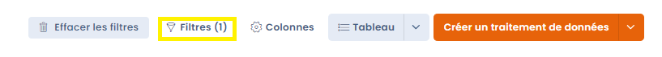
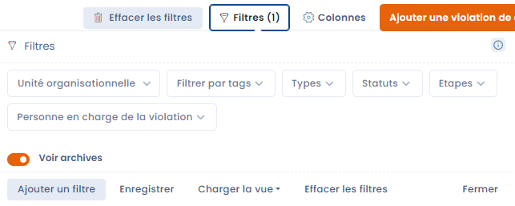

# Häufig gestellte Fragen

## Wie zeige ich die Modulnamen unter den Symbolen in Dastra an?

Sie möchten die Modulnamen unter jedem Symbol links auf dem Bildschirm anzeigen? Dies hängt von der Zoomstufe des Browsers ab.&#x20;

Verringern Sie die Zoomstufe und die Namen werden erscheinen!

## Wie ändere ich das Logo der Organisation in Dastra?

Es ist nicht möglich, das Logo der Organisation zu ändern, da es keines gibt. Das Logo, das über dem Organisationsnamen oben rechts angezeigt wird, ist das mit dem Benutzerkonto verknüpfte Bild, das in den Profileinstellungen konfiguriert wird.

Mit diesem Bild ist auch das Logo des Mandanten änderbar.

## Wie ändere ich das Logo des Mandanten in Dastra?

Sie können es ändern, indem Sie in den Einstellungen des Mandanten zur Rubrik Design und Marke navigieren. Sie können dort auch bestimmte Elemente des Exports im Word- und PDF-Format anpassen (Schriftart und Farben).

## Wie importiere ich die Daten meines Verarbeitungsverzeichnisses im CNIL-Format?&#x20;

Sie haben ein bestehendes Verarbeitungsverzeichnis im CNIL-Format? Sie können es selbstverständlich in Dastra importieren. Dazu sind mehrere Schritte erforderlich:&#x20;

1: Verarbeitungsnamen importieren&#x20;

2: Datensätze importieren

3: Akteure importieren

4: Sicherheitsmaßnahmen importieren&#x20;

5: Verknüpfungen zwischen den Objekten in den Verarbeitungen erstellen

Wenn Sie Unterstützung beim Import Ihres bestehenden Verzeichnisses wünschen, zögern Sie nicht, uns zu kontaktieren. Das ist eine gute Gelegenheit, es zu überprüfen!

## Wie lösche ich eine Verarbeitung?&#x20;

Um böse Überraschungen zu vermeiden, haben wir eine Sicherheitsvorkehrung eingerichtet. Die Löschung erfolgt in zwei Schritten.&#x20;

## Ich finde bestimmte Elemente nicht. Was kann ich tun?&#x20;

Wenn Sie ein Element nicht finden, auf das Sie Zugriff haben sollten, ist es möglicherweise aus folgenden Gründen nicht sichtbar:&#x20;

1.  Ein Filter ist aktiv und schränkt die Anzeige ein, wie unten mit der "(1)" dargestellt. Klicken Sie auf Filter löschen \
     

    <figure><figcaption></figcaption></figure>
2. Das Objekt ist mit einer Organisationseinheit verknüpft, auf die Sie keinen Zugriff haben oder für die Sie nicht die erforderlichen Rechte besitzen. Kontaktieren Sie den Verwalter Ihres Mandanten.
3.  Das Objekt ist archiviert und wird daher standardmäßig nicht in der Liste angezeigt. Sie können über das Filtermenü wählen, ob archivierte Elemente angezeigt werden sollen. 

    <figure><figcaption></figcaption></figure>

4. Schließlich sind möglicherweise fehlerhafte Einstellungen in Ihrem Browser gespeichert. Zur Überprüfung können Sie den privaten Modus verwenden. Wenn der private Modus das Problem löst, folgen Sie der unten beschriebenen Prozedur zum Löschen des lokalen Speichers Ihres Browsers.

## Wie lösche ich den LocalStorage?

Sie haben ein Problem mit der Anwendung? Manchmal werden Sie aufgefordert, den LocalStorage zu löschen. Dabei handelt es sich um Speicherelemente des Webbrowsers, die für die Nutzung der Anwendung erforderlich sind und sich gewählte Einstellungen merken (z. B. Filter).&#x20;

Hier die Vorgehensweise:&#x20;

### Google Chrome

1. "Hamburger"-Menü / Weitere Tools / Entwicklertools (F12)
2. Menü Application / Storage / Local Storage
3. Rechtsklick: "Clear"
4. Seite aktualisieren (F5)

### Mozilla Firefox

1. "Hamburger"-Menü / Web-Entwickler / Entwicklertools (F12)
2. Menü Speicher / Lokaler Speicher
3. Rechtsklick: "Alles löschen"
4. Seite aktualisieren (F5)
