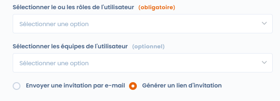
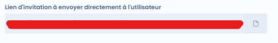

# Bekannte Probleme

## Der eingeladene Nutzer erhält keine Einladungs-E-Mails

**Überprüfen Sie, ob die E-Mail-Adresse des Nutzers (Domain, Name...)** korrekt ist. Wenn diese falsch ist, wird die Oberfläche keinen Fehler anzeigen

Überprüfen Sie, ob das Postfach der Person nicht voll ist

In sehr seltenen Fällen kann Dastra vom Spam-Filter des Servers blockiert werden. In diesem Fall können Sie einen Einladungslink generieren, indem Sie eine neue Einladung erstellen und auf **"Nutzer einladen"** > **Schritte befolgen > "Link generieren" auswählen** klicken.&#x20;

<figure><figcaption></figcaption></figure>

**Klicken Sie auf "Link generieren" > Kopieren Sie den auf der Seite angezeigten Link**

<figure><figcaption></figcaption></figure>

So können Sie den Einladungslink über einen Unternehmens-Chat, einen Versand aus Ihrem E-Mail-Postfach usw. an den Nutzer übermitteln.


Achtung: Eine Validierung der E-Mail-Adresse ist erforderlich, damit der Nutzer auf Ihren Bereich zugreifen kann


## Probleme im Zusammenhang mit dem Browser-Cache beheben

Wenn Sie einen Browser verwenden, nutzt dieser den Cache und Cookies, um Informationen von Websites zu speichern. Das Löschen dieser Daten behebt bestimmte Probleme, wie z. B. Probleme beim Laden von Anwendungen wie Dastra. 

Um diese Probleme zu beheben, stellen wir Ihnen mehrere Lösungen zur Verfügung: &#x20;

1. **Browser-Aktualisierung durchführen**, mit STRG + F5 (oder MAC + F5)&#x20;
2. Wenn die erste Lösung nicht funktioniert, eine **Zurücksetzung der Präferenzdaten** durchführen. Diese Aktion ermöglicht es Ihnen, die von Dastra gesetzten Cookies einfach zu löschen, die in Ihrem lokalen Speicher gespeicherten Elemente zu löschen und Ihre Anzeigeeinstellungen in Dastra zurückzusetzen, und kann so helfen, bestimmte Anzeige- und Fehlerprobleme zu beheben.

Um diese Funktion aufzurufen, navigieren Sie zum Reiter "Profil" in Ihren persönlichen Einstellungen:&#x20;


Wenn Sie diese Option wählen, verlieren Sie Ihre Spalteneinstellungen in allen Tabellen von Dastra und die Anzeige der Tutorials in allen Modulen wird erneut ausgelöst.&#x20;


Diese beiden Maßnahmen haben Ihr Problem nicht gelöst? Kontaktieren Sie den Support direkt über die Anwendung, per Chat oder über den "Megafon"-Tab.

## Fehler 401 bei der Anmeldung

**Szenario**: Sie melden sich bei Dastra über die URL https://app.dastra.eu an, geben Ihre Anmeldedaten ein und gelangen auf eine Fehlerseite "**Zugriff verweigert (401)**".

Vorschau der Seite:\

**Lösungen**:&#x20;

1. **Überprüfen Sie die Uhreinstellungen Ihres Computers**. Es wird dringend empfohlen, die Zeitsynchronisierung mit dem Internet zu aktivieren. Die Ablauffristen Ihrer Identifikationstoken werden nämlich mit der Zeit Ihres Computers verglichen. Wenn das Datum nicht korrekt mit der Serverzeit synchronisiert ist, werden Sie auf diesen Fehler stoßen. Zur Konfiguration Ihrer Uhr besuchen Sie folgende Links:&#x20;
   * [Mac](https://support.apple.com/fr-fr/guide/mac-help/mchlp2996/mac)
   * [PC](https://support.microsoft.com/fr-fr/windows/comment-d%C3%A9finir-l-heure-et-le-fuseau-horaire-dfaa7122-479f-5b98-2a7b-fa0b6e01b261)
2. **Verwenden Sie diese Adresse für den Zugriff auf Dastra: https://app.dastra.eu**. Sie können sie als Lesezeichen speichern. Dieses Problem kann auftreten, wenn Sie versuchen, über URLs mit der Domain account.dastra.eu auf Dastra zuzugreifen (die häufig automatisch in den URL-Vorschlägen Ihres Browsers gespeichert werden)
3. **Löschen Sie die Website-Daten und Cookies Ihres Browsers**

## Fehler 403: Zugriff verweigert

Die Fehlermeldung "Fehler 403 Zugriff verweigert" weist darauf hin, dass Sie versuchen, auf einen Teil des Dastra-Systems zuzugreifen, ohne die erforderliche Berechtigung zu haben. Dies geschieht, wenn der Zugriff auf bestimmte Elemente oder Module von einem Administrator in Ihrem Mandanten eingeschränkt wurde, basierend auf den Berechtigungen Ihrer Rolle oder Ihres Teams.

**Lösungsansätze**

* **Berechtigungen überprüfen**: Stellen Sie sicher, dass Sie die erforderlichen Berechtigungen für das gewünschte Modul oder Element besitzen.
* **Kontaktieren Sie einen der Administratoren Ihres Mandanten**: Im Zweifelsfall kontaktieren Sie einen der Administratoren Ihres Mandanten, um Ihre Zugriffsrechte zu überprüfen oder zu aktualisieren.

## Fehler 404: Element nicht gefunden

Die Fehlermeldung "Fehler 404 Element nicht gefunden" weist darauf hin, dass Sie versuchen, auf ein in Dastra nicht auffindbares Element zuzugreifen. Dies kann auftreten, wenn das betreffende Element geändert, verschoben oder gelöscht wurde (von einem anderen Nutzer oder von Ihnen selbst).

**Lösungsansätze**

* **URL überprüfen**
* **Element über die Suchfunktion suchen**

## Fehler 500

Dieser Fehler kann gelegentlich auftreten und wird häufig verursacht durch:\
-Verbindungsprobleme\
-Probleme mit Ihrer Umgebung (Browser, Erweiterungen usw.)\
-Die Tatsache, dass mehrere Personen gleichzeitig am selben Element arbeiten\
-Die Ausführung einer Aktion, die viele Serverressourcen erfordert.

In den meisten Fällen handelt es sich um einen vorübergehenden Vorfall, und wir empfehlen, einige Minuten zu warten, bevor Sie es erneut versuchen.\
\
Wenn das Problem erneut auftritt, zögern Sie nicht, über das Megafon in Dastra einen Fehlerbericht zu melden, damit unsere Teams das Problem untersuchen können. 

##
