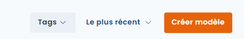
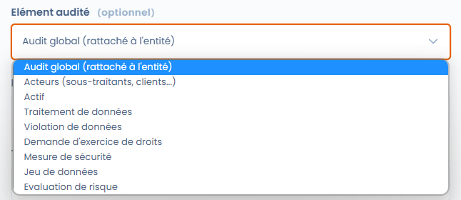
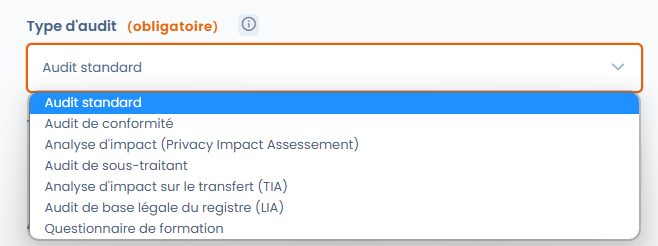

# Eine Fragebogenvorlage erstellen oder bearbeiten

## Einführung

Das Erstellen oder Bearbeiten einer Fragebogenvorlage in Dastra ist kinderleicht. Navigieren Sie dazu zur Funktion "Fragebögen".

## Eine Fragebogenvorlage erstellen oder bearbeiten

Um eine Fragebogenvorlage zu erstellen, klicken Sie auf die Schaltfläche "Vorlage erstellen" in der Registerkarte "Fragebögen". Anschließend können Sie einen der in Dastra verfügbaren Vorlagentypen auswählen: automatisierter Fragebogen, benutzerdefinierter Fragebogen oder aus einer Datei importiert.

<figure><figcaption></figcaption></figure>

Sie gelangen zur Auswahlansicht der Vorlagentypen:

* Durch Klicken auf die Registerkarte "**Automatisierter Fragebogen**" wählen Sie eine vordefinierte Fragebogenvorlage aus der Dastra-Bibliothek aus.
* Durch Klicken auf "**Benutzerdefinierter Fragebogen**" können Sie Ihre eigene Fragebogenvorlage erstellen.


Im Gegensatz zu automatisierten Fragebögen sind benutzerdefinierte Fragebögen vollständig anpassbar. Abhängig von den Antworten der Befragten können Sie automatisch einen Maßnahmenplan generieren oder die mit der Vorlage verbundenen Risiken kartieren.


## Automatisierte Fragebogenvorlagen

Dastra bietet zahlreiche automatisierte Fragebogenvorlagen zur Dokumentation der Compliance und zur Steuerung von Prozessen. Diese Vorlagen umfassen unter anderem DSFA/PIA, TIA, LIA, Fragebögen für Auftragsverarbeiter und vieles mehr.

Sobald die Vorlage ausgewählt ist, gelangen Sie zum Planungsbildschirm, auf dem Sie:

* entweder **die Vorlage bearbeiten** können, indem Sie auf die Schaltfläche "Vorlage bearbeiten" klicken
* oder einen Fragebogen planen können, indem Sie auf die Schaltfläche "Fragebogen planen" klicken


Bestimmte Fragebogentypen (DSFA, TIA, LIA) können auch direkt von einer Verarbeitung aus gestartet werden — beispielsweise über die Registerkarten "Folgenabschätzung", "Empfänger" oder "Zwecke". Weitere Details finden Sie auf den entsprechenden Seiten unten.


## Benutzerdefinierte Fragebogenvorlagen

In Dastra ist es möglich, Ihre eigene benutzerdefinierte Fragebogenvorlage zu erstellen. Klicken Sie dazu auf die Option "Benutzerdefinierter Fragebogen". Sie gelangen dann zur Bearbeitungsoberfläche für Fragebogenvorlagen.

Erstellen Sie die gewünschte Fragebogenvorlage und klicken Sie auf "Speichern und fortfahren".

### Bewertete Elemente

Sie können Fragebögen mit Elementen in Dastra verknüpfen. Durch die Auswahl des Typs des bewerteten Elements erzwingen Sie, dass alle auf dieser Vorlage basierenden Antworten mit einem Objekt des gewählten Typs verknüpft werden. Beispielsweise können Sie festlegen, dass diese Fragebogenvorlage immer mit einer Verarbeitung verknüpft wird.

<figure><figcaption></figcaption></figure>

Sie können auch entscheiden, einen Fragebogen nicht mit einem bestimmten Objekt zu verknüpfen. In diesem Fall wird die Antwort immer mit einer Organisationseinheit verknüpft. Dies kann beispielsweise bei globalen Compliance-Fragebögen der Fall sein.

### Vorlagentypen

Bei der Erstellung einer benutzerdefinierten Vorlage müssen Sie einen Vorlagentyp auswählen.

<figure><figcaption></figcaption></figure>

Diese Typen ermöglichen eine gewisse Anpassung der Fragebogenvorlagen.

* **Standardfragebogen**: Dies ist ein klassischer Fragebogen
* **Compliance-Fragebogen**: Derzeit handelt es sich um einen klassischen Fragebogen
* **Folgenabschätzung**: Diese Vorlage ermöglicht die Anzeige einer Risikomatrix (mit der erforderlichen Konfiguration) und kann beim DSFA-Schritt einer Verarbeitung aufgerufen werden
* **Fragebogen für Auftragsverarbeiter**: Diese Vorlage wird beim Schritt "Empfänger Auftragsverarbeiter" einer Verarbeitung aufgerufen
* **Transferfolgenabschätzung (TIA)**: Fragebogen zur Analyse der Risiken im Zusammenhang mit einer Datenübermittlung außerhalb der EU
* **Analyse der Rechtsgrundlage (LIA)**: Fragebogen zur Rechtsgrundlage der berechtigten Interessen, um sicherzustellen, dass die Interessen die Rechte und Freiheiten der Personen nicht überwiegen
* **Schulungsfragebogen**: Fragebogen zur Durchführung von Schulungsquizzen. Dieser Fragebogentyp ermöglicht es, eine richtige Antwort unter den Antworten auszuwählen und die richtigen Antworten am Ende des Fragebogens anzuzeigen.

## Eine eigene Fragebogenvorlage laden

Schließlich ist es möglich, eine Ihrer Fragebogenvorlagen im JSON-Format zu importieren. Wählen Sie dazu bei der Erstellung des Fragebogens die Option "Vorlage laden".

## Analyseblöcke

## Weiterführende Informationen


[planifier-un-audit.md](../planifier-un-audit.md)



[rapport-daudit.md](../rapport-daudit.md)



[pia-aipd.md](../pia-aipd.md)



[tia.md](../tia.md)



[lia.md](../lia.md)

