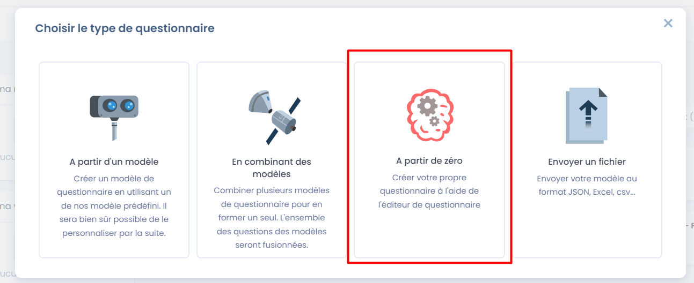
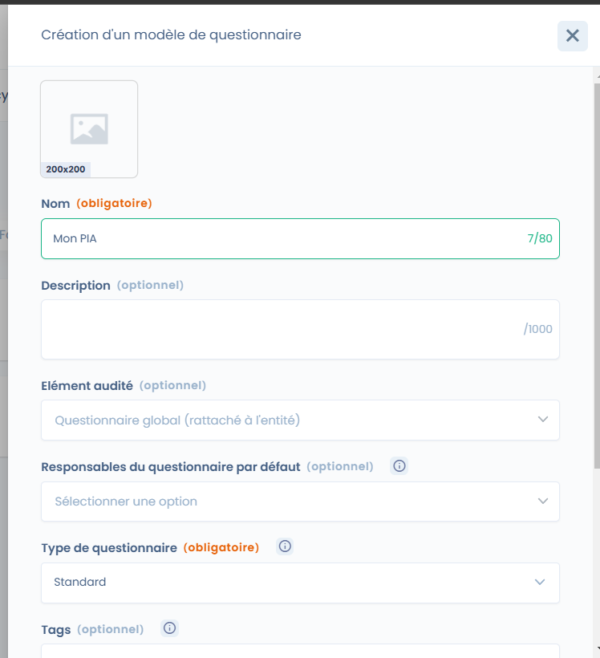
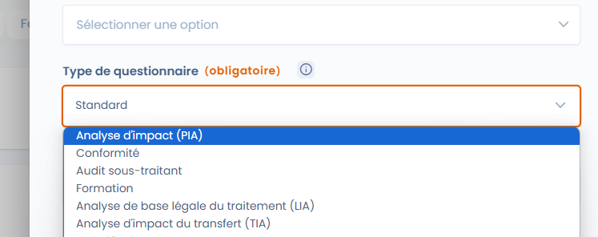
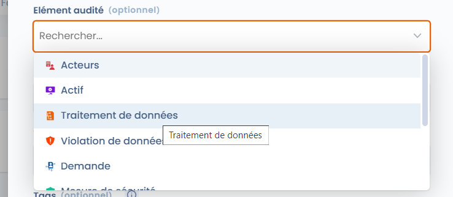

# Eine PIA-Vorlage erstellen oder bearbeiten

Dastra verfügt über mehrere Vorlagen für Datenschutz-Folgenabschätzungen (DSFA oder PIA). Sie können jedoch auch ganz einfach Ihre eigene Vorlage erstellen.


Fangen Sie nicht bei Null an! Verwenden Sie eine bestehende Vorlage zur Anpassung. Das gibt Ihnen einen Ausgangspunkt.&#x20;


Schritt 1: Vorlage erstellen

Gehen Sie zum Modul Fragebogen und klicken Sie auf "Von Grund auf neu"

<figure><figcaption></figcaption></figure>

Schritt 2: Vorlage konfigurieren

<figure><figcaption></figcaption></figure>

Sie müssen die folgenden Optionen auswählen, um die PIA-Funktionen voll nutzen zu können:&#x20;

* Fragebogentyp auswählen: Es ist erforderlich, "Folgenabschätzung (PIA)" anzugeben

<figure><figcaption></figcaption></figure>


Der PIA-Fragebogentyp ermöglicht die Anzeige der PIA-spezifischen Elemente, insbesondere der Heatmap im Fragebogen-Dashboard, sowie die Integration der Verarbeitungsdaten bei der Erstellung der PIA. Er ermöglicht außerdem den Import von PIAs im JSON-Format aus dem PIA-Tool der CNIL.&#x20;


* Im Bereich Bewertetes Element können Sie "Datenverarbeitung" zuordnen: Dies ermöglicht es, Ihren PIA-Fragebogen mit einer Verarbeitung zu verknüpfen und die PIA von der Verarbeitung aus wiederzufinden. Darüber hinaus können Sie so das Datum der letzten PIA bei deren Validierung aktualisieren.

<figure><figcaption></figcaption></figure>
