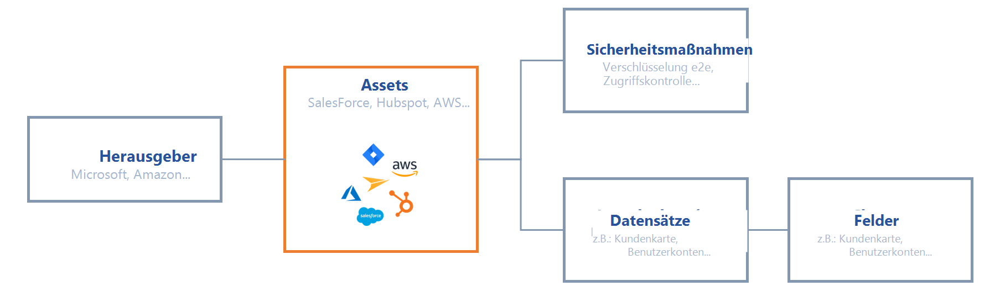
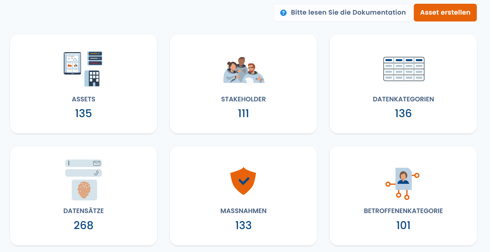

# Datenkartierung

#### Alles beginnt mit einer Datenkartierung 

Bevor Sie mit der Erstellung Ihrer Verarbeitungsblätter beginnen, empfehlen wir Ihnen, die Daten des Unternehmens so genau wie möglich zu kartieren. Das folgende Schema zeigt Ihnen die Struktur der Datenkartierung, die Sie einrichten können.

<figure><figcaption>
Schema der Datenkartierung
</figcaption></figure>

Um alle personenbezogenen Daten Ihres Informationssystems zu inventarisieren, gehen Sie wie folgt vor:

1. **Assets (Assets) erfassen**, die Software, Dateien, Plugins, Server, Maschinen usw. sein können
2. **Den Herausgeber des Assets identifizieren (falls zutreffend)**: Geben Sie die Informationen des Unternehmens ein, das dieses Asset produziert. Dieser kann bei der Erstellung des Verarbeitungsverzeichnisses in den Auftragsverarbeitern aufgeführt werden.
3. **Daten inventarisieren**: Listen Sie den oder die zugehörigen Datensätze auf (Sie können sich auf den mit dem Auftragsverarbeiter unterzeichneten DPA beziehen). Klicken Sie hier, um mehr über [die Datensätze](https://doc.dastra.eu/features/editer-le-registre/remplir-le-questionnaire/categorie-de-donnees) zu erfahren.
4. **Sicherheitsmaßnahmen auflisten**, die implementiert wurden

Diese Datenkartierung erleichtert die Erstellung von Verarbeitungsblättern erheblich, da sie von der Realität Ihrer Daten ausgeht.

Sie möchten diese Inventarisierung nicht durchführen oder sind der Meinung, dass die von Ihnen verwendete Software Standard ist? Wir haben an alles gedacht: Sie können Ihr Asset-Referenzsystem mithilfe unserer Bibliothek vordefinierter Vorlagen erstellen, die die Standard-Assets des Marktes enthalten (Salesforce, Jira...).

### So greifen Sie auf die Datenkartierung zu

1. [Greifen Sie auf Ihren Mandanten zu](../../getting-started/setup/espace-de-travail.md#accedez-a-un-espace-de-travail)
2. Klicken Sie in der Navigation auf das Symbol "**Metadaten**"
3. Sie gelangen auf diese Seite:

<figure><figcaption></figcaption></figure>

Wählen Sie dann das Referenzsystem, auf das Sie zugreifen möchten.

## Erstellen Sie Ihre Liste der Sicherheitsmaßnahmen

## Wie verwaltet man seine Auftragsverarbeiter?
