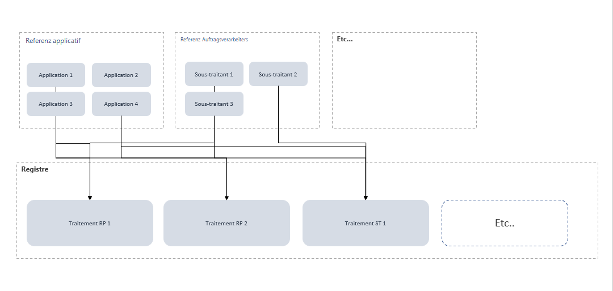

# Referenzdaten

Um Eingabefehler zu reduzieren, ermöglicht Ihnen das Dastra-Verzeichnis die Verwaltung eines oder mehrerer Referenzsysteme völlig autonom und unabhängig vom Verzeichnis. Das folgende Schema veranschaulicht die Wiederverwendbarkeit des Verarbeitungsverzeichnisses.

## Liste der von Dastra angebotenen Referenzsysteme

* **Assets**: Die Assets umfassen die für die Datensteuerung nützlichen Elemente (wie Datenträger, Räumlichkeiten, materielle oder immaterielle Elemente).
* **Stakeholder**: Die Stakeholder unterscheiden sich von den Nutzern, da sie sich nicht unbedingt auf der Plattform anmelden müssen.
* **Datensätze**: Die Datensätze sind Gruppen von Daten, die zusammenhängende Einheiten bilden.
* **Daten**: Die Daten sind die Informationen. Sie bilden die atomarste Ebene in Dastra.
* **Maßnahmen**: Die Sicherheitsmaßnahmen sind technische oder organisatorische Vorkehrungen.
* **Kategorien betroffener Personen**: Sie fassen Kategorien von Individuen zusammen.

## Datenreferenzsystem mit Dastra generieren

## Wie filtert man die Referenzsysteme?
