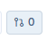
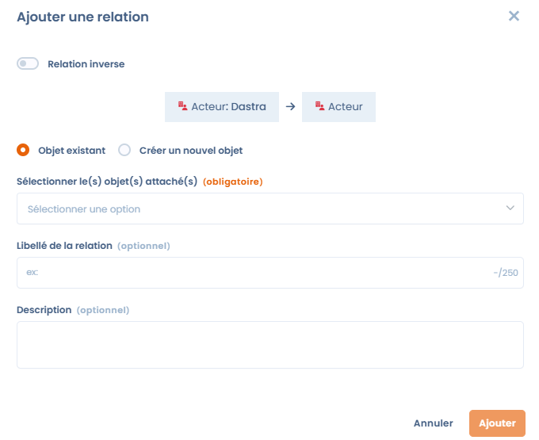
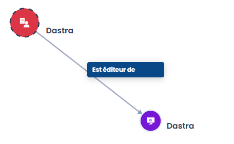

# Generische Beziehungen

## Was ist eine generische Beziehung?

Eine **generische Beziehung** ist eine einfache und benannte Verknüpfung zwischen zwei Elementen in Dastra. Sie ermöglicht es, Verbindungen zwischen Objekten zu dokumentieren, die nicht automatisch von der Plattform abgeleitet werden — zum Beispiel die Verknüpfung eines Assets mit einem Stakeholder oder eines Risikos mit einem Datenschutzvorfall.

Eine Beziehung zeichnet sich aus durch:

* ein **Quellobjekt** und ein **Zielobjekt**,
* eine **Beziehungsbezeichnung** (optional, z. B. "Verantwortlicher", "Verwaltet von"),
* eine **Zusammenfassung** (optional, um Kontext zu liefern),
* eine **Richtung** — die bei Bedarf umgekehrt werden kann.


Ein Element kann mit mehreren anderen Elementen verschiedener Typen verknüpft werden.


## Wo sind generische Beziehungen verfügbar?

Generische Beziehungen können von folgenden Elementen aus erstellt werden:

* **Assets**
* **Stakeholder**
* **Sicherheitsmaßnahmen**
* **Datenschutzvorfälle**
* **Datensätze**
* **Risiken**

Sie werden hauptsächlich im Modul **Assets** und in den **Referenzsystemen** (Datenkartierung) verwendet, wo der Beziehungsgraph visualisiert wird.

## So fügen Sie eine generische Beziehung hinzu

1. Öffnen Sie ein Element (z. B. ein Asset).
2. Klicken Sie auf das Symbol **"Verknüpfte Elemente"** in der Symbolleiste — es zeigt die Anzahl bestehender Verknüpfungen an.

<figure><figcaption></figcaption></figure>

3. Klicken Sie auf **"Beziehung hinzufügen"** und wählen Sie den Objekttyp, der verknüpft werden soll (Stakeholder, Sicherheitsmaßnahme, Datenschutzvorfall, Asset, Datensatz oder Risiko).
4. Im Dialogfenster:
   * Aktivieren Sie **"Umgekehrte Beziehung"**, wenn die Richtung umgekehrt werden soll.
   * Wählen Sie **"Bestehendes Element"**, um ein bereits in Dastra vorhandenes Element zu verknüpfen, oder **"Element erstellen"**, um eines ad hoc zu erstellen.
   * Wählen Sie das Zielobjekt im Dropdown-Menü.
   * Fügen Sie optional eine **Beziehungsbezeichnung** und eine **Zusammenfassung** hinzu.
5. Klicken Sie auf **"Hinzufügen"**, um die Beziehung zu speichern.

<figure><figcaption></figcaption></figure>

## Beziehungen visualisieren

Sobald die Beziehungen erstellt sind, erscheinen sie in:

* Dem Panel **"Verknüpfte Elemente"** jedes Elements, das alle direkten Verknüpfungen anzeigt.
* Dem **Knotengraph** in der Datenkartierungsansicht, in dem alle Beziehungen als verbundenes Netzwerk dargestellt werden.

<figure><figcaption>
Beispiel einer grafischen Visualisierung einer generischen Beziehung in der Datenkartierung
</figcaption></figure>

## Weiterführende Informationen


[cartography](../cartography/README.md)

