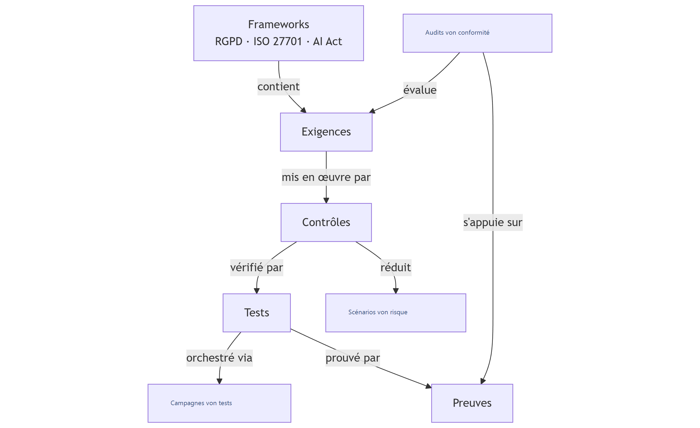

# Compliance

Das Modul **Compliance** von Dastra ermöglicht es, die regulatorische Compliance strukturiert, nachvollziehbar und auditierbar zu verwalten, basierend auf einer modularen Architektur, die an Compliance-Referenzrahmen ausgerichtet ist.

***

### Architektur des Compliance-Moduls

Das Modul basiert auf einer logischen Kette von Objekten, von den regulatorischen Referenzrahmen bis hin zu den Compliance-Nachweisen.

<figure><figcaption></figcaption></figure>

#### Frameworks (Referenzrahmen)

Beispiele: DSGVO, ISO 27701, ISO 27001, KI-Verordnung.

Ein Framework:

* definiert den regulatorischen oder normativen Rahmen,
* enthält eine Reihe von anwendbaren Anforderungen.

***

#### Anforderungen (Requirements)

Die Anforderungen repräsentieren die Verpflichtungen aus einem Framework.\
Beispiele: Zugangskontrollen, Berechtigungsverwaltung, Protokollierung.

Jede Anforderung:

* ist einem Framework zugeordnet,
* wird bei Compliance-Audits bewertet,
* wird durch eine oder mehrere Kontrollen umgesetzt.

***

#### Kontrollen (Controls)

Die Kontrollen beschreiben, **wie** eine Anforderung konkret umgesetzt wird.\
Beispiele: regelmäßige Überprüfung der Zugänge, Berechtigungsverfahren.

Eine Kontrolle:

* setzt eine Anforderung um,
* ist mit einem oder mehreren Risikoszenarien verknüpft,
* wird mithilfe von Tests überprüft.

***

#### Risikoszenarien (Risk scenarios)

Die Risikoszenarien beschreiben befürchtete Ereignisse.\
Beispiel: unbefugter Zugang zu sensiblen Daten.

Die Kontrollen ermöglichen:

* diese Risiken zu verhindern oder zu reduzieren,
* die umgesetzten Abhilfemaßnahmen nachzuweisen.

***

#### Tests

Die Tests dienen dazu, die Wirksamkeit der Kontrollen zu überprüfen.\
Beispiele: wiederkehrende Überprüfung der Zugänge, Validierungsdelegation.

Ein Test:

* überprüft eine oder mehrere Kontrollen,
* liefert messbare Ergebnisse,
* wird durch Nachweise gestützt.

***

#### Testkampagnen (Test campaigns)

Die Kampagnen ermöglichen es, Tests im großen Maßstab zu orchestrieren:

* Versand von Kampagnen an Teams oder Kunden,
* zentralisierte Erfassung der Antworten,
* Verfolgung des Fortschritts und der Status.

***

#### Nachweise (Evidences)

Die Nachweise belegen die Compliance.\
Beispiele: Richtlinien, Verfahren, Berichte zur Zugriffsüberprüfung.

Ein Nachweis:

* ist einem Test zugeordnet,
* wird bei Audits verwendet,
* gewährleistet die Nachvollziehbarkeit der Kontrollen.

***

#### Compliance-Audits (Compliance audits)

Die Audits ermöglichen die Bewertung des Compliance-Niveaus:

* interne Audits,
* Selbstbewertungen,
* Vorbereitung auf externe Audits.

Sie stützen sich auf:

* die Anforderungen,
* die Kontrollen,
* die zugehörigen Tests und Nachweise.

***

### Gesamtübersicht

Das Compliance-Modul von Dastra ermöglicht somit:

* regulatorische Anforderungen zu strukturieren,
* Verpflichtungen mit Risiken zu verknüpfen,
* die Compliance durch getestete und dokumentierte Kontrollen nachzuweisen,
* Audits und Zertifizierungen effizient vorzubereiten.

### Multi-Framework-Prinzip in Dastra

Das Compliance-Modul von Dastra ist **nativ multi-framework-fähig**.

Das bedeutet:

* ein und dasselbe **Framework** (DSGVO, ISO, KI-Verordnung…) enthält seine eigenen Anforderungen,
* eine **Anforderung** gehört zu **einem Framework**,
* eine **Kontrolle kann mehrere Anforderungen abdecken**, auch aus **verschiedenen Frameworks**,
* die **Tests und Nachweise** werden gemeinsam genutzt und sind wiederverwendbar.

Ziel: **Doppelarbeit vermeiden** und die Compliance übergreifend steuern.

***

### Wichtige Beziehungen zwischen den Objekten

* **Framework → Anforderungen**: 1 → N
* **Anforderungen ↔ Kontrollen**: N ↔ N
* **Kontrollen ↔ Tests**: N ↔ N
* **Tests → Nachweise**: 1 → N
* **Kontrollen → Risikoszenarien**: N ↔ N

Eine einzelne Kontrolle (z. B. Überprüfung der Zugänge) kann somit:

* eine DSGVO-Anforderung erfüllen,
* eine ISO 27001-Anforderung erfüllen,
* mehrere Risikoszenarien reduzieren.

**Erläuterndes Schema**

<figure><figcaption></figcaption></figure>
