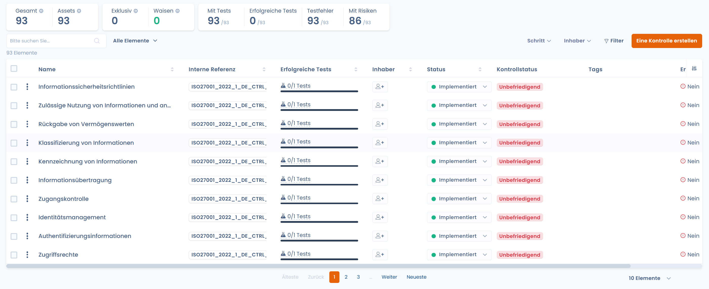
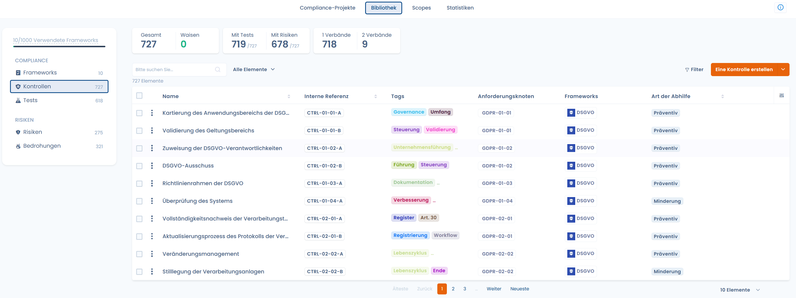
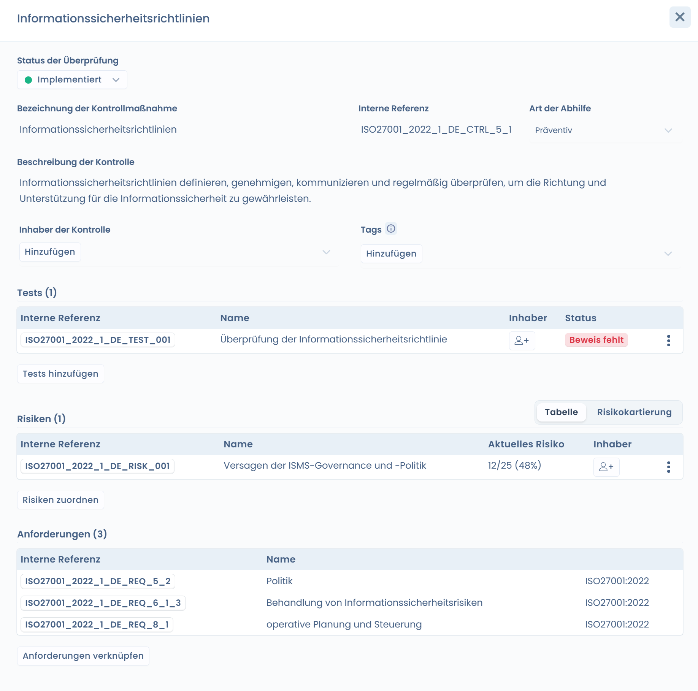
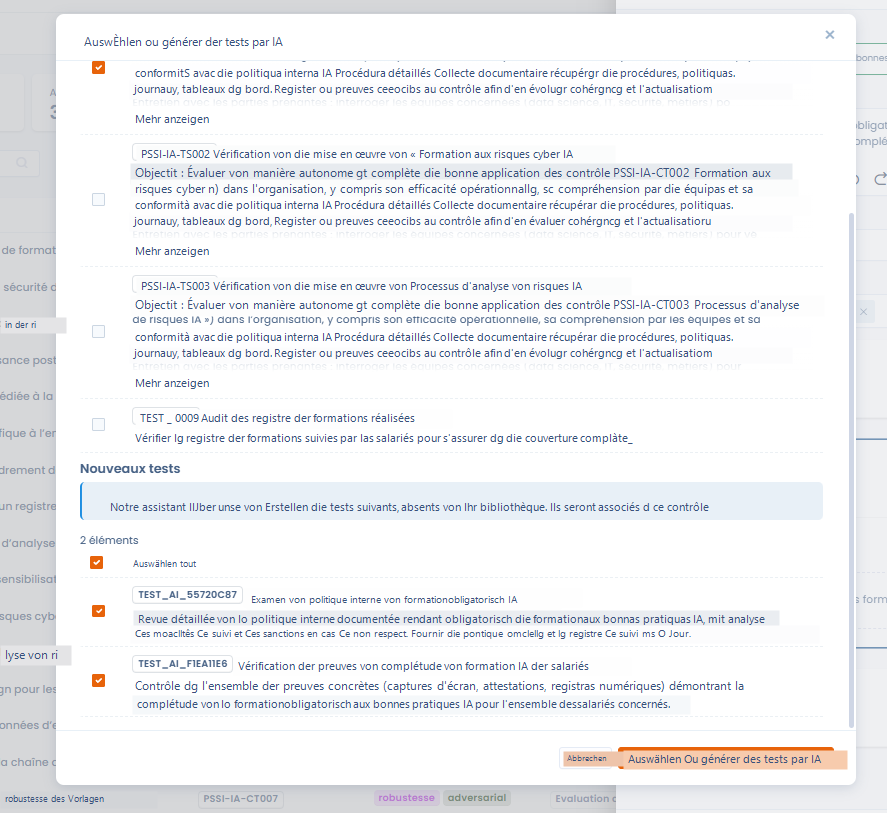
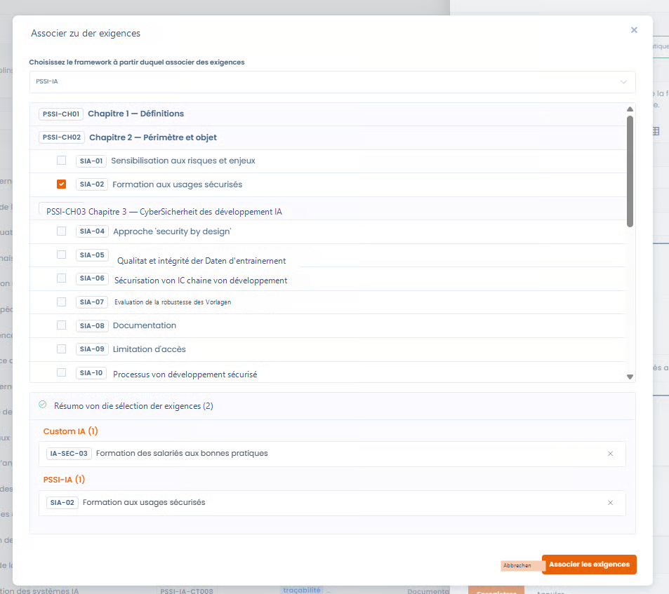
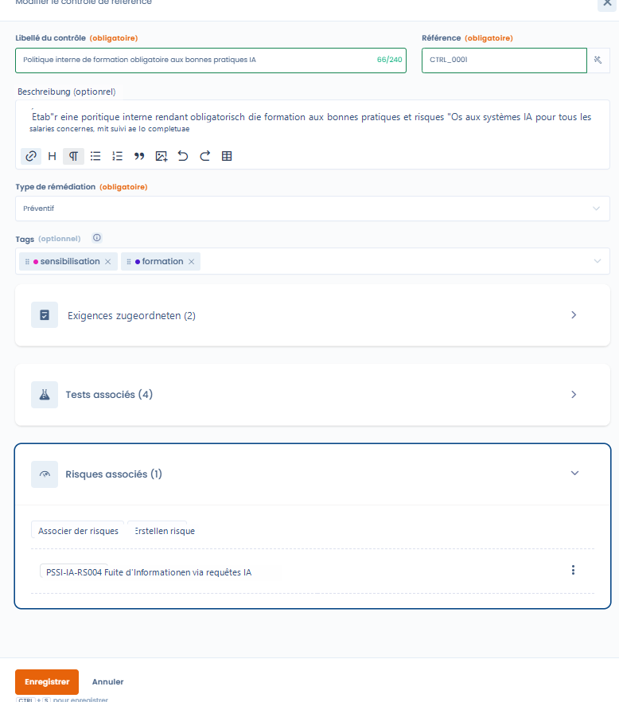

# Kontrollen

Sie übersetzen die Anforderungen des Frameworks in **konkrete Maßnahmen**, die messbar und auditierbar sind, und ermöglichen den Nachweis der Wirksamkeit der Compliance im Zeitverlauf.

Eine Kontrolle kann:

* **eine oder mehrere Anforderungen** abdecken
* zwischen **mehreren Frameworks** geteilt werden
* mit **Tests** und **Risiken** verknüpft sein

***

### Überwachung und Verwaltung der Kontrollen

<figure><figcaption></figcaption></figure>

Die Kontrollen können über zwei ergänzende Einstiegspunkte verfolgt werden.

***

#### 1. Vom Framework aus

Im Tab **Kontrollen** eines Frameworks sieht der Nutzer:

* die den Anforderungen des Frameworks zugeordneten Kontrollen
* ihren Abhilfemaßnahmentyp
* die abgedeckten Anforderungen
* die zugehörigen Tests und Risiken

👉 Diese Ansicht ist ideal für:

* das Verständnis der Abdeckung eines Frameworks
* die Identifizierung der Schlüsselkontrollen
* die Steuerung der Compliance nach Referenzrahmen

***

#### 2. Von der Kontrollbibliothek aus

<figure><figcaption></figcaption></figure>

Die **Kontrollbibliothek** zentralisiert alle Kontrollen der Organisation, über alle Frameworks hinweg.

Diese Ansicht ermöglicht:

* **globale Statistiken** zu nutzen (Kontrollen mit Tests, Risiken, Mehrfachzuordnungen, verwaiste Kontrollen)
* Kontrollen zu identifizieren, die in mehreren Frameworks wiederverwendet werden
* die **Qualität und Kohärenz** der Kontrollbibliothek zu verbessern

👉 Dies ist ein Schlüsselwerkzeug für die Governance und Industrialisierung der Compliance.

***

### Bearbeitungsfenster einer Kontrolle



Das Bearbeitungsfenster ermöglicht es, die Rolle der Kontrolle und ihre Verbindungen zum Rest des Referenzrahmens präzise zu definieren.



<figure><figcaption></figcaption></figure>



***

#### Bezeichnung und Referenz der Kontrolle

* **Bezeichnung der Kontrolle**\
  Beschreibt klar die umgesetzte Aktion oder Maßnahme.
* **Referenz der Kontrolle**\
  Eindeutige Kennung der Kontrolle in der Bibliothek.



📌 Ein **Referenzgenerator** ist verfügbar, um automatisch eine kohärente Referenz vorzuschlagen mit:

* dem Kontext der Kontrolle
* den Namenskonventionen
* den zugehörigen Frameworks

Der Nutzer kann die vorgeschlagene Referenz frei anpassen.



<figure><figcaption></figcaption></figure>



***

#### Abhilfemaßnahmentyp

Jede Kontrolle muss einem **Abhilfemaßnahmentyp** zugeordnet werden, der ihre Art präzisiert:

* **Präventiv**\
  Die Kontrolle zielt darauf ab, das Eintreten eines Risikos **zu vermeiden**\
  \&#xNAN;_(z. B. Schulung, Zugriffsregeln, Validierung vor Produktivsetzung)_
* **Abschwächung**\
  Die Kontrolle zielt darauf ab, die **Auswirkung oder Wahrscheinlichkeit** eines bereits bestehenden Risikos **zu reduzieren**\
  \&#xNAN;_(z. B. Überwachung, Erkennung, Mitigationsplan)_

👉 Diese Unterscheidung ist wesentlich für:

* die Analyse der Risikobewältigungsstrategie
* das Gleichgewicht zwischen Prävention und Erkennung
* die Steuerung der Compliance-Reife

***

#### Tags

Die Tags ermöglichen:

* Kontrollen zu kategorisieren (z. B. Schulung, KI, Sicherheit, Monitoring)
* die Suche und Filterung zu erleichtern
* die vorherrschenden Themen der Bibliothek zu analysieren

***

### Zuordnung von Tests

Die [**Tests**](tests.md) ermöglichen die Überprüfung der Existenz, Anwendung und Wirksamkeit einer Kontrolle.

#### Zuordnung per KI



<figure><figcaption></figcaption></figure>



Die KI-Unterstützung schlägt vor:

* **bestehende Tests** in der Bibliothek, die in Bezug auf die Kontrolle relevant sind
* bei Bedarf die **Erstellung neuer Tests**

👉 Dieser Ansatz gewährleistet:

* Kohärenz zwischen Kontrollen und Tests
* Zeitersparnis
* Standardisierung der Auditmethoden



***

### Zuordnung zu Anforderungen



Eine Kontrolle kann zugeordnet werden:

* mehreren Anforderungen desselben Frameworks
* Anforderungen aus **verschiedenen Frameworks**

👉 Dies ermöglicht:

* Kontrollen gemeinsam zu nutzen
* eine interne Kontrolle mit einem regulatorischen Referenzrahmen zu verknüpfen
* Brücken zwischen Frameworks zu schaffen (z. B. Custom KI ↔ PSSI-KI)



<figure><figcaption></figcaption></figure>



***

### Zuordnung von Risiken



<figure><figcaption></figcaption></figure>



Die Kontrollen können zugeordnet werden:

* **bestehenden** [**Risiken**](risks.md)
* oder **neuen Risiken**, die direkt aus der Kontrollkarte erstellt werden

Die Zuordnung ermöglicht:

* die von einer Kontrolle abgedeckten Risiken zu visualisieren
* die Auswirkung der Kontrolle auf das Restrisiko zu bewerten
* einen kohärenten Ansatz für das Risikomanagement zu strukturieren



***

### Zusammenfassung: Warum die Kontrollen zentral sind

In Dastra sind die Kontrollen der **Konvergenzpunkt** zwischen:

* den Anforderungen (was erwartet wird)
* den Tests (was überprüft wird)
* den Risiken (was beherrscht wird)

Dieser Ansatz ermöglicht:

* eine operative und messbare Compliance
* eine übergreifende Governance
* eine intelligente Wiederverwendung der Compliance-Bemühungen
