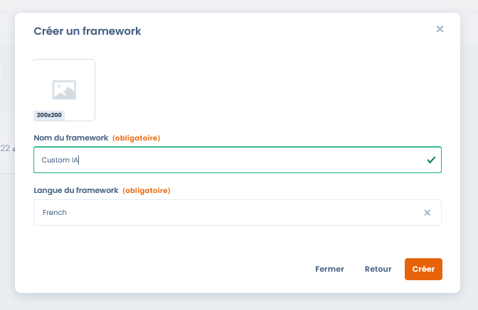
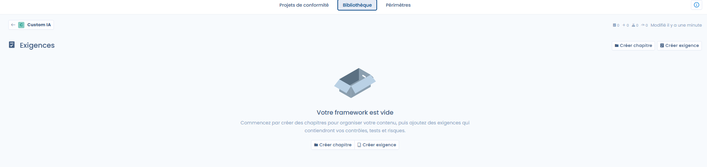
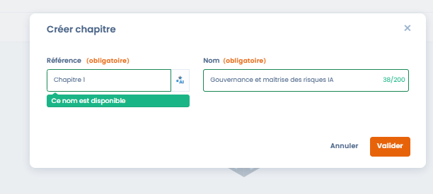
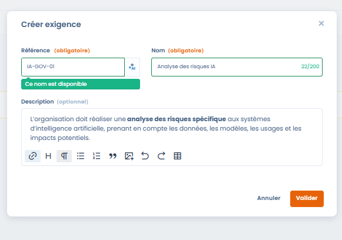
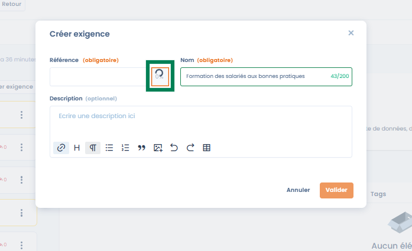
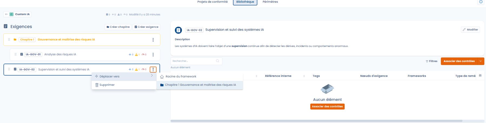
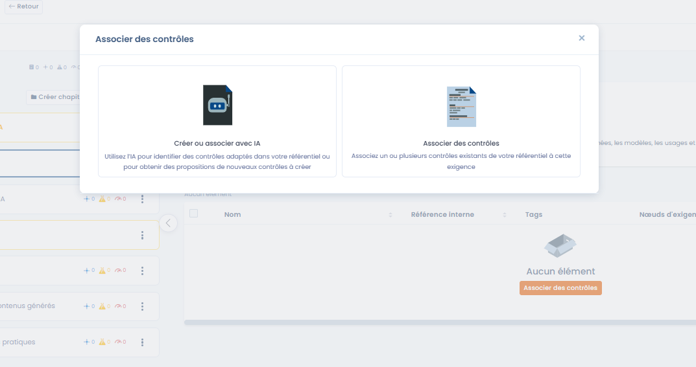
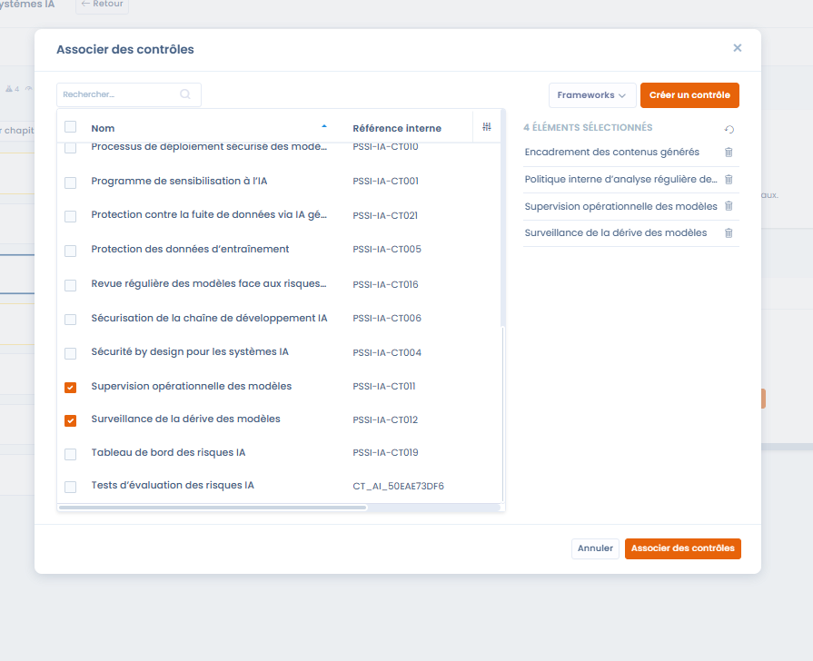
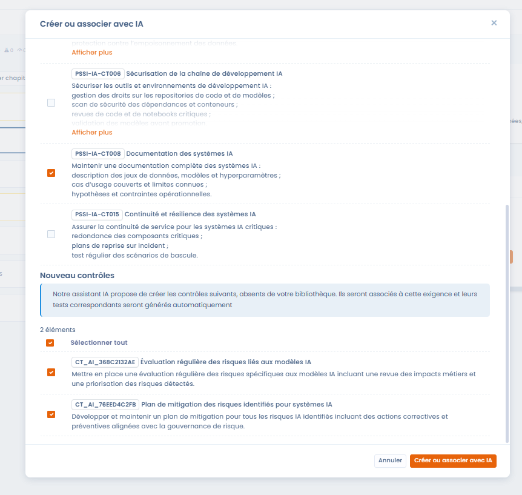

# Erstellung eines benutzerdefinierten Frameworks

#### Einführung

Die Erstellung eines benutzerdefinierten Frameworks ermöglicht es, einen Compliance-Referenzrahmen zu erstellen, der **an den spezifischen Kontext der Organisation angepasst** ist: interne Richtlinien, Branchenstandards, KI-Ansätze, Sicherheit, Qualität oder Governance.

Ein benutzerdefiniertes Framework kann:

* **vollständig von Grund auf** erstellt werden,
* oder als **gemeinsame Grundlage** für mehrere Compliance-Projekte dienen.

***

### Schritt 1 – Erstellung des Frameworks



Bei der Erstellung eines benutzerdefinierten Frameworks legt der Nutzer fest:

* **Den Namen des Frameworks** (z. B. _Custom KI_, _PSSI-KI – Demo_)
* **Die Sprache des Frameworks**, die die Standardsprache der Anforderungen und Kontrollen bestimmt

Nach der Erstellung wird das Framework der Bibliothek im Status **Entwurf** hinzugefügt.



<figure><figcaption></figcaption></figure>



***

### Schritt 2 – Ansicht und verfügbare Aktionen

Standardmäßig ist ein neu erstelltes Framework:

* **leer**
* **schreibgeschützt**

#### Verfügbare Aktionen, solange das Framework nicht bearbeitet wurde

* **Exportieren**: das Framework im JSON-/Excel-Format herunterladen
* **Duplizieren**: eine Kopie des Frameworks erstellen
* **In den Papierkorb verschieben**: das Framework löschen

👉 **Es sind keine Ergänzungen oder Änderungen möglich, solange das Framework nicht im Bearbeitungsmodus ist.**

***

### Schritt 3 – In den Bearbeitungsmodus wechseln



Um das Framework zu erweitern (Kapitel, Anforderungen, Kontrollen…), muss:

1. Auf **Bearbeiten** geklickt werden
2. Das Framework in den **Bearbeitungsmodus** versetzt werden

Im Bearbeitungsmodus kann der Nutzer:

* **Kapitel** erstellen
* **Anforderungen** hinzufügen
* Den Referenzrahmen schrittweise strukturieren




<figure><figcaption></figcaption></figure>




***

## Erstellung und Strukturierung der Anforderungen

Sobald das Framework erstellt und in den **Bearbeitungsmodus** versetzt wurde, kann der Nutzer beginnen, seinen Referenzrahmen mithilfe von **Kapiteln** und **Anforderungen** zu strukturieren.\
Dieser Schritt ermöglicht es, einen regulatorischen, normativen oder internen Rahmen in nutzbare Elemente in Dastra zu übersetzen.

***

### Strukturierung durch Kapitel



<figure><figcaption></figcaption></figure>



Die Kapitel ermöglichen es, das Framework übersichtlich und kohärent zu organisieren.



#### Strukturierungsregeln

Dastra erlaubt:

* **Hauptkapitel**
* **Unterkapitel**

👉 Die Tiefe ist bewusst auf **maximal zwei Ebenen** begrenzt, um:

* die Lesbarkeit des Referenzrahmens zu gewährleisten
* zu komplexe Strukturen zu vermeiden
* die Nutzung der Anforderungen in Compliance-Projekten zu erleichtern

#### Auszufüllende Felder

Bei der Erstellung eines Kapitels:

* **Referenz**: interne Kennung des Kapitels
* **Name**: funktionale Bezeichnung des Kapitels

&#x20;


_Best Practice_: Verwenden Sie Kapitel zur Strukturierung nach großen Themen\
(z. B. Governance, Sicherheit, Betrieb, Nutzung…).


***

### Erstellung einer Anforderung



Die Anforderungen drücken die **Compliance-Erwartungen** aus, denen die Organisation entsprechen muss.\
Sie bilden die direkte Verbindung zwischen dem Referenzrahmen und den operativen Kontrollen.



<figure><figcaption></figcaption></figure>



#### Verfügbare Felder

* **Referenz (Pflichtfeld)**\
  Eindeutige Kennung der Anforderung im Framework
* **Name (Pflichtfeld)**\
  Zusammenfassende Formulierung der Anforderung
* **Beschreibung (optional)**\
  Detail des erwarteten Inhalts, des Geltungsbereichs und der Ziele der Anforderung

***

### KI-Unterstützung für die Anforderungsreferenz



<figure><figcaption></figcaption></figure>



Bei der Erstellung einer Anforderung bietet Dastra eine **KI-Unterstützung** an, um automatisch eine kohärente Referenz zu generieren mit:

* dem Namen der Anforderung
* dem übergeordneten Kapitel
* dem Kontext des Frameworks




👉 Diese Funktion ermöglicht:

* Namenskonventionen zu harmonisieren
* Inkonsistenzen oder Duplikate zu vermeiden
* Zeit bei der Erstellung benutzerdefinierter Referenzrahmen zu sparen

Der Nutzer kann die vorgeschlagene Referenz frei ändern.

***

### Organisation und Verwaltung der Anforderungen

<figure><figcaption></figcaption></figure>

Nach der Erstellung können die Anforderungen:

* in ein anderes Kapitel verschoben werden
* gelöscht werden
* schrittweise erweitert werden

Jede Anforderung zeigt auch zusammenfassende Indikatoren (Verknüpfungen mit Kontrollen, Risiken, Tests) an, die das Verständnis ihres Abdeckungsgrades erleichtern.

***

### Zuordnung von Kontrollen zu einer Anforderung



Die Kontrollen sind die **operativen** Elemente, die es ermöglichen, die Compliance mit einer oder mehreren Anforderungen nachzuweisen.

Für die Zuordnung von Kontrollen zu einer Anforderung gibt es zwei Ansätze.



<figure><figcaption></figcaption></figure>



***

#### Option 1 – Bestehende Kontrollen zuordnen




Der Nutzer kann eine oder mehrere bereits in der Bibliothek vorhandene Kontrollen auswählen und der Anforderung zuordnen.




<figure><figcaption></figcaption></figure>



👉 Eine einzelne Kontrolle kann **mehreren Anforderungen** zugeordnet werden, was Folgendes fördert:

* die gemeinsame Nutzung
* die Kohärenz des Referenzrahmens
* eine bessere Nachvollziehbarkeit

***

#### Option 2 – Kontrollen mit KI erstellen oder zuordnen



<figure><figcaption></figcaption></figure>



Dastra bietet eine KI-Unterstützungsfunktion, die es ermöglicht:

* automatisch **relevante bestehende Kontrollen** zu identifizieren
* bei Bedarf die **Erstellung neuer Kontrollen** vorzuschlagen

Die KI stützt sich auf:

* den Inhalt der Anforderung
* den Kontext des Frameworks
* die bereits in der Bibliothek vorhandenen Kontrollen



👉 Die über KI erstellten Kontrollen können automatisch Folgendes enthalten:

* ihre Beschreibung
* ihre Zuordnung zur Anforderung
* die zugehörigen Tests

***

### Vorteile dieses Ansatzes

Dieser Ansatz ermöglicht:

* eine **schrittweise Strukturierung** des Frameworks
* **gewollte Überschneidungen** zwischen Anforderungen
* die Erstellung übergreifender Kontrollen, die mehrere Anforderungen abdecken
* eine solide Grundlage für das Risikomanagement und Compliance-Projekte
