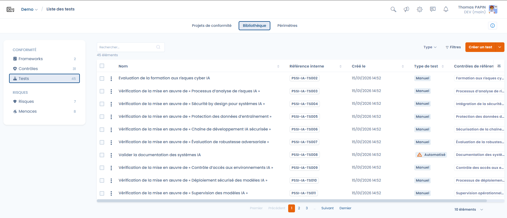
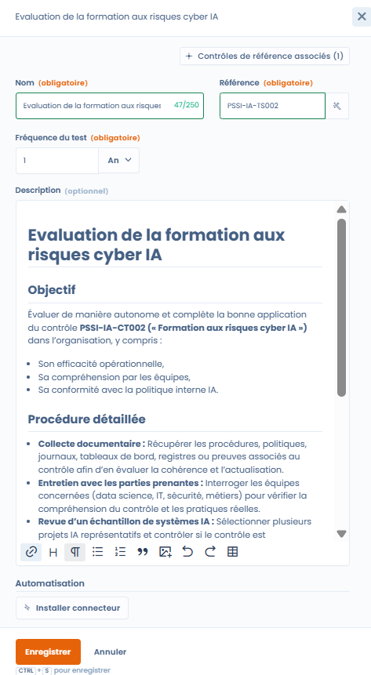
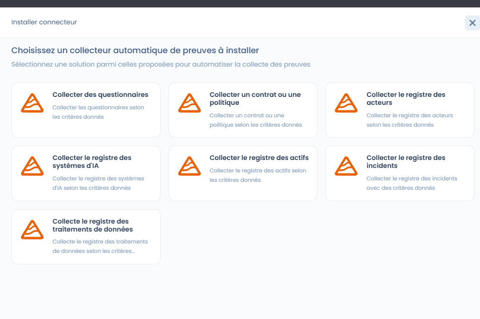
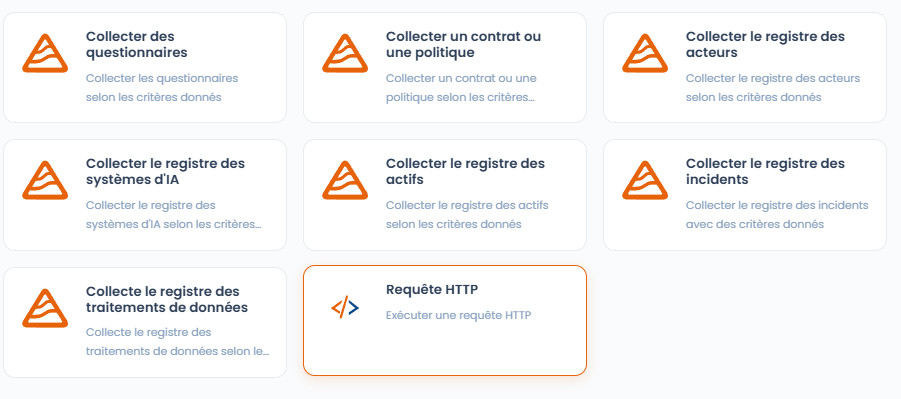

# Tests

Ein Test definiert, **wie** und **in welcher Häufigkeit** eine Kontrolle bewertet wird, und auf welchen Nachweisen diese Bewertung basiert.

Die Tests bilden die operative Verbindung zwischen:

* den **Kontrollen** (umgesetzte Maßnahmen),
* den gesammelten **Nachweisen**,
* und den **Compliance-Ergebnissen**, die im Zeitverlauf beobachtet werden.

***

### Rolle der Tests in Dastra

Ein Test ermöglicht die Beantwortung einer einfachen, aber wesentlichen Frage:

> _Wird die Kontrolle tatsächlich angewendet und ist sie wirksam?_

Jeder Test ist:

* einem **Referenzkontrollelement** zugeordnet
* gemäß einer **definierten Häufigkeit** ausgeführt
* in **Compliance-Projekten** verwendet, um verwertbare Nachweise und Ergebnisse zu liefern

***

### Bibliotheksansicht der Tests

<figure><figcaption></figcaption></figure>

Die Testbibliothek bietet einen übergreifenden Überblick über alle verfügbaren Tests, insbesondere:

* ihren Typ (manuell oder automatisiert),
* das Erstellungsdatum,
* die zugehörigen Kontrollen,
* erweiterte Filter (Framework, Typ, Anforderungen, verwaiste Tests).

👉 Diese Ansicht ermöglicht:

* Tests zu identifizieren, die in mehreren Kontexten wiederverwendet werden,
* nicht zugeordnete Tests zu erkennen,
* die Überprüfungsmethoden zu industrialisieren.

***

### Manuelle Tests (Standard)

Standardmäßig ist ein Test **manuell**.

📌 Ein manueller Test basiert auf einer **menschlichen Handlung**, zum Beispiel:

* Dokumentenprüfung,
* Gespräch mit den Teams,
* Überprüfung eines Verzeichnisses,
* punktuelles Audit eines Prozesses.

#### Funktionsweise in einem Compliance-Projekt

Wenn ein manueller Test einem Projekt hinzugefügt wird:

* erfordert er eine **regelmäßige Aktualisierung der Nachweise**
* gemäß der im Test **definierten Häufigkeit** (monatlich, vierteljährlich, jährlich usw.)

👉 Dies ermöglicht eine **lebendige** Compliance, die im Zeitverlauf aktualisiert wird.

***

### Konfiguration eines Tests



Bei der Erstellung oder Bearbeitung eines Tests legt der Nutzer fest:

* **den Namen und die Referenz des Tests** (mit Referenzgenerator)
* **die Häufigkeit des Tests**
* **die detaillierte Beschreibung**, einschließlich:
  * des Testzwecks
  * des zu befolgenden Verfahrens
  * der erwarteten Nachweisdokumente



<figure><figcaption></figcaption></figure>



Diese Informationen dienen als operativer Leitfaden bei der Durchführung des Tests in einem Projekt.

***

### Automatisierte Tests mit Dastra-Konnektoren

Dastra bietet mehrere Arten einsatzbereiter Konnektoren (Fragebögen, Verzeichnisse, Richtlinien usw.) sowie einen generischen Konnektor. Diese Konnektoren werden direkt in den **automatisierten Tests** des Compliance-Moduls verwendet.

<figure><figcaption></figcaption></figure>

Ergänzend zu den manuellen Tests ermöglicht Dastra die Konfiguration **automatisierter Tests** mithilfe von **Konnektoren**.

Ein automatisierter Test nutzt einen Dastra-Konnektor, um:

* Elemente des Mandanten direkt abzufragen
* automatisch Nachweise zu sammeln
* die Compliance anhand definierter Kriterien zu überprüfen

#### Beispiele für Konnektoren

Die Konnektoren können insbesondere ermöglichen:

* ein **Verzeichnis der KI-Systeme** zu erfassen
* die **Existenz und Aktualität von Dokumenten** zu überprüfen (z. B. Dokumentation der KI-Systeme)
* Verzeichnisse abzufragen (Assets, Vorfälle, Datenverarbeitungen)
* Fragebögen oder Richtlinien zu analysieren

📌 Beispiel:\
Ein automatisierter Test kann überprüfen, dass jedes KI-System über eine konforme und aktuelle Dokumentation verfügt, ohne manuellen Eingriff.

### Hinzufügen eines benutzerdefinierten Konnektors

Ergänzend zu den Standardkonnektoren ermöglicht Dastra die Erstellung **benutzerdefinierter Konnektoren**, um die Nachweissammlung in den Compliance-Tests zu automatisieren.

<figure><figcaption></figcaption></figure>

Ein benutzerdefinierter Konnektor ermöglicht:

* eine technische Abfrage auszuführen (z. B. HTTP-Anfrage),
* eine interne oder externe Quelle abzufragen,
* automatisch faktische Elemente zu erfassen,
* verwertbare Nachweise für Audits zu erstellen.

Der Konnektor wird so zu einer **wiederkehrenden und nachvollziehbaren Nachweisquelle**.

#### HTTP-Anfrage

Der Konnektor **HTTP-Anfrage** ermöglicht die Abfrage jeder API oder jedes exponierten Endpoints.

Er eignet sich besonders für:

* die Abfrage von Drittanbieter-Tools,
* die Überprüfung der Existenz oder des Zustands einer Ressource,
* die Automatisierung technischer oder dokumentarischer Kontrollen.

### Konfiguration eines benutzerdefinierten Konnektors

Bei der Erstellung eines HTTP-Konnektors können folgende Parameter definiert werden:

#### Testhäufigkeit

* Bestimmt die Ausführungshäufigkeit des Tests (z. B. monatlich).
* Angepasst an wiederkehrende Kontrollen.

#### URL (Pflichtfeld)

* Abzufragender Endpoint.
* Kann einer internen oder externen API entsprechen.

#### HTTP-Methode (optional)

* GET, POST usw.
* Je nach Art der Abfrage auszuwählen.

#### HTTP-Header (optional)

* Ermöglicht insbesondere die Authentifizierungsverwaltung (Tokens, API-Schlüssel, benutzerdefinierte Header).

#### Anfragekörper (optional)

* Nützlich für POST-Anfragen oder Aufrufe, die einen spezifischen Payload erfordern.

### Vorteile automatisierter Tests

Die automatisierten Tests ermöglichen:

* eine **kontinuierliche Nachweissammlung**
* eine Reduzierung der operativen Belastung
* eine bessere Zuverlässigkeit der Kontrollen
* eine schnellere Erkennung von Abweichungen

Sie eignen sich besonders für wiederkehrende oder strukturierte Kontrollen.

***

### Komplementarität der Ansätze

Dastra ermöglicht die Kombination von:

* **manuellen Tests** für Kontrollen, die menschliche Analyse oder Beurteilung erfordern
* **automatisierten Tests** für objektive und wiederholbare Überprüfungen

👉 Diese Komplementarität bietet ein Gleichgewicht zwischen Rigorosität, Effizienz und Pragmatismus.
