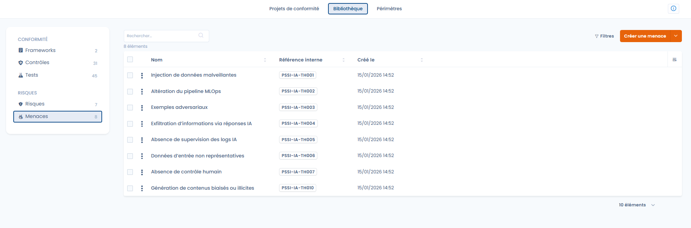
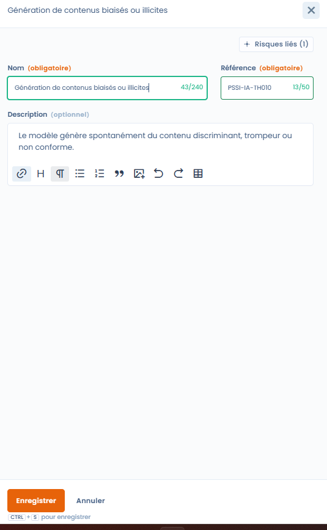

# Bedrohungen

In Dastra stellt eine Bedrohung den **auslösenden Faktor** eines Risikos dar:\
sie beschreibt, _wie_ oder _warum_ sich ein Risiko materialisieren kann.

👉 Die Bedrohungen bereichern die Risikoanalyse, ohne deren Bewertung zu verkomplizieren.

***

### Bedrohungen, Risiken und Kontrollen: kausale Logik

Das Dastra-Modell basiert auf einer einfachen und lesbaren Kette:

> **Bedrohung → Risiko → Kontrollen → Tests**

* Eine **Bedrohung** beschreibt eine Situation, ein Verhalten oder ein Ereignis
* Ein **Risiko** beschreibt die potenzielle Auswirkung auf die Organisation
* Die **Kontrollen** zielen darauf ab, das Eintreten oder die Auswirkungen des Risikos zu begrenzen
* Die **Tests** ermöglichen die Überprüfung der Wirksamkeit der Kontrollen

📌 Beispiel:

* **Bedrohung**: fehlende Überwachung der KI-Logs
* **Risiko**: Informationsabfluss über KI-Anfragen
* **Kontrollen**: Protokollierung, Überwachung, Sensibilisierung
* **Tests**: Überprüfung der Protokolle, regelmäßige Audits

***

### Bibliotheksansicht der Bedrohungen

<figure><figcaption></figcaption></figure>

Die Bedrohungsbibliothek zentralisiert alle identifizierten Bedrohungen mit:

* ihrem Namen und ihrer Referenz,
* ihrem Erstellungsdatum,
* Filtern zur Erleichterung der Navigation.

👉 Diese Ansicht ermöglicht:

* bestehende Bedrohungen wiederzuverwenden,
* eine einheitliche Terminologie zu gewährleisten,
* kohärente Risikoszenarien zu strukturieren.

***

### Erstellung und Verwaltung einer Bedrohung




Bei der Erstellung oder Bearbeitung einer Bedrohung gibt der Nutzer an:

* **den Namen der Bedrohung**
* **eine interne Referenz**
* eine **optionale Beschreibung** zur Kontextualisierung der Bedrohung



<figure><figcaption></figcaption></figure>



Das Modul ist bewusst **schlank**:\
Die Bedrohungen tragen keine numerische Bewertung und sind nicht direkt mit den Kontrollen verknüpft.

***

### Zuordnung zu Risiken

Eine Bedrohung ist **einem oder mehreren Risiken** zugeordnet.

Diese Zuordnung ermöglicht:

* Risikoszenarien präzise zu dokumentieren,
* das Verständnis der Ursachen zu verbessern,
* die Kohärenz der Gesamtanalyse zu stärken.

👉 Eine einzelne Bedrohung kann zu mehreren Risiken beitragen und umgekehrt.

***

### Warum Bedrohungen verwenden

Die Verwendung von Bedrohungen ermöglicht:

* eine feinere und realistischere Analyse der Risiken,
* eine bessere Nachvollziehbarkeit der Szenarien,
* eine klarere Kommunikation gegenüber den Beteiligten (CISO, Datenschutzbeauftragter, Fachabteilungen).

Die Bedrohungen ergänzen die Analyse, ohne das operative Management zu erschweren.

***

### Zusammenfassung

Die Bedrohungen sind ein **Klärungsinstrument**.\
Sie ermöglichen ein besseres Verständnis des **Ursprungs der Risiken** und damit eine bessere Begründung der umgesetzten Kontrollen.
