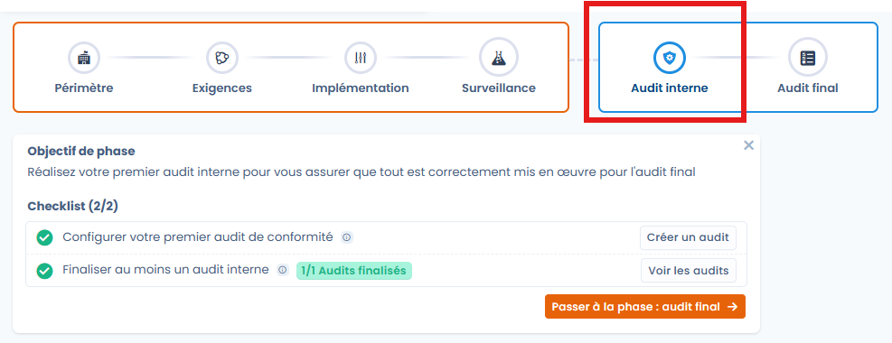
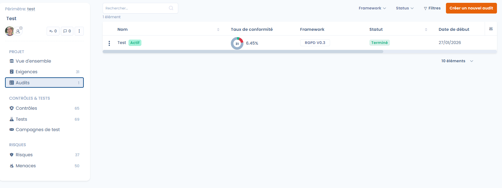
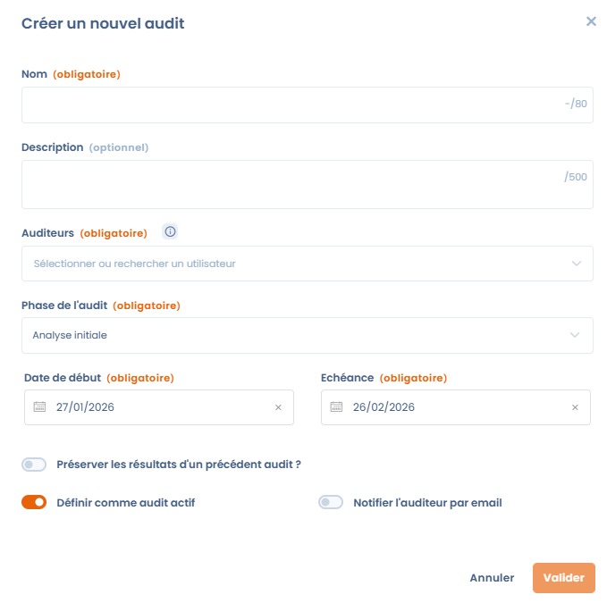
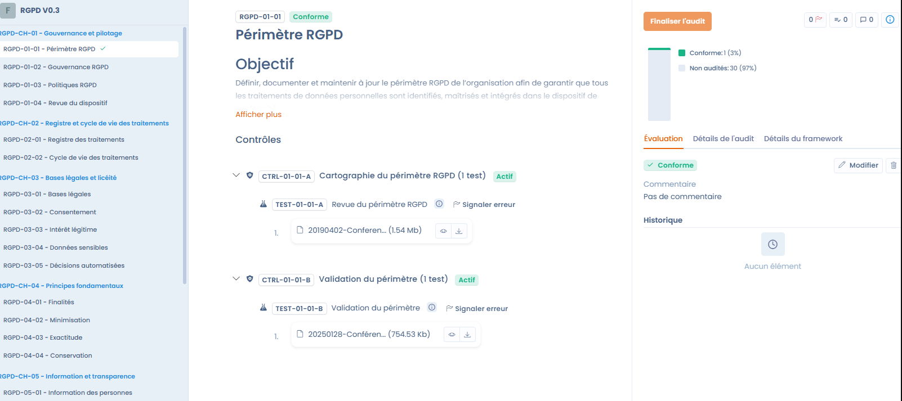
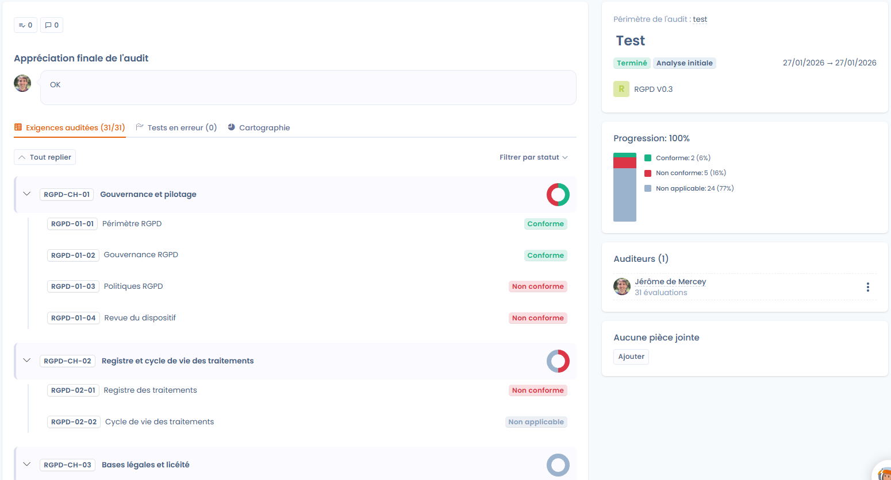

# Audits

Die Audit-Phase ermöglicht die offizielle Validierung des Compliance-Status zu einem bestimmten Zeitpunkt. Sie stützt sich auf die in den vorgelagerten Phasen geleistete Vorbereitungs- und Überwachungsarbeit, um eine strukturierte Bewertung zu bieten, sei es intern oder durch externe Auditoren.

**🎯 Ziel der Phase**&#x20;

Die Vorbereitung und Durchführung aller Compliance-Audits zentralisiert gestalten, mit den Beteiligten zusammenarbeiten und die Nachverfolgung der Korrekturen nach festgestellten Abweichungen sicherstellen.

<figure><figcaption></figcaption></figure>

***

### Übersicht des Moduls

Das Audit-Modul wandelt die theoretische Compliance in eine messbare Realität um, indem es Frameworks, Kontrollen, Risiken und Audits auf einer einzigen Plattform zusammenführt. Diese Phase basiert auf 4 Hauptsäulen:

1. Durchführung von Audits: Führen Sie interne oder externe Audits mithilfe von Standardframeworks (DSGVO, KI-Verordnung...) oder Ihren eigenen benutzerdefinierten Bewertungsrastern durch.
2. Zusammenarbeit: Erleichtern Sie den Austausch über einen zentralisierten Zugang zu Nachweisen, ein Delegationssystem und ein feingranulares Governance-Management.
3. Verknüpfung mit der Compliance: Verwenden Sie die bereits in Ihren Projekten vorhandenen Kontrollen und Nachweise direkt, um die Erfassung zu automatisieren.
4. Abweichungsmanagement: Identifizieren Sie Nichtkonformitäten und wandeln Sie sie sofort in Korrekturmaßnahmenpläne um.

#### Eine offene Architektur

Dastra bietet eine Multi-User-Verwaltung zur Steuerung der Compliance auf Konzernebene sowie eine vollständige Interoperabilität über APIs und Multi-Format-Exporte.

<figure><figcaption></figcaption></figure>

***

### 1. Eine neue Audit-Mission erstellen

Die Erstellung einer Mission ist der Ausgangspunkt Ihrer Bewertung. Klicken Sie im Modul Audits auf die Schaltfläche zur Erstellung, um das Konfigurationsformular zu öffnen.

#### 1. Allgemeine Informationen

* Name (Pflichtfeld): Eindeutiger Titel der Mission (z. B. „Jährliches Compliance-Audit"), begrenzt auf 80 Zeichen.
* Beschreibung (optional): Geben Sie den Kontext oder den spezifischen Geltungsbereich an (bis zu 500 Zeichen).
* Auditoren (Pflichtfeld): Wählen Sie die Nutzer aus, die für die Durchführung der Bewertung verantwortlich sind. Wenn Sie nicht in dieser Liste erscheinen, können Sie die Audit-Fragen nicht beantworten (auch wenn Sie Inhaber der Organisation sind).&#x20;

<figure><figcaption></figcaption></figure>

#### 2. Audit-Phase und Zeitplan

Die Wahl der Phase ermöglicht die Segmentierung Ihrer Mission und die Filterung Ihrer Governance-Dashboards.

| **Phase**        | **Beschreibung & Ziel**                                                                          |
| ---------------- | ------------------------------------------------------------------------------------------------ |
| Erstanalyse      | Rahmenphase: Definition des Geltungsbereichs, des Referenzrahmens und der regulatorischen Themen. |
| Vorbereitung     | Logistikphase: Zuweisung der Kontrollen an die Auditoren und Planung der Gespräche.              |
| Vor-Audit        | „Probeaudit": Selbstbewertung zur Identifizierung von Abweichungen vor dem offiziellen Termin.   |
| Abschlussaudit   | Abschlussphase: Abschlussbewertung, Erstellung der Schlussfolgerungen und Generierung des offiziellen Berichts. |

* Schlüsseldaten (Pflichtfeld): Geben Sie ein Startdatum und eine Frist an, um die Mission zeitlich einzurahmen.

#### 3. Erweiterte Optionen und Automatisierung

* Ergebnisse eines vorherigen Audits beibehalten: Ermöglicht den Start auf einer bestehenden Basis für wiederkehrende Audits. Dies kann nützlich sein, um ein Audit nach einem Audit zu wiederholen, bei dem die Kontrollen nicht zufriedenstellend waren.
* Als aktives Audit definieren: Integriert das Audit sofort in Ihre Echtzeit-Tracking-Indikatoren. Dieses Audit wird im Dashboard verwendet, um die Compliance-Rate anzuzeigen.
* Auditor per E-Mail benachrichtigen: Automatisiert den Versand einer Einladung an die bestimmten Mitarbeiter.

***

### Erwartetes Ergebnis

Am Ende dieser Phase verfügt die Organisation über einen offiziellen Statusbericht, eine vollständige Audit-Spur (Historie) und einen präzisen Maßnahmenplan zur Behandlung der Abweichungen und Verbesserung der Governance.

> Nächster Schritt: Sobald die Mission erstellt ist, können Sie mit der Bewertung der Kontrollpunkte und der Validierung der zugehörigen Nachweise beginnen.

### 2. Steuerung und Durchführung der Audit-Mission

Sobald die Mission erstellt und gestartet ist, gelangen Sie zum operativen Dashboard des Audits. Diese zentralisierte Oberfläche ermöglicht die Verfolgung des Bewertungsfortschritts und die Verwaltung der Mitarbeiter in Echtzeit.

#### Fortschrittsübersicht

Das Dashboard zeigt eine visuelle Zusammenfassung des Gesundheitszustands Ihres Audits:

* Anforderungsindikatoren: Verfolgen Sie die Gesamtzahl der zu auditierenden Anforderungen (z. B. 0/31) und visualisieren Sie sofort die Blockadepunkte über den Tab „Tests mit Fehlern".
* Fortschrittsdiagramm: Ein Kreisdiagramm ermöglicht die Visualisierung der Verteilung der Kontrollen (nicht auditiert, konform, nicht konform).
* Missionsstatus: Erinnerung an die aktuelle Phase (z. B. „Erstanalyse"), die Fristen und das verwendete Framework (z. B. „DSGVO V0.3").

#### Bewertungs- und Notierungsoberfläche

Durch Klicken auf „Audit ausfüllen" gelangt der Auditor zum detaillierten Arbeitsbereich für jeden Kontrollpunkt:

* Navigation nach Referenzrahmen: Die vollständige Baumstruktur des Frameworks wird links angezeigt (Governance, Verzeichnis, Rechtsgrundlagen usw.) für eine flüssige Navigation.
* Bewertungstools: Für jede Anforderung wählt der Auditor einen genauen Status:
  * Konform (Grün)
  * Teilweise konform (Gelb)
  * Nicht konform (Rot)
  * Nicht anwendbar (Grau)
* Begründung und Nachweis: Ein Texteditor ermöglicht die Eingabe detaillierter Kommentare. Der Auditor kann auch zum Tab „Framework-Details" wechseln, um die theoretischen Anforderungen vor der Validierung einzusehen.

#### Zusammenarbeit und Dokumentenmanagement

Das Dashboard dient auch als kollaborativer Hub für das Audit-Team:

* Auditorenverwaltung: Anzeige der zugewiesenen Teammitglieder und Hinzufügen neuer Auditoren während der Mission bei Bedarf.
* Anhänge: Zentralisieren Sie alle externen Nachweisdokumente direkt im Tab „Anhänge" des Dashboards, damit sie für alle Prüfer zugänglich sind.
* Kartografie: Ein spezieller Tab ermöglicht die Visualisierung der Verbindungen zwischen den Anforderungen und den Elementen Ihres Compliance-Inventars.

***

Ergebnis dieses Schritts: Das Audit wird nun ausgeführt. Jede Eingabe aktualisiert dynamisch die globalen Compliance-Indikatoren des Projekts.

### 3. Bewertung der Anforderungen und Überprüfung der Kontrollen

Sobald das Audit gestartet ist, besteht die Bewertungsphase darin, jede Anforderung des Referenzrahmens zu überprüfen, um die tatsächliche Compliance auf Basis der bestehenden Kontrollen und Tests zu validieren.

#### Struktur des Bewertungsbildschirms

Die Bewertungsoberfläche ist so konzipiert, dass sie eine vollständige Sicht auf die Nachweise bietet, ohne die Audit-Seite verlassen zu müssen:

* Navigationsbereich (links): Zeigt die Baumstruktur des Frameworks (z. B. DSGVO V0.3) an, unterteilt in Kapitel und Anforderungen. Ein visueller Indikator (grüner Haken) bestätigt die bereits behandelten Punkte.
* Zentraler Arbeitsbereich: Zeigt das Ziel der ausgewählten Anforderung und die vollständige Liste der zugehörigen Kontrollen und Tests.
* Entscheidungspanel (rechts): Gruppiert die Bewertungstools, die Kommentareingabe und die Änderungshistorie.

<figure><figcaption></figcaption></figure>

#### Nachweisüberprüfung (Kontrollen und Tests)

Der Kern des Dastra-Audits liegt in seiner Fähigkeit, das Audit mit den Überwachungsnachweisen zu verknüpfen:

* Einsicht in die Kontrollen: Für jede Anforderung sieht der Auditor die aktiven Kontrollen (z. B. Kartografie des Geltungsbereichs).
* Prüfung der Tests: Unter jeder Kontrolle sind die ausgeführten Tests mit ihren beigefügten Nachweisdokumenten aufgelistet (PDF-Dateien, Screenshots usw.).
* Direkte Ansicht: Der Auditor kann die Nachweisdateien direkt über die Oberfläche öffnen und einsehen, um deren Konformität zu validieren.

#### Bewertung und Compliance-Status

Nach der Analyse der Nachweise vergibt der Auditor einen endgültigen Status für die Anforderung:

* Konform: Die Anforderung ist vollständig durch die bereitgestellten Nachweise erfüllt.
* Teilweise konform: Nachweise existieren, sind aber unzureichend oder unvollständig.
* Nicht konform: Fehlende Nachweise oder Kontrolle als unwirksam bewertet.
* Nicht anwendbar: Die Anforderung betrifft nicht den Geltungsbereich des Audits.

#### Echtzeit-Steuerung

Während der Bewertung aktualisiert das System dynamisch die Tracking-Indikatoren:

* Fortschritt: Ein Zähler am unteren Seitenrand zeigt die aktuelle Position an (z. B. 1/31).
* Compliance-Statistiken: Das Diagramm rechts zeigt in Echtzeit den erreichten Compliance-Prozentsatz an (z. B. 3 % konform) im Verhältnis zu den noch zu auditierenden Punkten.
* Abschluss: Sobald alle Anforderungen behandelt sind, ermöglicht die Schaltfläche „Audit abschließen" das Sperren der Bewertung und den Übergang zur Berichtsgenerierung.

***

Erwartetes Ergebnis: Jede Anforderung ist nun mit einem Expertengutachten und verifizierten Nachweisen dokumentiert, was eine unveränderliche Audit-Spur für Regulierungsbehörden oder die Geschäftsleitung garantiert.

### 4. Abschluss und Schließung des Audits

Sobald alle Anforderungen des Frameworks überprüft wurden, muss die Mission formal abgeschlossen werden. Dieser Schritt sperrt die Bewertungen, um die Integrität der Ergebnisse zu gewährleisten und die endgültigen Berichte zu generieren.

#### Abschlussbeurteilung

Wenn Sie auf die Schaltfläche „Audit abschließen" klicken, erscheint ein Validierungsfenster. Vor dem Abschluss muss der Auditor eine Abschlussbeurteilung des Audits abgeben (Pflichtfeld, bis zu 1000 Zeichen).

Diese Zusammenfassung ermöglicht:

* Eine Gesamtbewertung des Reifegrads des auditierten Bereichs abzugeben.
* Die wichtigsten Warnpunkte oder festgestellten Erfolge hervorzuheben.
* Abschließende Zusammenfassungsdokumente über den Datei-Explorer beizufügen (Limit von 50 MB pro Datei).

> Achtung: Sobald das Audit abgeschlossen ist, können die individuellen Bewertungen der einzelnen Anforderungen nicht mehr geändert werden.

***

#### Nutzung der Ergebnisse und Reporting

Das abgeschlossene Audit speist dank der Ausgabefunktionen von Dastra sofort die Governance der Organisation:

**Compliance-Dashboard**

Die Ergebnisse werden in einer Übersicht konsolidiert, die den Compliance-Prozentsatz pro Audit anzeigt (z. B. 75 % für NIST, 57 % für DSGVO). Diese Indikatoren ermöglichen den Vergleich des Sicherheitsniveaus zwischen verschiedenen Einheiten oder Projekten.

<figure><figcaption></figcaption></figure>

**Export und Archivierung**

Dank einer offenen Architektur können Sie Ihre Ergebnisse effizient kommunizieren:

* Berichtsgenerierung: Exporte sind in zahlreichen Formaten für die interne oder externe Verbreitung verfügbar.
* Audit-Spur: Aufbewahrung einer strukturierten, messbaren und wiederverwendbaren Historie für die Folgejahre.

**Abweichungsmanagement (Aktionsplan)**

Der letzte Schritt besteht in der Behandlung der festgestellten Nichtkonformitäten:

* Automatische Identifizierung der Abweichungen (rote oder gelbe Punkte bei der Bewertung).
* Möglichkeit, diese Abweichungen mit neuen Aktionsplänen zu verknüpfen, um die Schwachstellen vor dem nächsten Überwachungszyklus zu korrigieren.

***

Endergebnis: Ihre Organisation verfügt nun über einen zertifizierten Compliance-Nachweis, der bei Prüfungen vorzeigbar ist, und über einen klaren Fahrplan für die kontinuierliche Verbesserung ihrer Governance.
