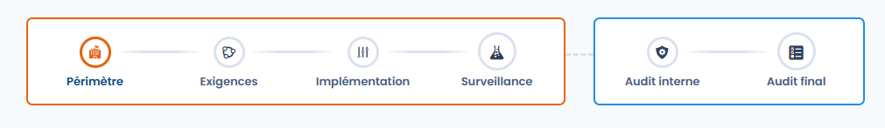
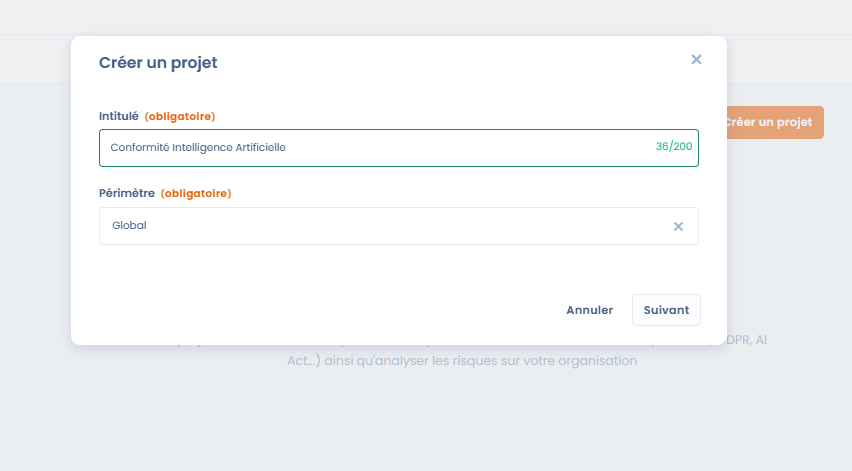
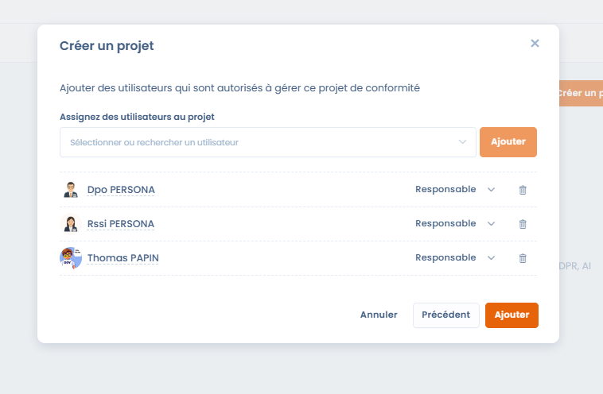
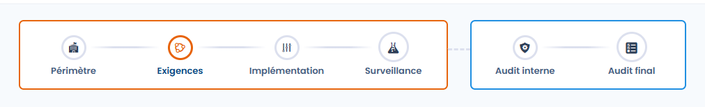
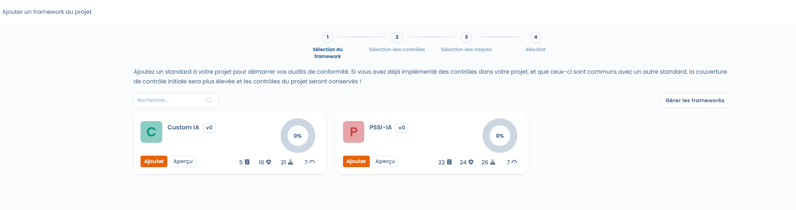
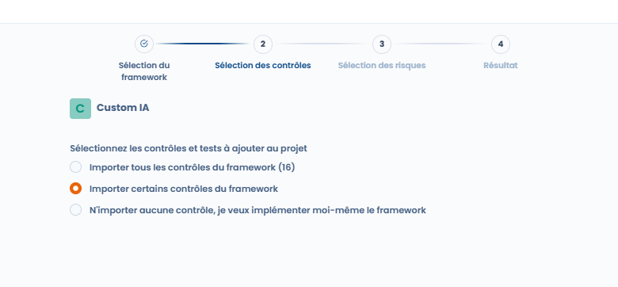
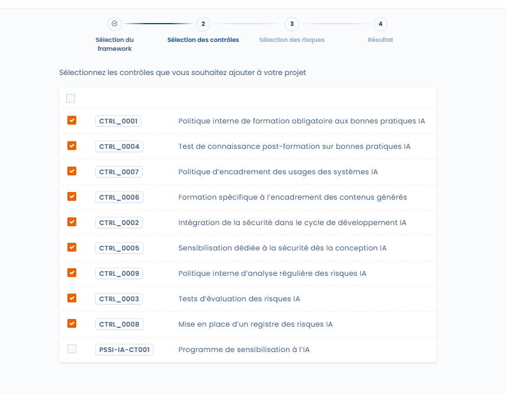
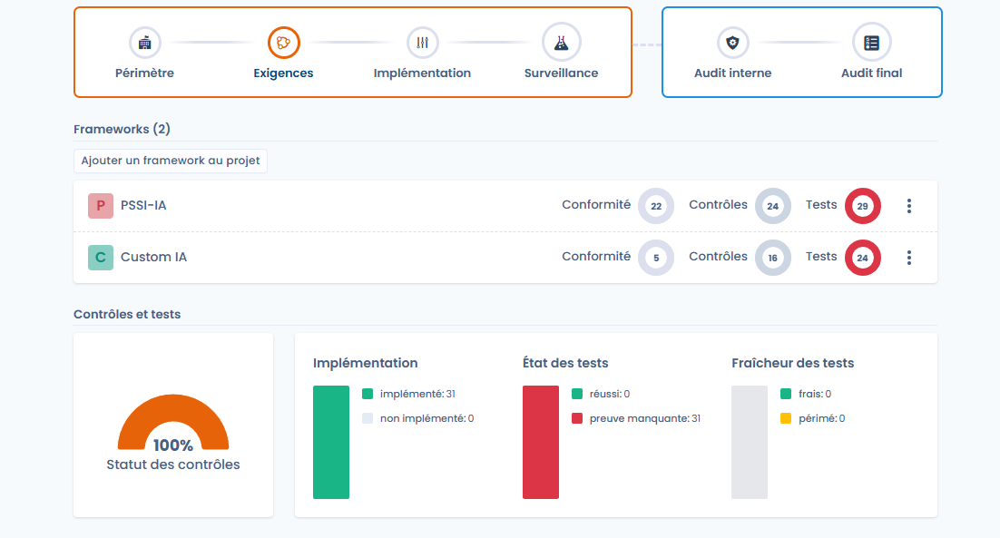
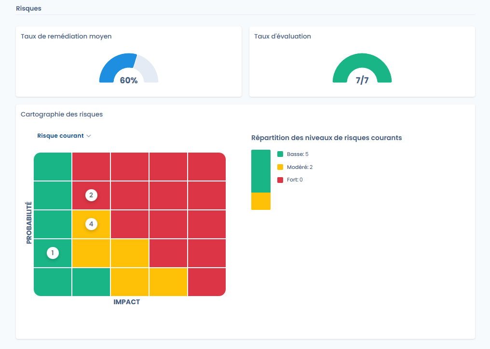

# Projektkonzeption

Sie ermöglicht die Definition des **organisatorischen Rahmens**, die Auswahl der **anwendbaren Referenzrahmen** und die automatische Initialisierung der zugehörigen Kontrollen, Tests und Risiken.

Dieser Schritt legt die Grundlagen des Projekts und bestimmt die Qualität der Nachverfolgung in den folgenden Phasen.

***

<figure><figcaption></figcaption></figure>

### 1. Projekterstellung und Definition des Geltungsbereichs

Bei der Projekterstellung muss ein **organisatorischer Geltungsbereich** ausgewählt werden.\
Der Geltungsbereich (Scope) umfasst eine oder mehrere Organisationseinheiten und bestimmt **den Anwendungsbereich des Compliance-Projekts**.



Nach der Projekterstellung wird der Geltungsbereich in der Projektkopfzeile angezeigt und während des gesamten Compliance-Zyklus verwendet.



<figure><figcaption></figcaption></figure>



***

### 2. Zuweisung von Nutzern zum Projekt



<figure><figcaption></figcaption></figure>



Die Konzeptionsphase ermöglicht es auch, **die zur Projektverwaltung berechtigten Nutzer zu bestimmen**.

* Jedem Nutzer kann eine Rolle zugewiesen werden (z. B.: Verantwortlicher).
* Diese Nutzer sind befugt, die Kontrollen, Tests und Audits des Projekts zu steuern.



***

<figure><figcaption></figcaption></figure>

### 3. Hinzufügen von Compliance-Frameworks

Ein Compliance-Projekt basiert auf einem oder mehreren **Frameworks** (Standards, interne oder benutzerdefinierte Referenzrahmen).

Das Hinzufügen eines Frameworks ermöglicht den Import von:

* den **Anforderungen**,
* den **Kontrollen**,
* den **Tests**,
* und den zugehörigen **Risiken**.

<figure><figcaption></figcaption></figure>

Es ist möglich, nacheinander mehrere Frameworks zum selben Projekt hinzuzufügen.

***

### 4. Gemeinsame Nutzung von Kontrollen zwischen Frameworks

Wenn mehrere Frameworks zum Projekt hinzugefügt werden, erkennt Dastra automatisch die **gemeinsamen Kontrollen**.

* Eine zwischen mehreren Frameworks geteilte Kontrolle **wird nur einmal importiert**.
* Ihre Umsetzung deckt gleichzeitig alle zugehörigen Anforderungen ab.
* Dies ermöglicht eine Erhöhung der Compliance-Abdeckung ohne Vervielfachung der Maßnahmen.

<figure><figcaption></figcaption></figure>

***

### 5. Auswahl der zu importierenden Kontrollen

Beim Hinzufügen eines Frameworks werden mehrere Optionen angeboten:

* **alle Kontrollen** des Frameworks importieren,
* **nur bestimmte Kontrollen** importieren,
* oder **keine Kontrollen importieren**, um sie manuell zu implementieren.

<figure><figcaption></figcaption></figure>

Diese Flexibilität ermöglicht die Anpassung des Projekts an den Reifegrad der Organisation.

***

### 6. Initialisierung der Kontrollen und Tests



Nach dem Import der Frameworks:

* Die **ausgewählten Kontrollen** werden automatisch zum Projekt hinzugefügt.
* Sie gelten standardmäßig als **implementiert**.
* Die **zugehörigen Tests** werden ebenfalls den Kontrollen zugeordnet.

Zu diesem Zeitpunkt:

* befinden sich die Tests im Status **„Nachweis fehlt"**,
* es wurden noch keine Nachweise gesammelt.







***

### 7. Vorbereitung der Risikoanalyse

Die **aus den Frameworks stammenden Risiken** können beim Import ausgewählt werden.

Sie bilden:

* die Grundlage für die **Bewertung des Anfangsrisikos**,
* den Bezugspunkt für die Berechnung des **Restrisikos** nach Anwendung der Kontrollen.

<figure><figcaption></figcaption></figure>

***

### Ergebnis der Konzeptionsphase

Am Ende der Konzeptionsphase verfügt das Projekt über:

* einen klar definierten Geltungsbereich,
* identifizierte Verantwortliche,
* importierte anwendbare Frameworks,
* gemeinsam genutzte und nachverfolgungsbereite Kontrollen,
* initialisierte Tests,
* und eine strukturierte Risikobasis.

Das Projekt ist dann bereit, in die nächste Phase einzutreten: **Implementierung**.
