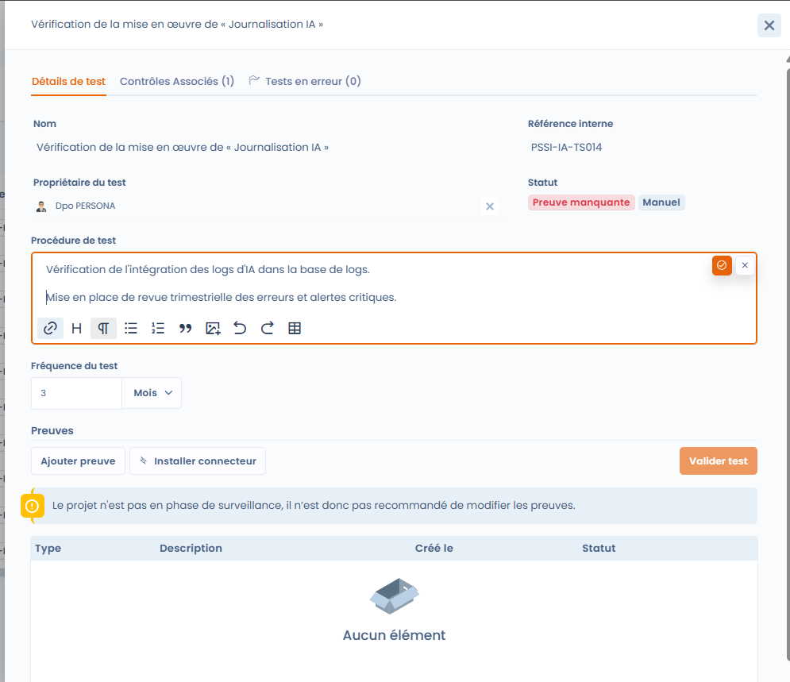
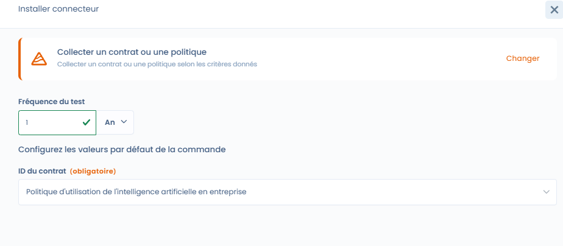
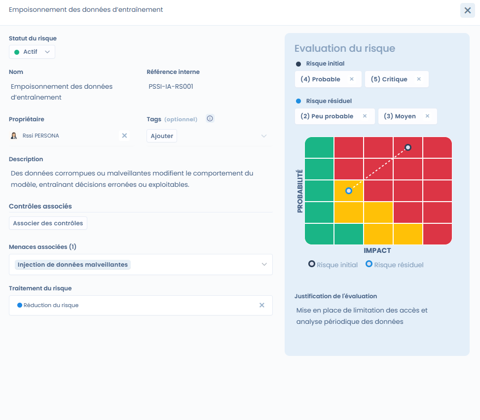
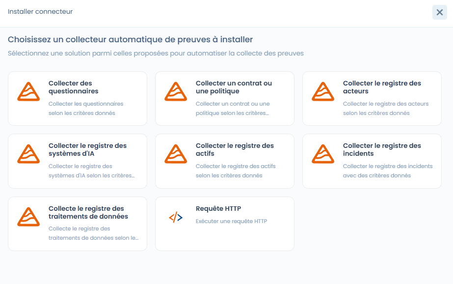

# Projektimplementierung

Sie besteht darin, die **Kontrollen konkret zu konfigurieren**, die Überprüfungsmodalitäten zu definieren und die Nachweissammlung vorzubereiten.

In diesem Stadium verfügt das Projekt bereits über:

* seine Frameworks,
* seine Kontrollen,
* seine während der Konzeption initialisierten Tests und Risiken.

***

### 🎯 Ziel der Phase

Das Ziel der Implementierungsphase ist:

* zu definieren, **wie die Kontrollen überprüft werden**,
* die **Tests (manuell oder automatisiert) zu konfigurieren**,
* die **Risiken den Kontrollen zuzuordnen**,
* die **Sammlung von Compliance-Nachweisen** vorzubereiten.

***

### 1. Verständnis des Teststatus in der Implementierungsphase

Standardmäßig befinden sich alle Tests des Projekts im Status **„Nachweis fehlt"**.

Das bedeutet:

* die Kontrolle existiert,
* der Test ist definiert,
* aber **es wurde noch kein Nachweis erbracht oder gesammelt**.

👉 Solange sich das Projekt nicht in der **Überwachungsphase** befindet, wird die Änderung oder Validierung der Nachweise nicht empfohlen.

<figure><figcaption></figcaption></figure>

***

### 2. Konfiguration der Compliance-Tests

Jede Kontrolle kann mithilfe eines oder mehrerer **Tests** überprüft werden.



Ein Test ermöglicht die Definition von:

* einem **Überprüfungsverfahren**,
* einer **Ausführungshäufigkeit** (z. B. monatlich, vierteljährlich, jährlich),
* einem **Testverantwortlichen**.

Die Tests können sein:

* **manuell**, erfordern eine menschliche Handlung und einen Nachweis,
* oder **automatisiert**, über einen Dastra-Konnektor oder benutzerdefinierten Konnektor.



<figure><figcaption></figcaption></figure>



***

### 3. Risiken zuordnen und bewerten

Die Kontrollen können mit einem oder mehreren **Risiken** verknüpft werden, um deren Auswirkung auf die Risikoreduktion zu messen.

Für jedes Risiko können Sie:

* eine **Anfangsbewertung** definieren (Wahrscheinlichkeit × Auswirkung),
* eine **Restbewertung** definieren, nach Anwendung der Kontrollen,
* die **Risikobehandlung** wählen (Reduktion, Akzeptanz usw.).

Dieser Ansatz ermöglicht es, die Wirkung der Kontrollen auf die Risikolage konkret zu visualisieren.

<figure><figcaption></figcaption></figure>

***

### 4. Bedrohungen, Risiken und Kontrollen verknüpfen

Die **Bedrohungen** stellen die konkreten Szenarien dar, die ein Risiko auslösen können\
(z. B.: Einschleusung bösartiger Daten, fehlende Überwachung, Informationsabfluss).

Eine Bedrohung kann:

* mit einem oder mehreren **Risiken** verknüpft sein,
* indirekt durch die umgesetzten **Kontrollen** abgedeckt werden.

Diese Verkettung ermöglicht eine vollständige Nachvollziehbarkeit:\
**Bedrohung → Risiko → Kontrolle → Test → Nachweis**

***

### 5. Einen Konnektor zur Automatisierung der Nachweise installieren

Für bestimmte Tests ist es möglich, einen **Dastra-Konnektor** zu installieren, um die Nachweissammlung zu automatisieren.

Die Konnektoren ermöglichen zum Beispiel:

* die Existenz einer Richtlinie oder eines Vertrags zu überprüfen,
* ein Verzeichnis abzufragen (KI-Systeme, Vorfälle, Verarbeitungen),
* wiederkehrende Kontrollen ohne manuellen Eingriff zu automatisieren.

Jeder Konnektor wird konfiguriert mit:

* einer **Ausführungshäufigkeit**,
* **Erfassungsparametern**, die an den Test angepasst sind.

<figure><figcaption></figcaption></figure>

***

### 6. Ergebnis der Implementierungsphase

Am Ende der Implementierungsphase:

* sind die **Kontrollen konfiguriert**,
* sind die **Tests bereit zur Ausführung**,
* sind die **Risiken bewertet und verknüpft**,
* sind die **eventuellen Konnektoren installiert**.

Das Projekt ist dann bereit, in die nächste Phase einzutreten: **Überwachung**, in der:

* die Tests regelmäßig ausgeführt werden,
* die Nachweise gesammelt werden,
* und die Compliance im Zeitverlauf gemessen wird.
