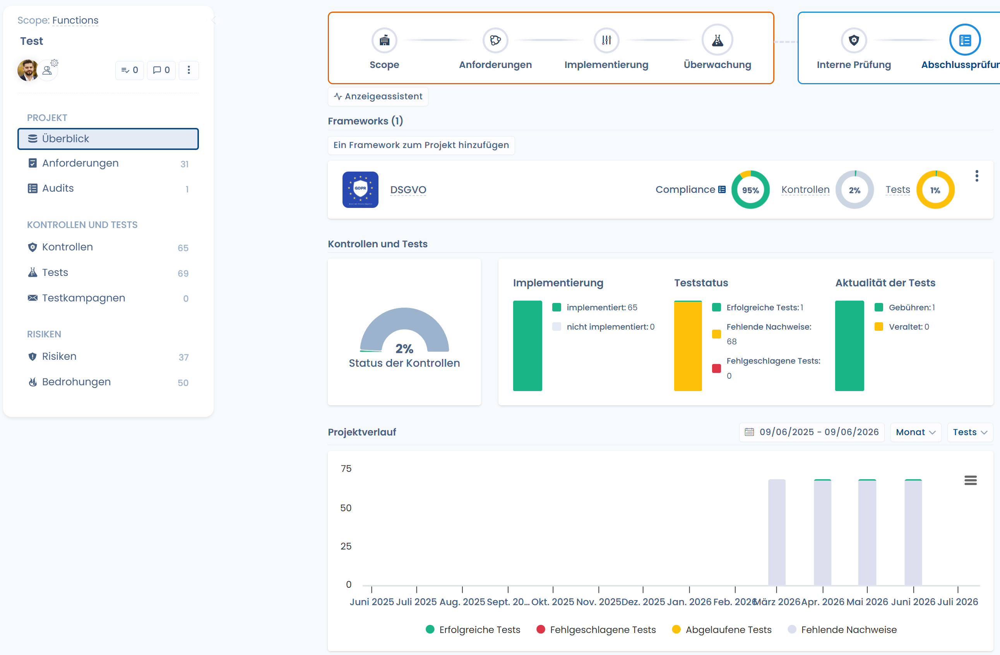
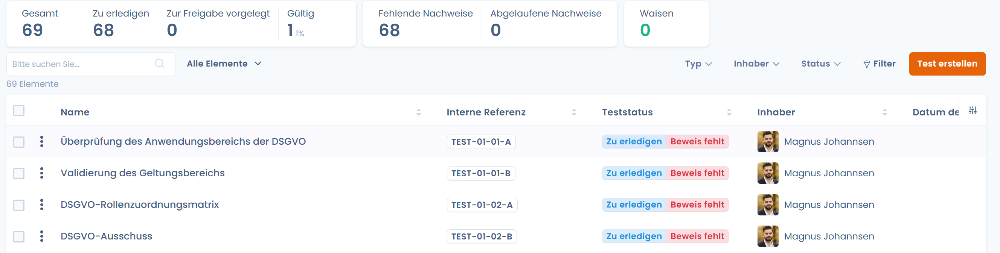
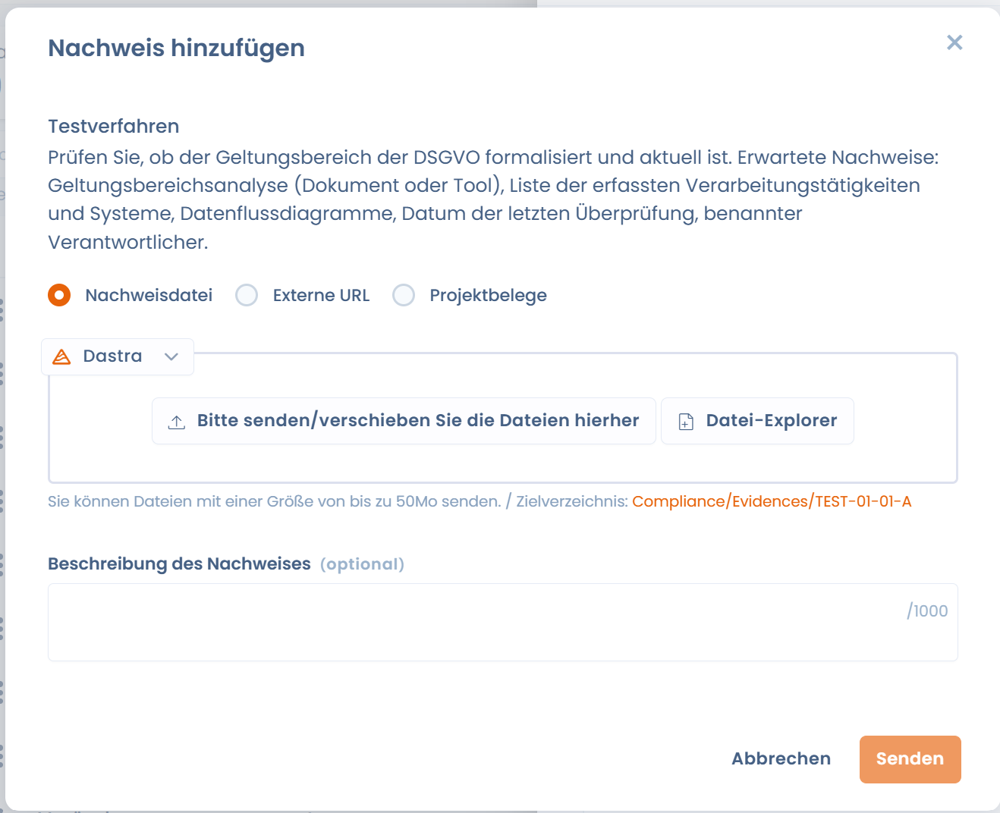
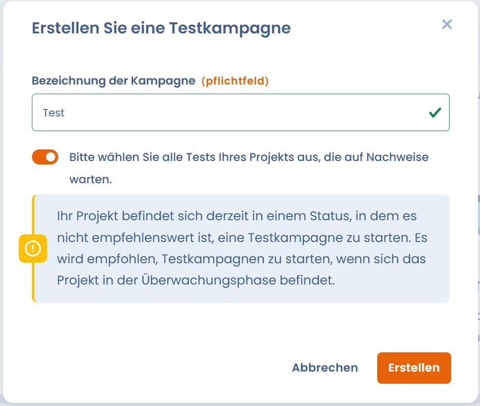
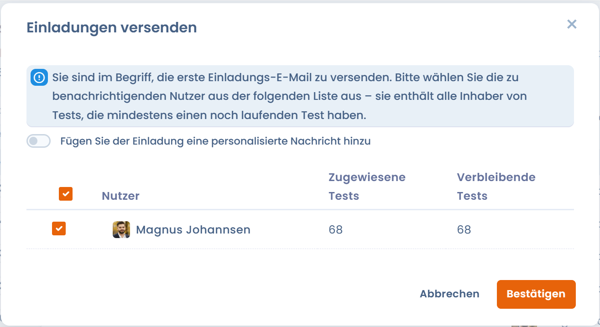
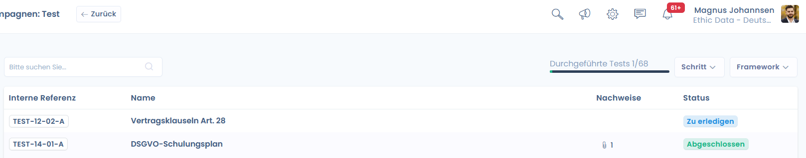

# Compliance-Überwachung

Sie zielt darauf ab, **die tatsächliche Wirksamkeit der Kontrollen im Zeitverlauf zu überprüfen**, die zugehörigen Nachweise zu sammeln und die Entwicklung der Compliance über wiederkehrende Testkampagnen zu verfolgen.

> 🎯 Ziel der Phase\
> Nachweise für das gesamte Projekt mithilfe von Testkampagnen sammeln, sicherstellen, dass möglichst viele Kontrollen bestanden werden, und ein messbares Compliance-Niveau im Zeitverlauf aufrechterhalten.

***

### Übersicht der Überwachungsphase

In dieser Phase wechselt das Projekt von einer Vorbereitungslogik zu einer **kontinuierlichen Ausführungslogik**:

* die Kontrollen sind bereits implementiert,
* die Tests werden regelmäßig ausgeführt,
* die Nachweise werden gesammelt, aktualisiert und bewertet,
* die Compliance-Indikatoren werden verwertbar.

<figure><figcaption></figcaption></figure>

***

### Globale Überwachung der Kontrollen und Tests

Die Überwachungsseite bietet eine zusammenfassende Übersicht des Projektstatus:

* **Status der Kontrollen**: Anteil der zufriedenstellenden oder zu verbessernden Kontrollen.
* **Status der Tests**:
  * bestandene Tests,
  * fehlende Nachweise,
  * fehlgeschlagene Tests.
* **Aktualität der Tests**:
  * aktuelle Tests,
  * abgelaufene Tests, die einen neuen Nachweis erfordern.

Diese Indikatoren ermöglichen es, schnell kritische Punkte zu identifizieren und Korrekturmaßnahmen zu priorisieren.

<figure><figcaption></figcaption></figure>

***

### Verwaltung der Nachweise



Die Nachweise bilden den Kern der Überwachungsphase.\
Sie können direkt aus einem Test hinzugefügt werden und in **mehreren Tests des Projekts wiederverwendet** werden.

Die verfügbaren Erfassungsmethoden umfassen insbesondere:

* Hinzufügen von Nachweisdateien,
* externe Links,
* Auswahl bereits im Projekt vorhandener Nachweise.

Jeder Nachweis kann dokumentiert werden, um nachfolgende Audits zu erleichtern.



<figure><figcaption></figcaption></figure>



***

### Testkampagnen

Die **Testkampagnen** ermöglichen die Orchestrierung der Testausführung im großen Maßstab.

Eine Kampagne ermöglicht:

* eine Reihe von auszuführenden Tests zusammenzufassen,
* jedem Test einen Inhaber zuzuweisen,
* eine globale Frist festzulegen,
* den Fortschritt zentral zu verfolgen.

Bei der Erstellung einer Kampagne ist es möglich, **automatisch alle Tests mit ausstehenden Nachweisen vorab auszuwählen**, um den Start zu erleichtern.

<figure><figcaption></figcaption></figure>

***

### Start und Verfolgung der Kampagnen



Sobald die Kampagne konfiguriert ist:

* erhalten die betroffenen Nutzer eine **Einladung per E-Mail**,
* eine personalisierte Nachricht kann hinzugefügt werden, um die Anfrage zu kontextualisieren,
* jeder Test wird individuell fortgeführt (_zu erledigen_, _abgeschlossen_).

Der globale Fortschritt der Kampagne ist in Echtzeit sichtbar, sodass der Projektverantwortliche schnell Verzögerungen oder Blockaden identifizieren kann.



<figure><figcaption></figcaption></figure>



***

### Validierung der Tests

Jeder Test verfügt über einen klaren Lebenszyklus:

* Einsicht in das Verfahren,
* Hinzufügen oder Aktualisierung der Nachweise,
* Validierung des Tests.

Nach der Validierung trägt der Test automatisch zur Verbesserung des Status der zugehörigen Kontrolle und zu den globalen Projektindikatoren bei. Die Einladung leitet den Nutzer zu einem personalisierten Tracking-Dashboard, in dem er die Nachweise für die Tests eingeben kann, für die er Inhaber ist.

<figure><figcaption></figcaption></figure>

***

### Erwartetes Ergebnis der Überwachungsphase

Am Ende dieser Phase verfügt das Projekt über:

* **gesammelte und nachvollziehbare Nachweise**,
* **regelmäßig ausgeführte und aktualisierte Tests**,
* eine **zuverlässige und messbare Sicht auf die tatsächliche Compliance**,
* eine solide Grundlage für die Vorbereitung der Phasen **internes Audit** und **Zertifizierung**.
