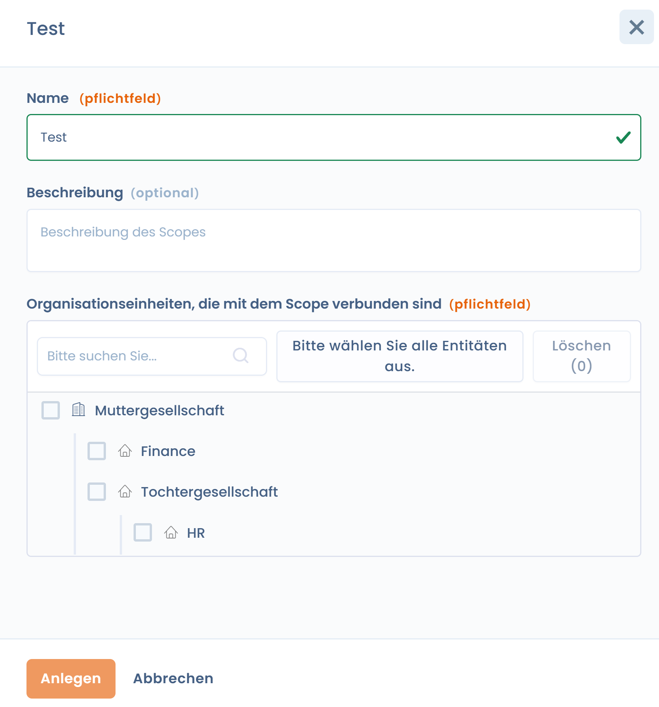

# Scopes

Sie dienen dazu, **Organisationseinheiten** zu gruppieren, um einen Compliance-Ansatz auf die gesamte Organisation oder Teile davon anzuwenden.

Ein Geltungsbereich beantwortet eine einfache Frage:

> _Auf welche organisatorischen Einheiten gilt dieses Compliance-Projekt?_

***

### Rolle der Scopes in Dastra

In Dastra werden die Scopes ausschließlich in den **Compliance-Projekten** verwendet.\
Sie ermöglichen:

* die betroffenen Einheiten gezielt anzusprechen,
* die Anforderungen, Kontrollen und Tests auf die richtige Ebene abzustimmen,
* die Compliance entsprechend der organisatorischen Realität zu strukturieren.

👉 Ein Scope ändert nicht die Frameworks:\
er **bestimmt, wo** die Compliance gilt, nicht **was** gilt.

***

### Eine flexible organisatorische Aufteilung

Ein Geltungsbereich wird anhand der im Mandanten vorhandenen **Organisationseinheiten** definiert.

Er kann darstellen:

* das gesamte Unternehmen (z. B. _Global_)
* eine Direktion oder Abteilung (z. B. _IT_, _HR_)
* einen Standort, eine Tochtergesellschaft oder eine spezifische Aktivität

Die Organisationseinheiten können einzeln oder in Gruppen ausgewählt werden, unter Berücksichtigung ihrer Hierarchie.

***

### Erstellung eines Scopes

Bei der Erstellung eines Scopes gibt der Nutzer an:

* **den Namen des Scopes** (z. B. _Global_, _IT & Sicherheit_)
* eine **optionale Beschreibung**
* die im Scope enthaltenen **Organisationseinheiten** (Pflichtfeld)

<figure><figcaption></figcaption></figure>

👉 Ein Scope muss immer **mindestens eine Organisationseinheit** enthalten.

***

### Beispiel eines Scopes

📌 Beispiel:

* **Name**: Global
* **Beschreibung**: Gesamtes Unternehmen
* **Organisationseinheiten**:
  * Global
  * HR
  * IT
  * Factory
  * Sub / Service

Dieser Scope kann anschließend in einem Compliance-Projekt ausgewählt werden, um anzugeben, dass dieses für die gesamte Organisation gilt.

***

### Best Practices

* Einen **globalen Scope** für übergreifende Ansätze erstellen
* **Eingeschränktere Scopes** für gezielte Projekte erstellen
* Scopes zwischen Projekten wiederverwenden, um Kohärenz zu gewährleisten
* Scopes eindeutig und fachlich benennen

***

### Verbindung mit Compliance-Projekten

Die Scopes werden **bei der Erstellung eines Compliance-Projekts** ausgewählt.

Sie ermöglichen:

* dasselbe Framework auf mehrere Einheiten anzuwenden,
* die Compliance nach Geltungsbereich zu verfolgen,
* die Ergebnisse zwischen verschiedenen Teilen der Organisation zu vergleichen.

***

### Zusammenfassung

Die Scopes sind ein **organisatorisches Rahmenwerkzeug**.\
Sie ermöglichen die Ausrichtung der Compliance an der tatsächlichen Unternehmensstruktur, ohne die Referenzrahmen zu verkomplizieren.
