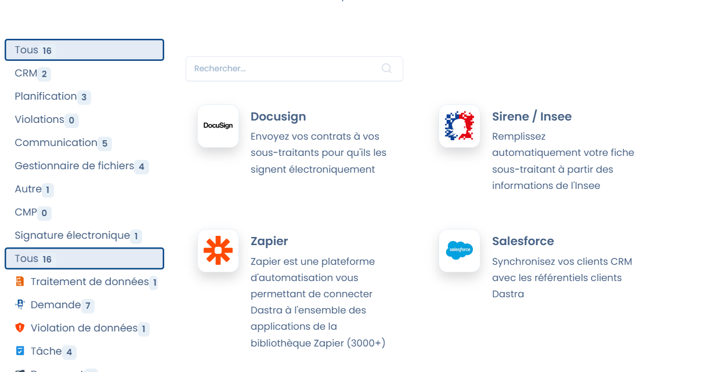
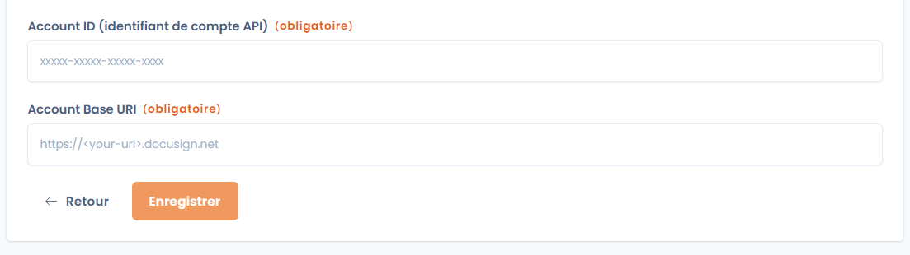
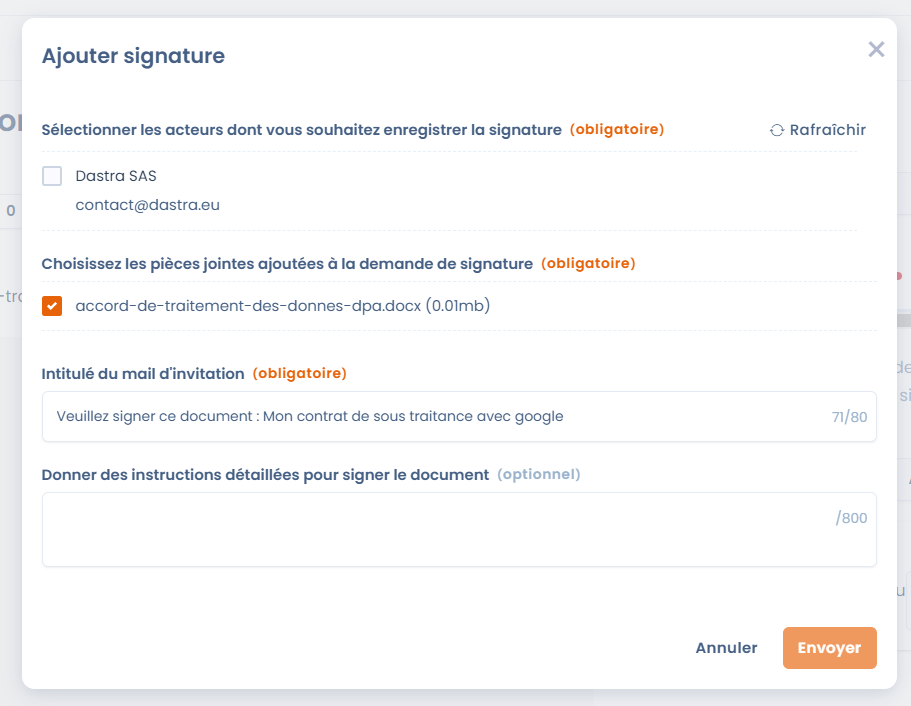
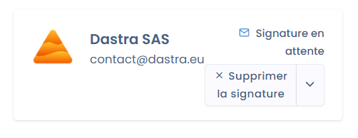

# Integration mit Docusign

Wir haben eine native Integration zwischen Dastra und DocuSign eingerichtet, dem weltweit führenden Anbieter für elektronische Unterschriften, die es Ihnen ermöglicht, Unterschriften direkt aus dem Vertragsmodul von Dastra zu versenden, zu leisten und deren Status zu verfolgen.&#x20;

Gehen Sie zu den [Einstellungen Ihres Mandanten, Registerkarte Integrationen](https://app.dastra.eu/workspace/2/settings/integrations), um die Integration einzurichten und im Unterschriftsbereich eines Vertrags darauf zuzugreifen.

<figure><figcaption>
Wählen Sie Docusign in den Integrationen aus
</figcaption></figure>

Sobald die Docusign-Integration geöffnet ist, klicken Sie bitte auf "Integration hinzufügen". Sie werden dann zur Docusign-Authentifizierung weitergeleitet, um Ihr Docusign-Konto mit Dastra zu verknüpfen.

Sobald die Verbindung hergestellt ist, müssen Sie in Dastra Ihre Docusign-AccountId und Ihre Docusign Account Base URI angeben, die Sie [hier finden](https://apps.docusign.com/admin/apps-and-keys).&#x20;

<figure><figcaption>
Die in Dastra einzugebenden Schlüssel aus Ihrem Docusign-Konto
</figcaption></figure>

Sobald diese Felder ausgefüllt sind, haben Sie die Einrichtung der Integration abgeschlossen. Sie können nun zum Vertragsmodul gehen und die Unterschriften Ihrer Verträge elektronisch verwalten.&#x20;

### Docusign-Unterschriftsoberfläche

Nachfolgend sehen Sie die Unterschriftsoberfläche eines Vertrags über Docusign (zugänglich über die Schaltfläche 'Unterschrift hinzufügen' eines Unterzeichners).

Um diese Seite validieren zu können, benötigen Sie zwingend einen Akteur (Unterzeichner) mit einer gültigen E-Mail-Adresse, einen zu unterschreibenden Anhang im Format .pdf, .doc, .docx und einen Betreff für die Einladungs-E-Mail zur Unterschrift.&#x20;

Sie können detaillierte Anweisungen für die Dokumentenunterschrift hinzufügen. Diese werden in die Einladungs-E-Mail zur Unterschrift aufgenommen und sind für den Unterzeichner auch in der Docusign-Oberfläche sichtbar, wenn er auf das zu unterschreibende Dokument zugreift.&#x20;

<figure><figcaption>
Oberfläche zum Versand der Unterschrift per Docusign über Dastra
</figcaption></figure>

Sobald die Unterschrift versendet wurde, wird ihr Status automatisch in Ihrem Vertrag synchronisiert und bei jeder Statusänderung der Unterschrift auf Docusign-Seite aktualisiert.

<figure><figcaption>
Eine ausstehende Unterschrift
</figcaption></figure>
