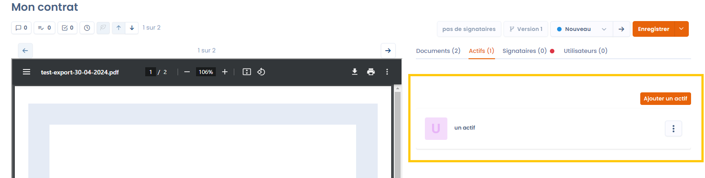

# Die Assets

In der Registerkarte Assets können Sie bestimmte Assets mit Ihrem Vertrag verknüpfen. Dies ermöglicht die Nachverfolgung der materiellen oder immateriellen Ressourcen, die an der Vertragserfüllung beteiligt sind, wie Geräte, Software oder Daten.

Die verknüpften Assets stammen aus Ihren [referentials](../cartography/referentials/ "mention"). Sie finden die mit Ihrem Vertrag verknüpften Assets im Vertrag, aber auch auf der Asset-Detailseite, wo Sie alle Verträge einsehen können, mit denen es verknüpft ist.

<figure><figcaption>
Erfassen Sie Assets in Ihrem Vertrag
</figcaption></figure>
