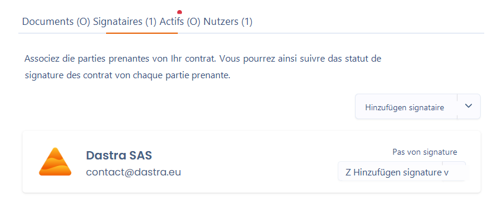

# Die Unterzeichner


Der Unterzeichner eines Vertrags ist in der Regel eine natürliche oder juristische Person, die **als Akteur in Dastra referenziert ist**.


Geben Sie die am Vertrag beteiligten Parteien an, indem Sie die erforderlichen Unterzeichner benennen.

Ein Unterzeichner wird durch einen Akteur aus Ihrem [referentials](../cartography/referentials/ "mention") dargestellt. Ebenso wie bei den Assets finden Sie auf der Detailseite der Akteure (Unterzeichner), die mit Ihrem Vertrag verknüpft sind, die Details aller Verträge, mit denen sie verknüpft sind.

<figure><figcaption>
Unterzeichner erfassen
</figcaption></figure>

Sie können die Unterschrift jedes Unterzeichners unabhängig verwalten (siehe Abschnitt [signer-le-contrat.md](signer-le-contrat.md "mention"))
