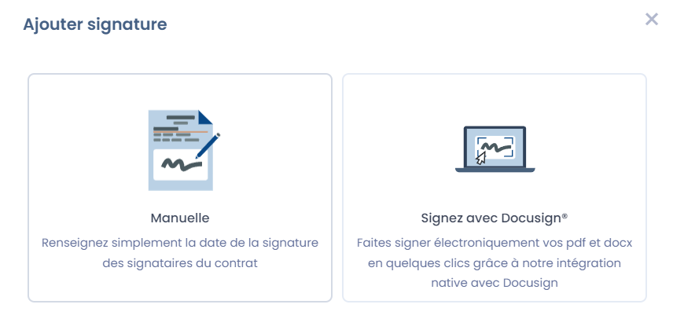
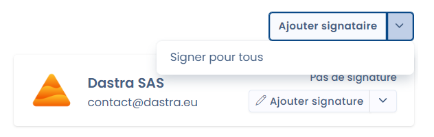
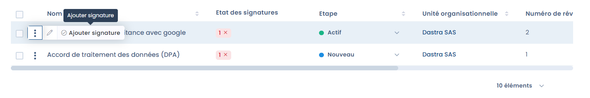
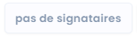
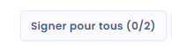
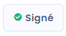

# Den Vertrag unterschreiben

Sobald Sie mindestens einen Unterzeichner zu Ihrem Vertrag hinzugefügt haben (siehe [les-signataires.md](les-signataires.md "mention")), können Sie die Unterschrift Ihres Vertrags verwalten. Bitte beachten Sie, dass es **zwingend erforderlich ist, Ihren Vertrag zu speichern, um unterschreiben zu können**. Jede noch nicht gespeicherte Änderung führt zur Sperrung der Unterschrift-Schaltfläche.

Sie können Unterschriften manuell erfassen oder unsere [Integration mit Docusign](integration-avec-docusign.md) einrichten, um den gesamten Unterschriftsprozess elektronisch zu verwalten.

<figure><figcaption></figcaption></figure>

Es gibt mehrere Möglichkeiten, auf dieses Unterschriftsmenü zuzugreifen:

#### 1) Die Unterschrift jedes Unterzeichners einzeln erfassen, indem Sie auf die Schaltfläche "Unterschrift hinzufügen" eines Unterzeichners klicken

#### 2) Mehrere Unterschriften gleichzeitig erfassen

Sie können mehrere Unterzeichner gleichzeitig unterschreiben lassen, indem Sie auf den Pfeil rechts neben der Schaltfläche "Unterzeichner hinzufügen" klicken. Ihnen wird dann angeboten, alle Unterzeichner auszuwählen, für die Sie unterschreiben möchten.

<figure><figcaption></figcaption></figure>

#### 3) Aus der Tabellenansicht unterschreiben

Sie können einen Vertrag direkt aus der zusammenfassenden Tabellenansicht unterschreiben

<figure><figcaption></figcaption></figure>

### Die Unterschrift-Schaltfläche im Hauptaktionsbereich

Im Hauptaktionsbereich Ihres Vertrags (siehe [structure-dun-contrat.md](structure-dun-contrat.md "mention")) finden Sie eine Schaltfläche, die sich auf die Unterschriften bezieht.

Je nach Anzahl der erfassten Unterzeichner und der erhaltenen Unterschriften ändert sich der Status dieser Schaltfläche

#### 1) Keine Unterzeichner

Erfassen Sie Unterzeichner, um mit dieser Schaltfläche interagieren zu können

<figure><figcaption>
Keine Unterzeichner
</figcaption></figure>

#### 2) Unterschriften fehlen

Durch Klicken auf diesen Status können Sie die fehlenden Unterschriften erfassen

<figure><figcaption></figcaption></figure>

#### 3) Vertrag von allen Unterzeichnern unterschrieben

Durch Klicken auf diesen Status können Sie Unterschriften löschen

<figure><figcaption></figcaption></figure>
