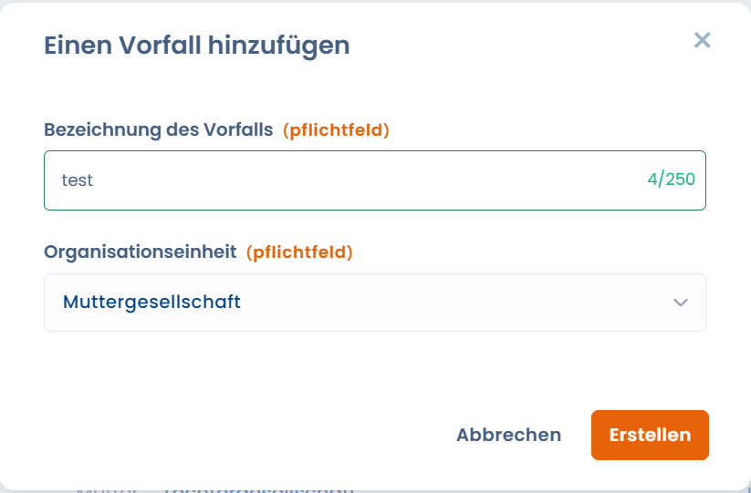
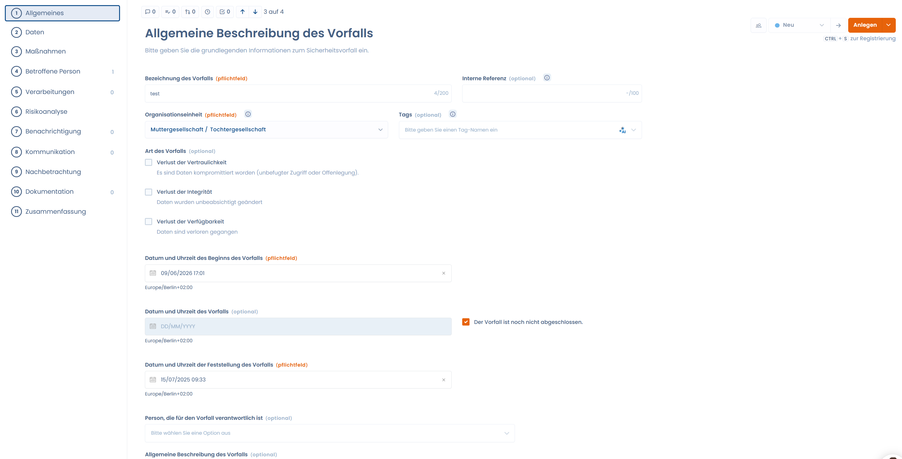
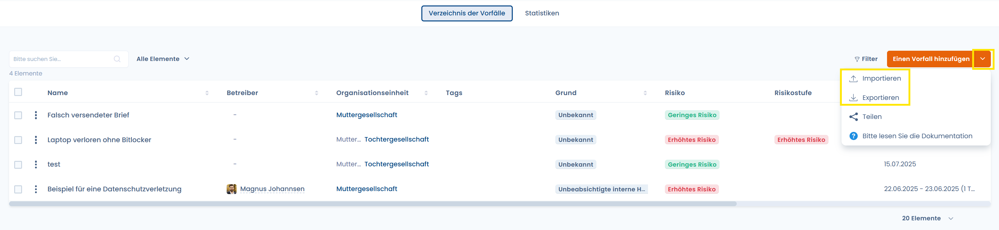
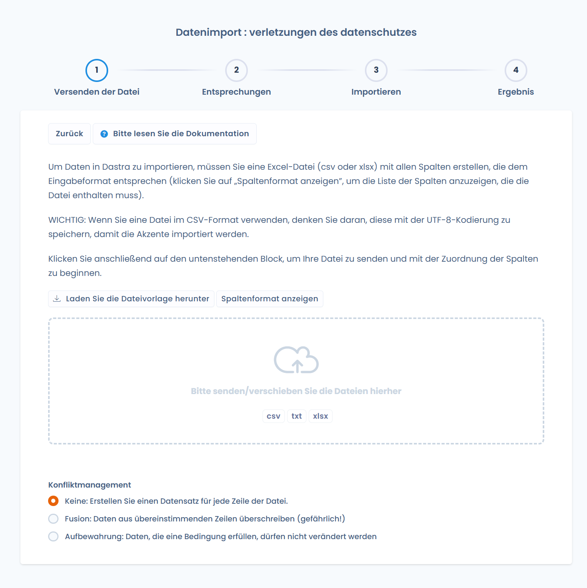

# Einen neuen Datenschutzvorfall dokumentieren

## Einführung

Es gibt 2 Möglichkeiten, einen neuen Datenschutzvorfall in DASTRA zu erfassen:

1. Jeden neuen Datenschutzvorfall direkt manuell erfassen
2. Datenschutzvorfälle per Excel-, CSV- oder Textdatei importieren

### Manuelle Dokumentation eines Datenschutzvorfalls

Durch Klicken auf die Schaltfläche „**Einen Vorfall hinzufügen**" erscheint ein Fenster, in dem Sie dem Vorfall einen Namen geben, und eine Organisationseinheit zuordnen können. Anschließend klicken Sie auf "**Erstellen**"

<figure><figcaption></figcaption></figure>

Im nächsten Fenster Datenschutzvorfall detailliert beschreiben können. Folgen Sie den Schritten und klicken Sie auf „**Anlegen**". Fertig – Sie haben Ihren ersten Datenschutzvorfall manuell dokumentiert!

### Import / Export des Verzeichnisses der Datenschutzvorfälle

Das gesamte Verzeichnis der Datenschutzvorfälle kann importiert und exportiert werden. Um einen Datenschutzvorfall zu importieren, klicken Sie auf das **Pfeilsymbol** neben der Schaltfläche „**Einen Vorfall hinzufügen**".

Ein Fenster erscheint mit einer Schaltfläche „**Importieren**". Klicken Sie darauf, laden Sie die Verzeichnisvorlage herunter und folgen Sie den Anweisungen, um die Datenschutzvorfälle in Dastra zu importieren. Nach dem Import ist der Datenschutzvorfall direkt im Verzeichnis der Datenschutzvorfälle verfügbar.

### Wie führt man eine Risikoanalyse des Datenschutzvorfalls durch?
