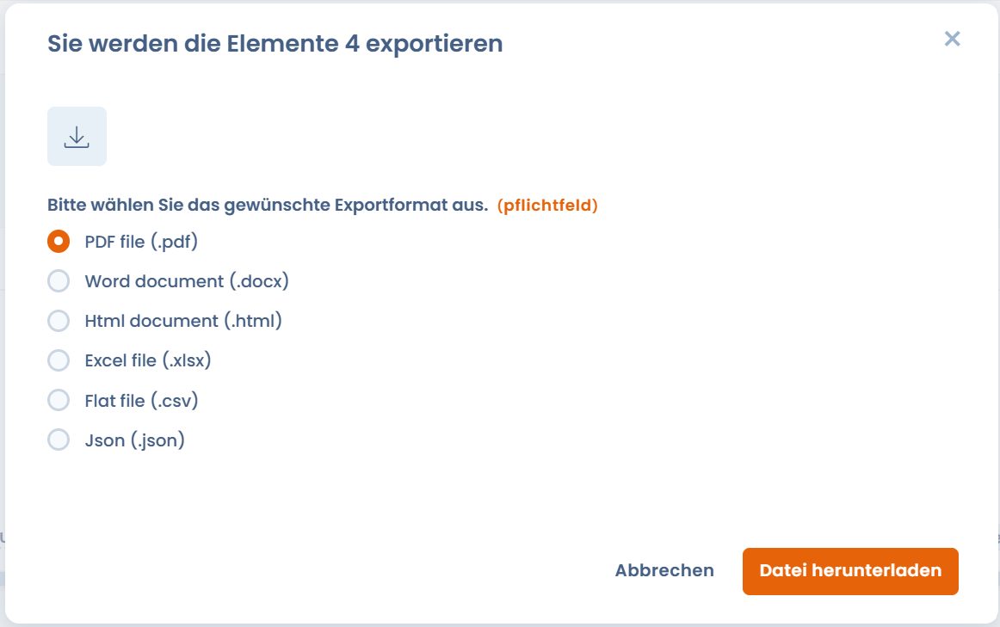

# Ihre Datenschutzvorfälle exportieren

Das gesamte Verzeichnis der Datenschutzvorfälle kann exportiert werden. Um einen Datenschutzvorfall zu exportieren, klicken Sie auf den **Pfeil** rechts auf dem Bildschirm und dann auf die Schaltfläche „**Exportieren**".

.png>)

Ein Fenster erscheint mit einer Auswahl möglicher Exportformate. Klicken Sie auf das gewünschte Format und dann auf die Schaltfläche „**Datei herunterladen**".

Fertig – Ihre Datenschutzvorfälle sind exportiert!
