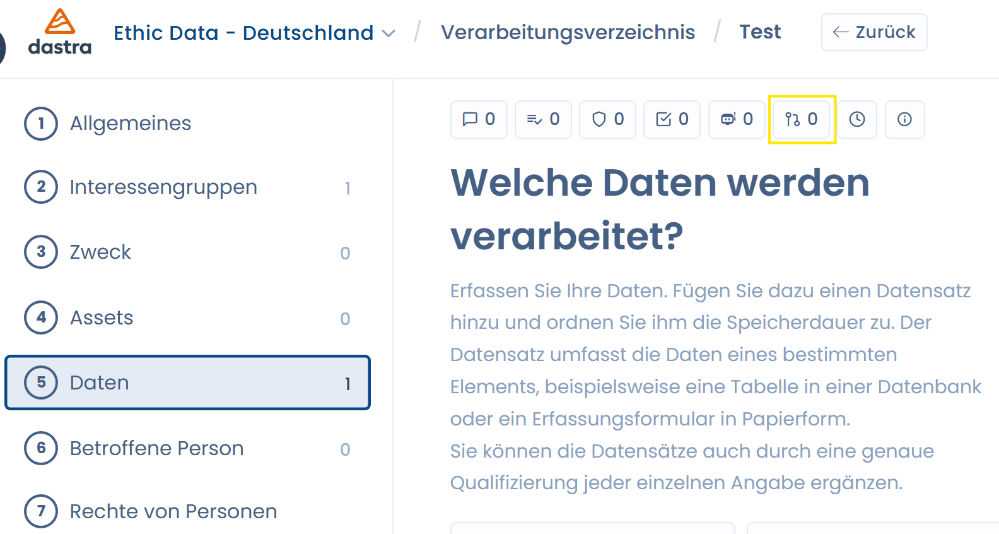
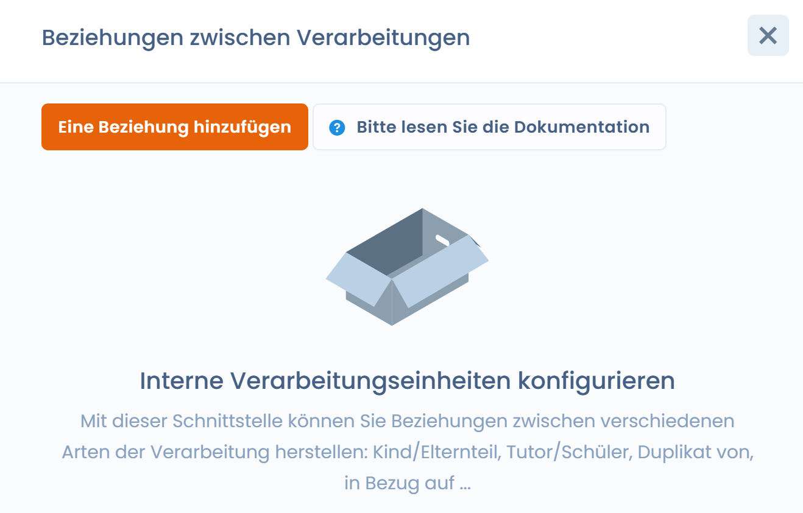
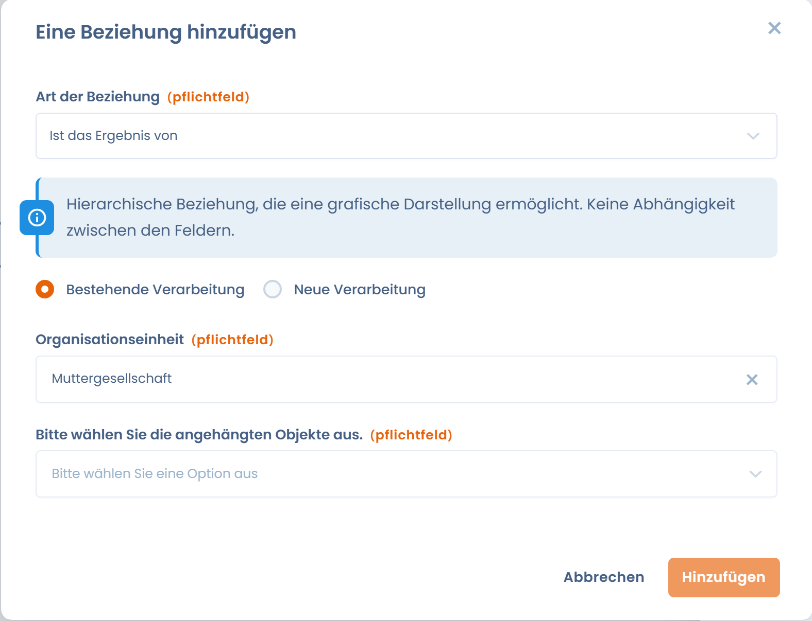

# Beziehungen zwischen Verarbeitungen erstellen

In Dastra haben Sie die Möglichkeit, Beziehungen zwischen Ihren Verarbeitungen zu erstellen, um deren Verwaltung zu erleichtern.

Diese Beziehungen sind zwischen Verarbeitungen möglich, die sich im selben Mandanten befinden.

### Warum Beziehungen zwischen Verarbeitungen erstellen?

Beziehungen zwischen Verarbeitungen können genutzt werden, um die Verantwortlichkeitsbeziehungen zwischen den verschiedenen verantwortlichen Entitäten darzustellen.

Beispielsweise können Sie in einem Unternehmensverbund eine Beziehung zwischen einer Verarbeitung der Muttergesellschaft und den Verarbeitungen der Tochtergesellschaften herstellen. Dies ist häufig bei Verarbeitungen im Bereich der allgemeinen Verwaltung des Konzerns der Fall, wie Personalverwaltung, Buchhaltung, Lieferantenmanagement usw.

> Eine Muttergesellschaft X führt eine Gehaltsabrechnungsverarbeitung für ihre Tochtergesellschaften Y und Z durch. In der Entität X wird eine Verarbeitung (ST1) "Gehaltsabrechnung" als Auftragsverarbeiter erstellt. Ausgehend von dieser Verarbeitung können wir eine starke Vererbungsbeziehung mit zwei weiteren Verarbeitungen (RT1 und RT2) in Y und Z erstellen, die als Verantwortlicher erstellt werden.
>
> So wird die Aktualisierung der Verarbeitung ST1 automatisch an die Verarbeitungen RT1 und RT2 weitergeleitet.

### Eine Beziehung hinzufügen

Gehen Sie dazu auf ein Verarbeitungsblatt und wählen Sie den Tab "Beziehungen" oben auf dem Blatt aus.

<figure><figcaption>
Schaltfläche zur Erstellung von Verarbeitungsbeziehungen
</figcaption></figure>

<figure><figcaption></figcaption></figure>

Wählen Sie dann einen Beziehungstyp aus.

<figure><figcaption>
Erstellung neuer Beziehungen
</figcaption></figure>

Sie können Beziehungen zu mehreren Verarbeitungen gleichzeitig erstellen. Dazu müssen Sie neue Verarbeitungen erstellen und die betreffenden Organisationseinheiten auswählen.


Es ist nur möglich, Beziehungen mit Verarbeitungen zu erstellen, die sich im selben Mandanten befinden.


### Beziehungstypen

Es gibt zwei Arten von Beziehungen:

1. **Deklarative Beziehungen:** Werden verwendet, um eine einfache Verknüpfung zwischen zwei Verarbeitungen herzustellen (ohne funktionale Abhängigkeit).
2. **Funktionale Beziehungen:** Ermöglichen die Übertragung oder Vererbung von Feldern von einer Verarbeitung zu einer anderen.

### Deklarative Beziehungen:

#### **Ist Kind von:**

Hierarchische Beziehung, die eine strukturierte Lesart der Verarbeitungen ermöglicht, **ohne funktionale Abhängigkeit** zwischen den Feldern.

> Verarbeitung A ist hierarchisch der Verarbeitung B zugeordnet.

#### Ist Elternteil von:

Hierarchische Beziehung, die eine strukturierte Lesart der Verarbeitungen ermöglicht, **ohne funktionale Abhängigkeit** zwischen den Feldern.

> Verarbeitung A steht hierarchisch über Verarbeitung B.

#### Bezieht sich auf:

Einfache logische Verknüpfung zwischen zwei Verarbeitungen, **ohne Abhängigkeit oder funktionale Unterordnung** zwischen den Feldern.

> Verarbeitung A ist mit Verarbeitung B verknüpft. 

#### Wird kopiert durch:

Diese Beziehung ermöglicht es, die von dieser Verarbeitung duplizierten Elemente nachzuverfolgen. Diese Beziehung wird automatisch beim Duplizieren einer Verarbeitung erstellt.

> Verarbeitung A ist die Quelle (der Duplizierung) der Verarbeitung B.

#### Ist eine Kopie von:

Diese Beziehung ermöglicht es, die Quelle der Duplizierung der Verarbeitung nachzuverfolgen. Diese Beziehung wird automatisch beim Duplizieren einer Verarbeitung erstellt.

> Verarbeitung A ist ein Duplikat der Verarbeitung B.

### **Funktionale Beziehungen**:

#### Überträgt strikt (Starke Vererbung):

Die Felder der Zielverarbeitung **A** ersetzen vollständig die der Ursprungsverarbeitung **B.**


mit Ausnahme der Felder des Tabs **1 "Allgemein"** und der der Verarbeitung zugeordneten Dokumente im Tab **11 "Dokumentation"**.


* Strikte Unterordnung zwischen A und B.
* Die vorhandenen Felder in B werden bei der Erstellung der Verknüpfung gelöscht.
* Die von A geerbten Felder sind **weder bearbeitbar noch löschbar**, und es können keine neuen Felder in B hinzugefügt werden.
* Bei Löschung der Verknüpfung werden die ursprünglichen Felder von B wiederhergestellt (wobei die Referenzsystem-Elemente erhalten bleiben).

#### Erbt strikt von (Starke Vererbung):

Die Felder der Zielverarbeitung **B** ersetzen vollständig die der Ursprungsverarbeitung **A**.


mit Ausnahme der Felder des Tabs **1 "Allgemein"** und der der Verarbeitung zugeordneten Dokumente im Tab **11 "Dokumentation"**.


* Strikte Unterordnung zwischen B und A.
* Die vorhandenen Felder in A werden bei der Erstellung der Verknüpfung gelöscht.
* Die von B geerbten Felder sind **weder bearbeitbar noch löschbar**, und es können keine neuen Felder in A hinzugefügt werden.
* Bei Löschung der Verknüpfung werden die ursprünglichen Felder von B wiederhergestellt.


Eine Verarbeitung kann nicht gleichzeitig von mehreren Verarbeitungen erben.


#### Überträgt (Schwache Vererbung):

Die Ursprungsverarbeitung **A** überträgt automatisch ihre Felder an die Zielverarbeitung **B**.


mit Ausnahme der Felder des Tabs **1 "Allgemein"** und der der Verarbeitung zugeordneten Dokumente im Tab **11 "Dokumentation"**.


* **A** überträgt seine Felder an **B**.
* Die geerbten Felder sind in B nicht bearbeitbar.
* B kann eigene Felder hinzufügen, bearbeiten oder löschen.
* Jede Änderung der Felder von A wird automatisch in B übernommen.
* Bei Löschung der Verknüpfung werden die geerbten Felder wieder bearbeitbar.
* Die vorhandenen Felder in B bleiben erhalten.

#### Erbt von (Schwache Vererbung):

Die Zielverarbeitung **B** erbt automatisch die Felder der Ursprungsverarbeitung **A**.


mit Ausnahme der Felder des Tabs **1 "Allgemein"** und der der Verarbeitung zugeordneten Dokumente im Tab **11 "Dokumentation"**.


* **B** erbt die Felder von **A**.
* Die geerbten Felder sind in B nicht bearbeitbar.
* B kann eigene Felder hinzufügen, bearbeiten oder löschen.
* Jede Änderung der Felder von A wird automatisch in B übernommen.
* Bei Löschung der Verknüpfung werden die geerbten Felder wieder bearbeitbar.
* Die vorhandenen Felder in B bleiben erhalten.


Eine Verarbeitung kann nicht gleichzeitig von mehreren Verarbeitungen erben.


### Übersichtstabelle der Beziehungen:

| **Beziehungstyp**                                                                                           | **Tab 1 – "Allgemein"** | **Tabs 2 bis 10 (Fachfelder)** | **Hochgeladene Dokumentation** im Tab 11 – "**Dokumentation"** | **Bearbeitbarkeit der eigenen Felder der Zielverarbeitung** |
| ----------------------------------------------------------------------------------------------------------- | ----------------------- | ------------------------------ | -------------------------------------------------------------- | ----------------------------------------------------------- |
| **Hierarchische / logische Beziehungen** (Elternteil / Kind / Bezieht sich auf / Kopiert durch / Kopie von) | Ohne Auswirkung         | Ohne Auswirkung                | Ohne Auswirkung                                                | Ohne Auswirkung                                             |
| **Überträgt strikt (Starke Vererbung)**                                                                     | ❌ Nicht übertragen      | ✅ Übertragen                   | ❌ Nicht übertragen                                             | ❌ Hinzufügen / Bearbeiten / Löschen nicht möglich           |
| **Erbt strikt von (Starke Vererbung)**                                                                      | ❌ Nicht geerbt          | ✅ Geerbt                       | ❌ Nicht geerbt                                                 | ❌ Hinzufügen / Bearbeiten / Löschen nicht möglich           |
| **Überträgt (Schwache Vererbung)**                                                                          | ❌ Nicht übertragen      | ✅ Übertragen                   | ❌ Nicht übertragen                                             | ✅ Hinzufügen / Bearbeiten / Löschen möglich                 |
| **Erbt von (Schwache Vererbung)**                                                                           | ❌ Nicht geerbt          | ✅ Geerbt                       | ❌ Nicht geerbt                                                 | ✅ Hinzufügen / Bearbeiten / Löschen möglich                 |
