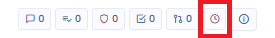
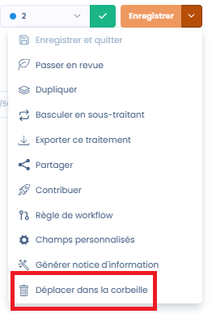
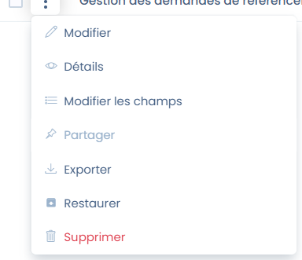
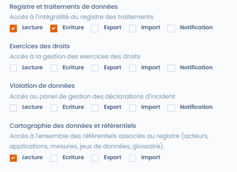
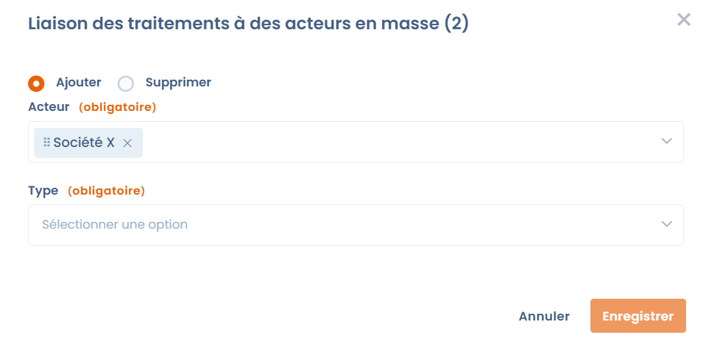
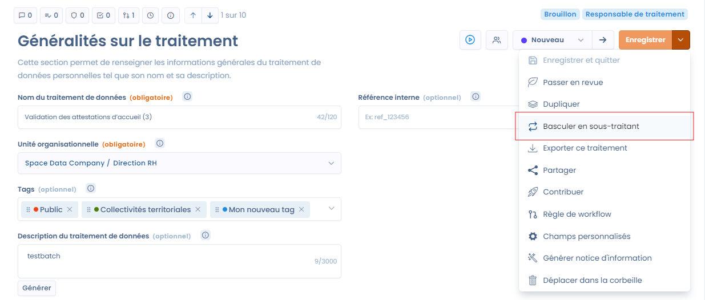
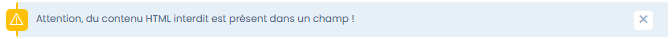
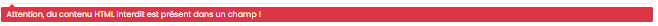
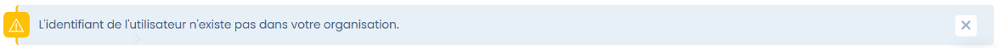
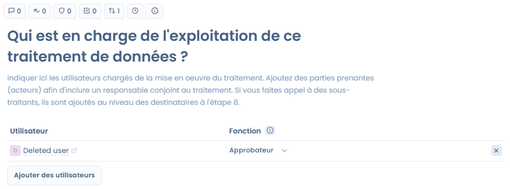

# Häufig gestellte Fragen

## Wie zeigt man den Änderungsverlauf einer Verarbeitung an?

Für alle Verarbeitungen können Sie den Änderungsverlauf sowie die Details der Änderungen anzeigen.

Klicken Sie dazu einfach auf das Uhrsymbol oben auf der Seite.

<figure><figcaption>
Schaltfläche zum Zugriff auf den Verlauf
</figcaption></figure>

Achtung, Änderungen an Organisationseinheiten werden nicht nachverfolgt.

## Ist es möglich, automatisch Elemente im Feld "Interessengruppen" bei einer neuen Verarbeitung hinzuzufügen?

Nein, Interessengruppen können nicht automatisch über automatisierte Workflows aktualisiert werden.

Es ist jedoch möglich, ein benutzerdefiniertes Feld auf Ebene der Interessengruppen zu erstellen, das über den automatisierten Workflow geändert werden kann.

## Wie löscht man eine Verarbeitung?

Um eine Verarbeitung zu löschen, ist ein Umweg über den Papierkorb erforderlich: Klicken Sie auf "In den Papierkorb verschieben" und zeigen Sie dann den Papierkorb über die Filter an. Dort ist es möglich, die Verarbeitung endgültig zu löschen. Dies dient als Schutzmaßnahme gegen vorschnelle Löschungen.

Um eine Verarbeitung in den Papierkorb zu verschieben, gehen Sie auf die drei kleinen Punkte auf der Verarbeitung, um das Menü anzuzeigen.

<figure><figcaption></figcaption></figure>

Und schließlich die Archive anzeigen

<figure><figcaption></figcaption></figure>

und löschen

<figure><figcaption></figcaption></figure>

## Wie verwendet man Datensätze, ohne die Daten ändern zu können?

Sie fragen sich, wie Sie den Zugriff auf die Daten (Felder) der Datensätze einschränken können, um Probleme mit der Verknüpfung zu anderen Verarbeitungsblättern zu vermeiden.

Es ist nämlich möglich, dass Ihre DSB-Vertreter die von Ihnen vorgeschlagenen Datensätze verwenden müssen, ohne neue erstellen zu dürfen.

In diesem Fall sollte eine benutzerdefinierte Rolle erstellt werden.

Gehen Sie dazu zu den Rollen: [https://app.dastra.eu/general-settings/roles](https://app.dastra.eu/general-settings/roles)

Erstellen Sie dann eine benutzerdefinierte Rolle mit den Berechtigungen:

* Verzeichnis: Lesen, Schreiben
* Datenkartierung: Lesen

<figure><figcaption>
Rolle, die den Zugriff auf Datensätze ohne Bearbeitungsmöglichkeit ermöglicht
</figcaption></figure>

Weisen Sie dann diese Rolle den betreffenden Nutzern zu.

Sie werden die Elemente der Datenkartierung nicht ändern können.


Wenn Sie die Antwort in diesem Leitfaden nicht finden, können Sie uns [über den Support kontaktieren](../../getting-started/le-support/faire-une-demande-de-support.md)


## Interessengruppen oder Empfänger zu mehreren Verarbeitungen hinzufügen?

Sie können Interessengruppen zu mehreren Verarbeitungen gleichzeitig hinzufügen, indem Sie Massenänderungen verwenden.

Gehen Sie dazu in die Tabellenansicht des Verzeichnisses und wählen Sie die Verarbeitungen mit den Kontrollkästchen aus.

Anschließend sehen Sie die Schaltfläche "Gruppenaktionen wählen" erscheinen.

Wählen Sie die Option "Stakeholder verknüpfen" und fügen Sie Ihre Stakeholder als Interessengruppe hinzu.

<figure><figcaption></figcaption></figure>

## Die Liste der Assets nach Organisationseinheit (OE) erhalten?

Sie können die Liste der nach Organisationseinheit verteilten Assets über deren Verknüpfungen mit den Verarbeitungen erhalten.

Sie können den Export der Verarbeitungen im Excel-Format dafür verwenden. Durch Filtern der Verarbeitungen nach OE und Exportieren der ausgewählten Verarbeitungen können Sie wählen, nur das Feld Assets im Export zu exportieren. So erhalten Sie den Export der Assets nach OE. Sie können auch wählen, nur die OE und die Assets zu exportieren, um alle Assets aller OE zu erhalten. Über die Datenkartierungsansicht des Verzeichnisses finden Sie diese Information ebenfalls als grafische Darstellung.

## Wie dupliziert man ein Verzeichnis in einen anderen Mandanten?

Sie können ein Verzeichnis und die zugehörigen Verarbeitungen auf verschiedene Weise duplizieren:

* entweder durch [Export und Re-Import](exporter-importer-le-registre.md) der Verarbeitungen im JSON-Format
* oder indem Sie zum Zielmandanten gehen und die Verarbeitungen aus der Bibliothek erstellen. Sie können dann die Quelle der Bibliothek ändern und den Ursprungsmandanten des Verzeichnisses wählen.

## Wie ändert man den Verarbeitungstyp (von einer als Verantwortlicher erstellten Verarbeitung zu einer als Auftragsverarbeiter erstellten Verarbeitung und umgekehrt)?

Sie können den Verarbeitungstyp ändern, indem Sie auf "Zu Auftragsverarbeiter wechseln" oder "Zu Verantwortlicher wechseln" klicken:

<figure><figcaption></figcaption></figure>

## Fehlermeldung: "Das Feld Label ist erforderlich."

Diese Meldung erscheint in der Regel, wenn ein Element bei der Beantwortung eines Fragebogens leer gelassen wurde. 

## Fehlermeldung: "Achtung, verbotener HTML-Inhalt ist in einem Feld vorhanden!"

<figure><figcaption>
Achtung, verbotener HTML-Inhalt ist in einem Feld vorhanden!
</figcaption></figure>

\
Diese Meldung bedeutet, dass HTML-Code (in der Regel zwischen spitzen Klammern <> enthalten) in einem Feld vorhanden ist, in dem HTML (aus Sicherheitsgründen) verboten ist. 

\
Die folgende Meldung ermöglicht eine einfache Identifizierung des betreffenden Felds:

<figure><figcaption>
Achtung, verbotener HTML-Inhalt ist in einem Feld vorhanden
</figcaption></figure>

## Fehlermeldung: "Die Nutzer-ID existiert nicht in Ihrer Organisation." beim Speichern einer Verarbeitung

<figure><figcaption>
Die Nutzer-ID existiert nicht in Ihrer Organisation.
</figcaption></figure>

Diese Meldung bedeutet, dass ein Nutzer, der aus Ihrem Mandanten gelöscht wurde, noch als Genehmiger in den Interessengruppen der Verarbeitung definiert ist:

<figure><figcaption>
Gelöschter Nutzer, der als Interessengruppe der Verarbeitung definiert ist
</figcaption></figure>

Entfernen Sie den gelöschten Nutzer aus den Interessengruppen der Verarbeitung, um das Problem zu beheben.
