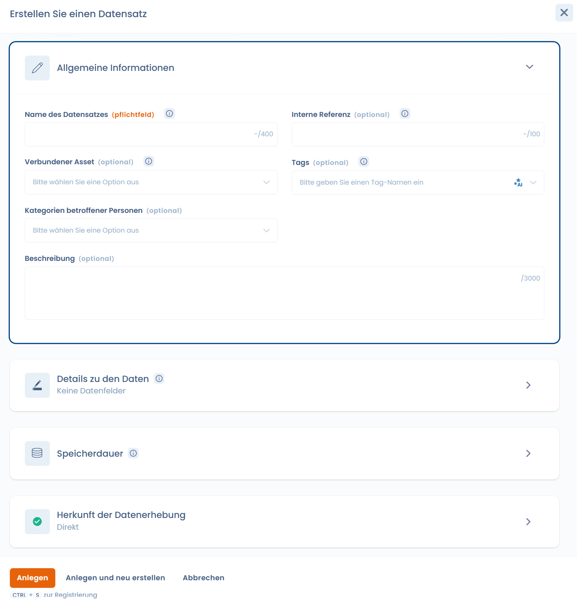
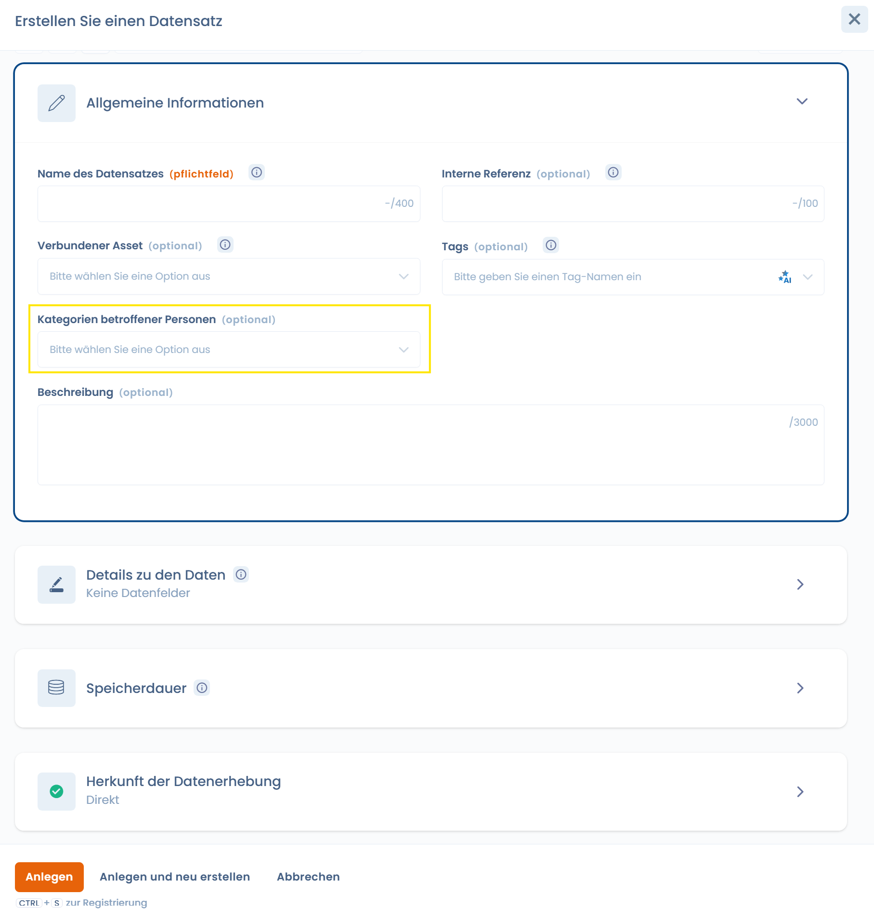
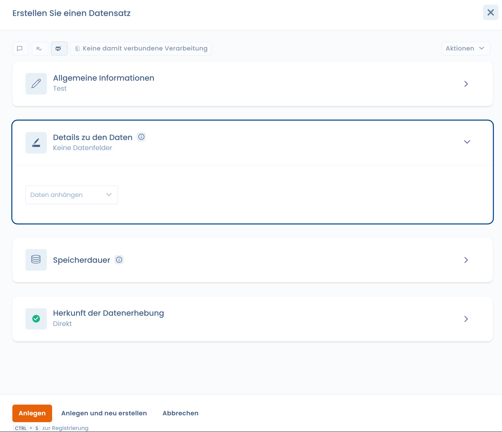
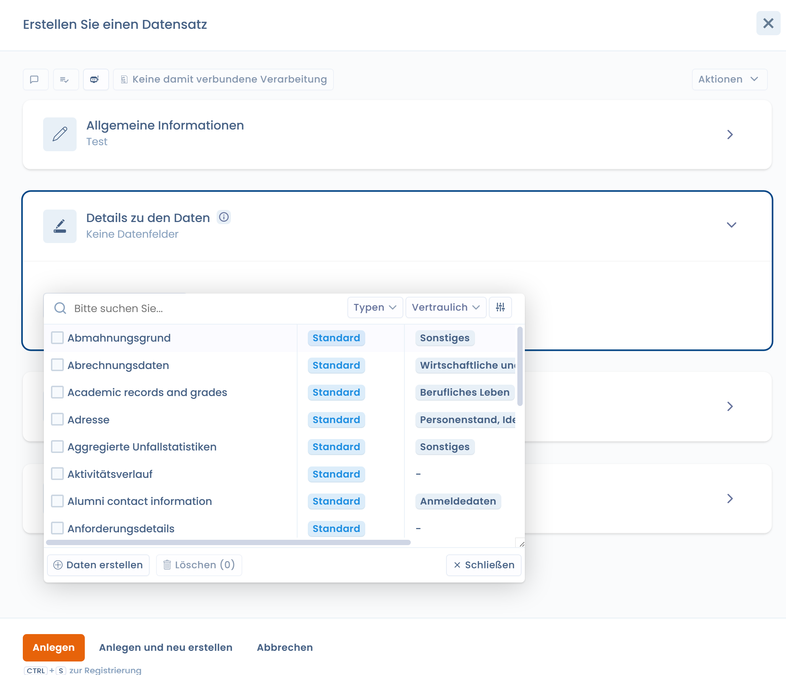
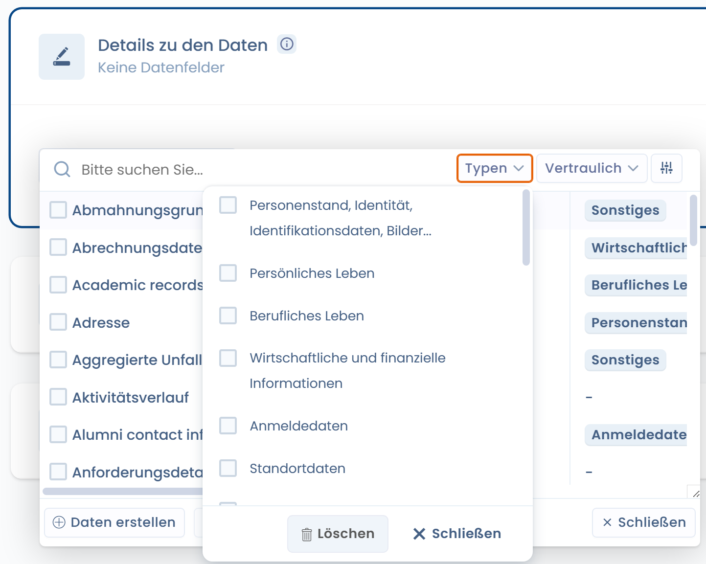
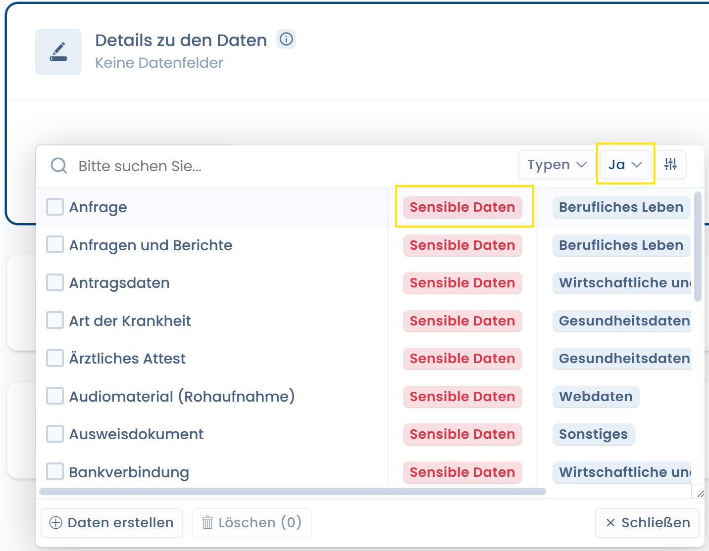
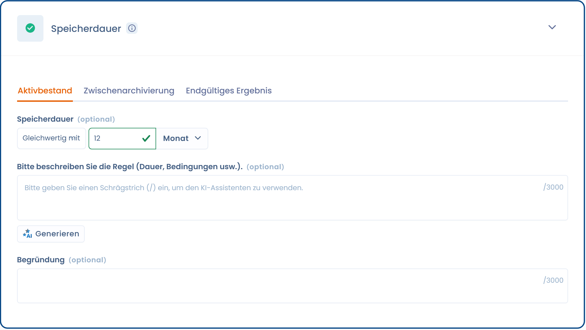
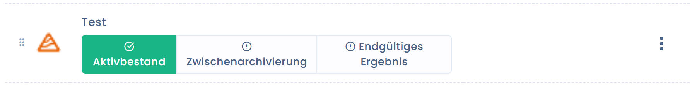
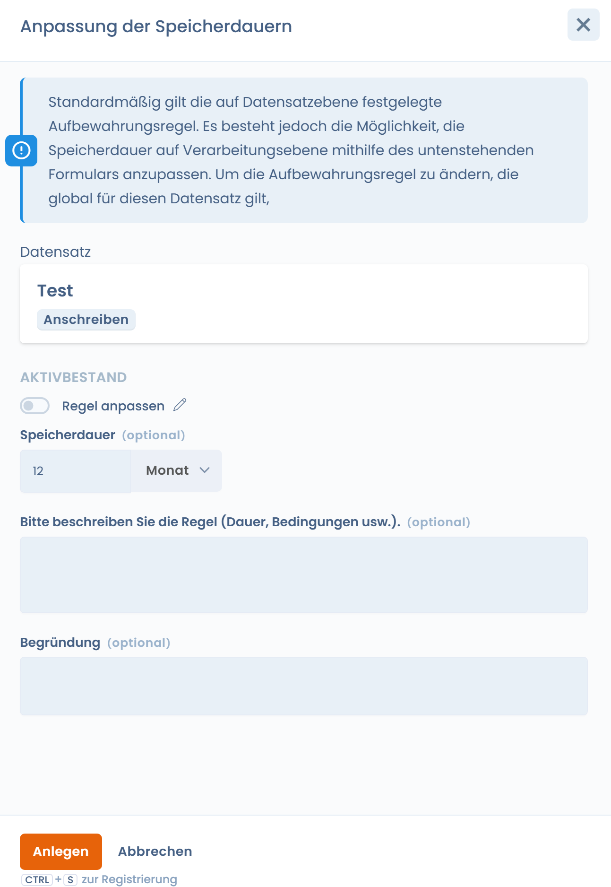
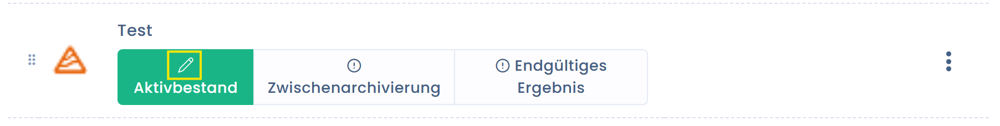

# Daten und Speicherdauer

[**Artikel 30 der DSGVO**](https://dsgvo-gesetz.de/art-30-dsgvo/) verlangt auch die Eintragung der verarbeiteten Datenkategorien.

Hier geht es darum, die Kategorien der verarbeiteten Daten zu definieren. Diese können als gewöhnlich oder sensibel eingestuft werden. Es wird nämlich zwischen Daten unterschieden, die ein höheres Risiko für natürliche Personen darstellen, wie z. B. Gesundheitsdaten, Daten zu politischen Meinungen oder gewerkschaftlichen Aktivitäten. Daten zu Straftaten oder anderen Vollstreckungsmaßnahmen stellen ebenfalls besonders geschützte Daten dar.

Ebenso kann die Sozialversicherungsnummer (NIR) als sensible Daten eingestuft werden.

Die Erhebung sensibler Daten ist grundsätzlich verboten. Nur die in [**Artikel 9 der DSGVO**](https://dsgvo-gesetz.de/art-9-dsgvo/) vorgesehenen Ausnahmen erlauben deren Erhebung.

## Datensätze

Der Datensatz fasst die Daten eines bestimmten Elements zusammen, zum Beispiel eine Tabelle in einer Datenbank oder ein Papiererhebungsformular.

### Verschiedene Anwendungsfälle der Datensätze

Datensätze können auf verschiedene Weise verwendet werden:

* **Fall Nr. 1**: Indem **ein Datensatz einem einzelnen Asset zugeordnet** wird. In diesem Fall entspricht der Datensatz den Daten des Assets und ist nicht generisch.
* **Fall Nr. 2**: Indem **ein Datensatz der Datenverarbeitung zugeordnet** wird. Dieser Datensatz kann spezifisch für die Datenverarbeitung sein und wird nicht in einer anderen Verarbeitung wiederverwendet.
* **Fall Nr. 3**: Indem **generische Datensätze der Datenverarbeitung zugeordnet** werden. In diesem Fall kann der Datensatz in mehreren Verarbeitungen wiederverwendet werden.

Für die Verwendung generischer Datensätze empfehlen wir folgendes Vorgehen:

* Öffnen Sie die Seite der Verarbeitung bezüglich der Datensätze
* Öffnen Sie einen neuen Tab auf der Seite der Datensätze in der Datenkartierung
* Wählen Sie den Datensatz in der Datenverarbeitung aus
* Wenn der Datensatz geändert werden muss, erstellen Sie einen neuen: Gehen Sie zum anderen Tab und duplizieren Sie den generischen Datensatz, indem Sie die gewünschten Felder entfernen oder hinzufügen
* Für mehr Übersichtlichkeit wird empfohlen, einen Tag für diese Datensätze zu verwenden (damit Sie sie im Datensatz-Selektor leicht unterscheiden können). Zum Beispiel: ein Tag "generisch" und ein Tag bezüglich der hinzugefügten oder entfernten Daten

#### Datensätze ohne Felder verwenden

Darüber hinaus ist es möglich, noch generischer zu bleiben, indem die dem Datensatz zugeordneten Daten nicht angegeben werden, sondern der Datensatz als Datenkategorie benannt wird (was im Sinne der DSGVO ebenfalls gültig ist).

Je nach Verarbeitung können Sie unterschiedliche Ansätze verfolgen, abhängig von der Sensibilität, die sie hinsichtlich der Rechte und Freiheiten der betroffenen Personen darstellen.

### Die Datenquelle im Datensatz angeben

In jedem Datensatz können Sie den Ursprung der Daten eintragen. Dieser ist entweder direkt, indirekt oder beides.

Ein Feld zur Beschreibung des Erhebungsursprungs ermöglicht es, die erforderliche Präzision zu liefern.

<figure><figcaption>
Erstellen Sie einen Datensatz
</figcaption></figure>

### Ein Asset dem Datensatz zuordnen

Datensätze haben von Natur aus die Bestimmung, [Assets](applications.md) zugeordnet zu werden.

Sie können bei der Erstellung eines Datensatzes ein Asset zuordnen.

<figure><figcaption>
Asset-Selektor
</figcaption></figure>

Ein Datensatz kann nur einem einzigen Asset zugeordnet werden. Durch die Definition der Datensätze eines Assets sind diese nämlich einzigartig.

Betrachtet man beispielsweise eine Buchhaltungssoftware als Asset, könnten diesem Asset mehrere Datensätze zugeordnet werden, wie "Rechnungsdaten" mit den Daten zum Rechnungsverfolgungsmodul oder "Kundendaten" mit den Daten zu den Kundenkonten.

### Eine Kategorie betroffener Personen zuordnen

Für jeden Datensatz können Sie eine oder mehrere Kategorien betroffener Personen zuordnen.

Dies ermöglicht es Ihnen, besser zu verstehen, welche Daten den betroffenen Personen zugeordnet sind. Darüber hinaus vereinfacht dies die Kartierungsarbeit.

<figure><figcaption>
Selektor für Kategorien betroffener Personen
</figcaption></figure>


Die Angabe der betroffenen Personen ist nützlich für die Verwaltung von [Betroffenenanfragen](../../gerer-les-exercices-des-droits/). Sie können die Daten, die Gegenstand der Anfrage sind, leicht finden, indem Sie die betreffenden Datensätze schnell identifizieren.


### Datenfelder zuordnen

Jeder Datensatz soll durch Datenfelder ergänzt werden. Diese Felder sind die eigentlichen Daten.

<figure><figcaption></figcaption></figure>

Die im Selektor angezeigten Felder sind die im Datenglossar verfügbaren Felder.

<figure><figcaption>
Datenfeld-Selektor
</figcaption></figure>

Wenn eine Daten nicht vorhanden ist, können Sie sie direkt über diesen Selektor erstellen, um sie zum Datensatz hinzuzufügen.

Die Felder können nach vordefinierten Kategorien kategorisiert werden.

<figure><figcaption>
Selektor für Kategorien personenbezogener Daten
</figcaption></figure>

Auf Feldebene können Sie auch das Vorhandensein sensibler Daten angeben. Zum Beispiel Gesundheitsdaten oder eine andere Art sensibler Daten.

In diesem Fall werden Sie aufgefordert, die Erhebung dieser Daten und insbesondere die sie erlaubende Rechtsgrundlage zu begründen.

<figure><figcaption>
Sensible Daten
</figcaption></figure>


Diese Information wird von der Anwendung analysiert, um ein intelligentes [DSFA](analyse-dimpact.md)-Kriterium auszulösen.


### Eine Aufbewahrungsregel für Daten zuordnen

In jedem Datensatz können Sie eine Aufbewahrungsregel für Daten zuordnen.

<figure><figcaption>
Speicherdauer
</figcaption></figure>

Die Speicherdauern gelten standardmäßig, da sie auf Verarbeitungsebene angepasst werden können (siehe unten).

Sie können eine Dauer für die aktive Datenbank, für das Zwischenarchiv oder eine Löschregel hinzufügen.

Die aktive Datenbank ist die laufende Datenbank der Verarbeitung. Das Zwischenarchiv ist eine eingeschränktere Form der Aufbewahrung. Das Feld "Löschung" ermöglicht es Ihnen, die Bedingungen für die Löschung der Daten oder ihre Übermittlung zur endgültigen Archivierung zu beschreiben.

## Aufbewahrung der Daten

Die begrenzte Aufbewahrung der Daten gehört zu den allgemeinen Grundsätzen des Datenschutzrechts und wird in [**Artikel 5 Abs. 1 Buchst. e) der DSGVO**](https://dsgvo-gesetz.de/art-5-dsgvo/) bekräftigt. Dieser sieht vor, dass Daten "_in einer Form gespeichert werden, die die Identifizierung der betroffenen Personen nur so lange ermöglicht, wie es für die Zwecke, für die sie verarbeitet werden, erforderlich ist_".

Konkret bedeutet dies, dass bei der Durchführung einer Datenverarbeitung an deren Zukunft gedacht werden muss, wenn der Verarbeitungszweck erfüllt ist. Die Daten müssen entweder endgültig vernichtet, anonymisiert oder für einen neuen kompatiblen Verarbeitungszweck verarbeitet werden.

Die Speicherdauer hängt vom Verarbeitungszweck und der Art der Daten ab. Die Speicherdauern können nach Datentypen definiert werden. Zum Beispiel werden bei der Gehaltsabrechnung die Daten zur Gehaltsabrechnung 1 Monat in der aktiven Datenbank und 5 Jahre im Zwischenarchiv aufbewahrt, während die Daten zum Zahlungsauftrag nur so lange in der aktiven Datenbank aufbewahrt werden, wie es für die Erstellung der Gehaltsabrechnung erforderlich ist, und 10 Jahre ab Abschluss im Zwischenarchiv.

Die Dauer kann als Wert angegeben werden oder, falls dies nicht möglich ist, als Kriterien zur Bestimmung der Aufbewahrungsfrist (z. B. bis zur Abmeldung). Es wird empfohlen Verfahren einzurichten, die die Verwaltung der Speicherdauern auf Ebene der Datenkategorie ermöglichen und insbesondere die Löschung oder Vernichtung von Daten verwalten.

#### Aufbewahrungsregeln eines Datensatzes anpassen

Die Datenfelder eines generischen Datensatzes können nicht von einer Verarbeitung zur anderen variieren. Die Speicherdauer kann jedoch unterschiedlich sein. Es ist nämlich möglich, die Speicherdauer eines Datensatzes je nach Verarbeitung anzupassen. Somit wird die Speicherdauer des Datensatzes nicht mehr berücksichtigt.

Dazu muss der Datensatz der Verarbeitung hinzugefügt werden. In der Liste der Datensätze klicken Sie auf die Schaltflächen "**Aktivbestand**".

<figure><figcaption>
Schaltfläche "Aktivbestand"
</figcaption></figure>

Sie sehen dann das Anpassungsfenster.

<figure><figcaption>
Fenster zur Anpassung der Speicherdauern
</figcaption></figure>

Wenn die Speicherdauer auf Verarbeitungsebene angepasst wurde, erscheint ein kleines Stiftsymbol auf der betreffenden Schaltfläche:

Das langfristige Ziel kann sein, die Verwendung generischer Datensätze zu reduzieren und sich einer präziseren Kartierung zuzuwenden, entweder über die Datenverarbeitungen (Fall Nr. 2) oder über die Assets (Fall Nr. 1).

<figure><figcaption>
Auf Verarbeitungsebene angepasste Speicherdauer
</figcaption></figure>
