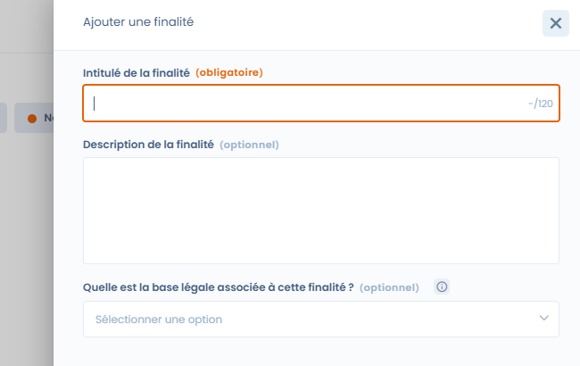

# Verarbeitungszwecke

## Verarbeitungszwecke

Ein **Verarbeitungszweck** stellt das Ziel dar, das mit der Einrichtung Ihrer Datei verfolgt wird. Er gibt an, wozu die Verarbeitung personenbezogener Daten dient, ihre Daseinsberechtigung. Dieses Ziel muss klar und verständlich sein.

Die Definition des Verarbeitungszwecks ist grundlegend, da sie eine Voraussetzung für die anderen Elemente ist, die die Verarbeitung umrahmen, wie die Speicherdauer, die Angemessenheit, Relevanz, Verhältnismäßigkeit der Daten sowie die Genauigkeit und Aktualisierung der Daten.

[**Artikel 5 Abs. 1 Buchst. b) der DSGVO**](https://www.cnil.fr/fr/reglement-europeen-protection-donnees/chapitre2#Article5) sieht vor, dass der Verarbeitungszweck festgelegt, eindeutig und rechtmäßig sein muss.

**Der Verarbeitungszweck muss festgelegt sein**: Der Zweck muss hinreichend genau definiert sein, um die erforderlichen Datenschutzgarantien anzupassen und den Umfang der Datenverarbeitung abzugrenzen. Das erforderliche Detaillierungsniveau hängt vom konkreten Kontext der Datenerhebung und den betroffenen Daten ab. Manchmal genügt eine einfache Sprache. Ein Familienunternehmen in der Nachbarschaft erfordert beispielsweise nicht den gleichen Detaillierungsgrad bei der Beschreibung des Zwecks der Kundendatei wie ein multinationales Unternehmen, das komplexe Algorithmen für personalisierte Angebote und gezielte Werbung einsetzt. Der Zweck muss vor der Durchführung der Verarbeitung festgelegt werden.

**Der Verarbeitungszweck muss eindeutig sein**: Der Zweck darf nicht mehrdeutig sein und muss klar formuliert sein.&#x20;

**Der Verarbeitungszweck muss rechtmäßig sein**: Die Rechtmäßigkeit bezieht sich auf die Rechtsgrundlage der Datenverarbeitung, die durch [**Artikel 6 der DSGVO**](https://www.cnil.fr/fr/reglement-europeen-protection-donnees/chapitre2) gefordert wird.&#x20;

Dieser Begriff verlangt auch, dass der Zweck nicht allgemein gegen das Gesetz verstößt. Beispielsweise ist ein Zweck nicht rechtmäßig, wenn er zu einer im Strafgesetzbuch verbotenen Diskriminierung führt. Dabei können insbesondere das Arbeitsrecht, das Verbraucherschutzrecht oder das Vertragsrecht berücksichtigt werden.&#x20;

Darüber hinaus ist es notwendig, den Kontext der Verarbeitung zu berücksichtigen, um die Rechtmäßigkeit zu bewerten, insbesondere die berechtigten Erwartungen der von der Verarbeitung betroffenen Person.&#x20;

Eine Verarbeitungstätigkeit kann mehrere Verarbeitungszwecke haben. Beispielsweise könnte die Tätigkeit "Recruiting" zwei unterschiedliche Zwecke haben: die Analyse der Bewerbungen und die Verwaltung der Vorstellungsgespräche sowie den Aufbau einer Lebenslaufdatenbank.&#x20;

\
Für jeden Zweck müssen Sie [**die Rechtsgrundlage**](https://www.cnil.fr/fr/les-bases-legales) festlegen. Es kann nur eine Rechtsgrundlage pro Zweck geben. Die Wahl dieser Rechtsgrundlage ist je nach Kontext der Verarbeitung zu treffen.

## Einen Verarbeitungszweck in Dastra hinzufügen&#x20;

Das Hinzufügen von Verarbeitungszwecken erfolgt in Abschnitt 3 der Verarbeitung.

<figure><figcaption>
Verarbeitungszweck hinzufügen
</figcaption></figure>

<figure><figcaption></figcaption></figure>

Die Bezeichnung des Verarbeitungszwecks ist auf 120 Zeichen begrenzt.&#x20;

Sie können mehrere Verarbeitungszwecke zu Ihrer Verarbeitung hinzufügen.

## Rechtsgrundlagen&#x20;

Es gibt 6 mögliche Rechtsgrundlagen für eine Datenverarbeitung.

### Einwilligung

Die **Einwilligung** muss vier Kriterien erfüllen, damit die Verarbeitung rechtmäßig ist: Sie muss&#x20;

* frei,&#x20;
* spezifisch,&#x20;
* informiert und&#x20;
* eindeutig sein.&#x20;

Sie muss ebenso einfach zu erteilen wie zu widerrufen sein. Sie müssen den Nachweis dokumentieren, dass die Einwilligung gültig eingeholt wurde. Dazu können Sie die Beschreibung des Einwilligungsverfahrens als Anhang der Verarbeitung (Schritt 11) hinzufügen.

### Vertrag oder vorvertragliche Maßnahmen

Die Rechtsgrundlage des **Vertrags** muss drei Kriterien erfüllen, um gültig zu sein: Es muss

* ein Vertrags- oder vorvertragliches Verhältnis zwischen dem Verantwortlichen und der betroffenen Person bestehen;&#x20;
* der Vertrag muss nach geltendem Recht gültig sein und&#x20;
* die Verarbeitung muss objektiv zur Erfüllung des Vertrags erforderlich sein.&#x20;

Das Widerspruchsrecht kann bei auf dieser Rechtsgrundlage basierenden Verarbeitungen nicht ausgeübt werden, und das Recht auf Datenübertragbarkeit kann hingegen bei dieser Verarbeitung ausgeübt werden. Sie können den Vertrag, auf den Sie die Verarbeitung stützen, in den Anhängen in Schritt 11 hinzufügen.

### Rechtliche Verpflichtung

Die **rechtliche Verpflichtung** muss&#x20;

* zwingend sein,&#x20;
* hinreichend klar und präzise, um eine Verarbeitung gültig zu begründen.&#x20;

Die Rechtstexte, die diese Verpflichtung begründen, müssen mindestens den Zweck dieser Verarbeitung definieren.&#x20;

Die Verpflichtung muss sich an den Verantwortlichen und nicht an die betroffenen Personen richten. Sie müssen den Text angeben, der die Verarbeitung vorschreibt (z. B. einen Gesetzesartikel).

### **Schutz lebenswichtiger Interessen**

Der **Schutz lebenswichtiger Interessen** beschränkt sich auf Situationen, die das Leben der betroffenen Person oder einer anderen natürlichen Person bedrohen. Die offensichtlichste Anwendung ist die Situation, in der eine Person einen Unfall erleidet und schwer verletzt in ein Krankenhaus eingeliefert wird, während sie bewusstlos ist und nicht in der Lage ist, ihre Einwilligung zur Verarbeitung ihrer Daten im Rahmen ihrer Behandlung zu geben. Diese Grundlage muss eng ausgelegt werden und nur verwendet werden, wenn keine Einwilligung eingeholt werden kann.

### Aufgabe im öffentlichen Interesse

Die **Wahrnehmung einer Aufgabe im öffentlichen Interesse oder in Ausübung öffentlicher Gewalt**. Der Rückgriff auf diese Rechtsgrundlage ist insbesondere für Verarbeitungen gerechtfertigt, die von Behörden zur Erfüllung ihrer Aufgaben durchgeführt werden.&#x20;

Zwei Bedingungen sind erforderlich:&#x20;

* Die Verarbeitung muss es ermöglichen, die Aufgabe, mit der die Behörde betraut ist, auf relevante und angemessene Weise auszuüben und darf kein anderes Ziel verfolgen, das ohne besonderen Zusammenhang oder zu weit von den Besonderheiten der betreffenden öffentlichen Aufgabe entfernt ist.&#x20;
* Das öffentliche Interesse muss im Recht definiert sein und kann nicht vermutet werden.&#x20;

Sie müssen die Aufgabe im öffentlichen Interesse angeben, die die Verarbeitung erfordert.

### Berechtigte Interessen des Verantwortlichen

Die **berechtigten Interessen** des Verantwortlichen oder eines Dritten.&#x20;

Diese Rechtsgrundlage kann nicht von öffentlichen Stellen im Rahmen ihrer Aufgabe geltend gemacht werden und muss 3 Bedingungen erfüllen:&#x20;

* Das verfolgte Interesse muss berechtigt sein, d. h. rechtmäßig (legal), klar und präzise sowie real (nicht fiktiv);&#x20;
* die Verarbeitung muss zur Erreichung des Ziels erforderlich sein, d. h. das am wenigsten invasive Mittel darstellen;&#x20;
* und schließlich darf die Verarbeitung die Rechte und Freiheiten der betroffenen Personen unter Berücksichtigung ihrer berechtigten Erwartungen nicht überwiegen.&#x20;

Eine Abwägung muss durchgeführt werden, z. B. mit einem Verhältnismäßigkeitstest.&#x20;

Sie können die Ergebnisse dieses Tests als Dokument in Schritt 11 aufbewahren. Sie müssen auch die geltend gemachten berechtigten Interessen detailliert beschreiben (z. B. Netzwerksicherheit oder Betrugsbekämpfung).

## Die Rechtsgrundlage einem Verarbeitungszweck zuordnen

In jedem Verarbeitungszweck können Sie eine Rechtsgrundlage aus den 6 oben genannten Grundlagen hinzufügen.

<figure><figcaption>
Rechtsgrundlage-Selektor
</figcaption></figure>

Sobald die Grundlage ausgewählt ist, können Sie eine Beschreibung hinzufügen. Zum Beispiel, um die berechtigten Interessen oder die gesetzliche Bestimmung zu präzisieren.&#x20;
