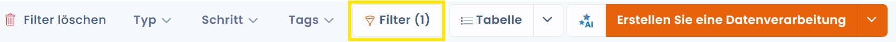
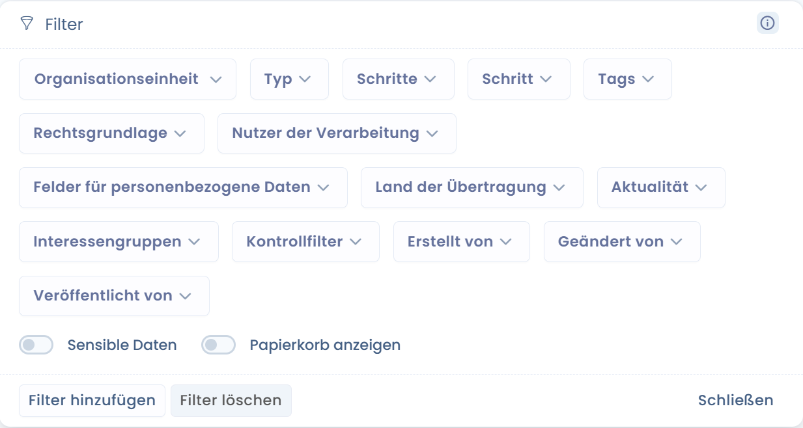

# Erweiterte Filter

## Verwendung

Die erweiterten Filter ermöglichen es Ihnen, Ihre Daten nach nahezu allen Feldern Ihrer Entitäten zu filtern.

* Gehen Sie in ein Modul von Dastra (z. B. das Modul für Betroffenenanfragen)
* Klicken Sie auf die Schaltfläche "Filter" oben rechts in der Datentabelle.

<figure><figcaption></figcaption></figure>

* Ein kleines Fenster erscheint, das Ihnen eine Liste der am häufigsten verwendeten Standardfilter zeigt. Wenn Sie einen dieser Filter anwenden, wird die Tabelle automatisch aktualisiert.f

<figure><figcaption>
<mark style="color:$info;">Kombination erweiterter Filter für Betroffenenanfragen</mark>
</figcaption></figure>


Die Kombination dieser Filter ist kumulativ.

_Beispiel: Wenn ich nach einem oder zwei Tags "komplex" und "ausstehend" filtere + eine Organisationseinheit auswähle: werden alle Zeilen angezeigt, die die 2 Tags "komplex" und "ausstehend" enthalten **und** sich in der Organisationseinheit befinden_


* Wenn Sie keinen passenden Filter finden, können Sie auf die Schaltfläche "Filter hinzufügen" klicken. Dort können Sie die Filterkombination bearbeiten, die am besten Ihren Anforderungen entspricht

<figure><figcaption></figcaption></figure>

Standardmäßig speichert Dastra die von Ihnen ausgewählten Filter dauerhaft, was bedeutet, dass die Filter erhalten bleiben, wenn Sie die Seite wechseln oder Ihren Browser aktualisieren. Diese Filter sind spezifisch für Ihren Browser und Ihren Mandanten (sie werden im **LocalStorage** gespeichert).

## Benutzerdefinierte Spalten

Sie können die aktuellen Spalten mit einem einzigen Klick auf "**Spalten anpassen**" in der Symbolleiste ändern.

<figure><figcaption></figcaption></figure>

<figure><figcaption></figcaption></figure>

## Benutzerdefinierten Ansichten

Um verschiedene benutzerdefinierte Ansichten zu erstellen klicken Sie auf "**Alle Elemente**" -> "**Benutzerdefinierte Ansicht speichern**".

<figure><figcaption></figcaption></figure>

Es erscheint ein Fenster in der Sie die **Benutzerdefinierte Ansicht speichern können.** Geben Sie Ihrer Ansicht einen Namen und bestätigen Sie.

<figure><figcaption></figcaption></figure>

Sie können **eine Ansicht** mit anderen Nutzern Ihres Mandanten **teilen**. Geteilte Ansichten erscheinen unter der Rubrik **"Geteilte Ansichten"** in der Symbolleiste.

<figure><figcaption></figcaption></figure>

<figure><figcaption></figcaption></figure>

Diese Funktion ist in allen Bereichen verfügbar, in denen Objekte aufgelistet werden: Betroffenenanfragen, Verarbeitungsverzeichnis, Assets, Verträge, KI-Systeme, Vorfälle…

## Bekannte Probleme

### Meine Daten werden nicht mehr angezeigt?

Wenn Sie Schwierigkeiten mit den Filtern haben und Ihre Daten nicht mehr angezeigt werden, empfehlen wir Ihnen, die Browserdaten (Cookies, LocalStorage...) zu löschen. Dadurch wird der Status Ihrer Filter in Ihrem Mandanten zurückgesetzt.

### Bestimmte Spalten sind in den erweiterten Filtern nicht vorhanden?

Es kann sein, dass es technisch nicht möglich ist, diese Filter aus verschiedenen Gründen einzurichten. In diesem Fall empfehlen wir Ihnen, die Daten als Rohdaten zu exportieren und den Bericht in Tools wie Excel zu erstellen.

Wenn es sich um einen Filter handelt, der für Ihre Tätigkeit unerlässlich ist, zögern Sie nicht, eine Anfrage für eine neue Funktion [über die Dastra-Community oder das Anforderungssystem](../../getting-started/le-support/faire-une-demande-de-support.md) zu stellen.
