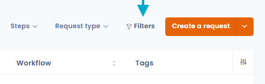
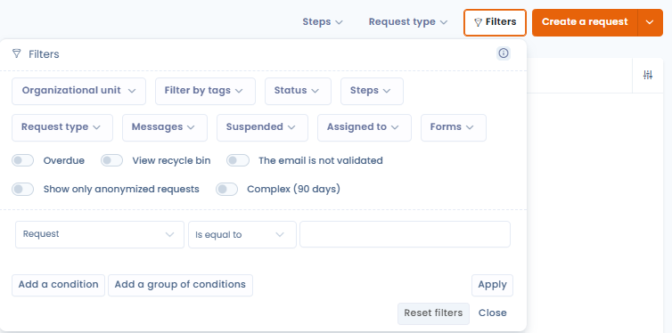
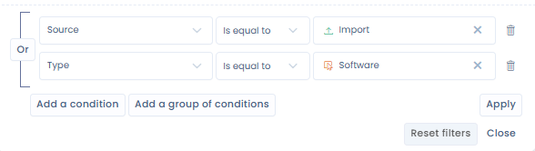
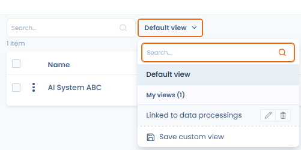
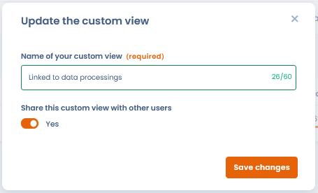
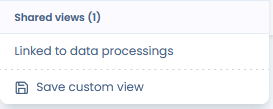

# Erweiterte Filter

## Verwendung

Die erweiterten Filter ermöglichen es Ihnen, Ihre Daten nach nahezu allen Feldern Ihrer Entitäten zu filtern.

* Gehen Sie in ein Modul von Dastra (z. B. das Modul für Betroffenenanfragen)
* Klicken Sie auf die Schaltfläche "Filter" oben rechts in der Datentabelle.

<figure><figcaption></figcaption></figure>

* Ein kleines Fenster erscheint, das Ihnen eine Liste der am häufigsten verwendeten Standardfilter zeigt. Wenn Sie einen dieser Filter anwenden, wird die Tabelle automatisch aktualisiert.

<figure><figcaption></figcaption></figure>

<mark style="color:$info;">Kombination erweiterter Filter für Betroffenenanfragen</mark>


Die Kombination dieser Filter ist kumulativ.

_Beispiel: Wenn ich nach einem oder zwei Tags "komplex" und "ausstehend" filtere + eine Organisationseinheit "Contoso" auswähle: werden alle Zeilen angezeigt, die die 2 Tags "komplex" und "ausstehend" enthalten **und** sich in der Organisationseinheit "Contoso" befinden_


* Wenn Sie keinen passenden Filter finden, können Sie auf die Schaltfläche "Filter hinzufügen" klicken. Dort können Sie die Filterkombination bearbeiten, die am besten Ihren Anforderungen entspricht

<figure><figcaption></figcaption></figure>

Standardmäßig speichert Dastra die von Ihnen ausgewählten Filter dauerhaft, was bedeutet, dass die Filter erhalten bleiben, wenn Sie die Seite wechseln oder Ihren Browser aktualisieren. Diese Filter sind spezifisch für Ihren Browser und Ihren Mandanten (sie werden im **LocalStorage** gespeichert).

## Benutzerdefinierte Ansichten

Sie können den aktuellen Zustand Ihrer Filter (und Ihre Spaltenauswahl) als **benannte Ansicht** speichern und dann mit einem einzigen Klick in der Symbolleiste jeder Liste zwischen Ihren Ansichten wechseln.

So erstellen Sie eine Ansicht:

1. Wenden Sie die gewünschten Filter und die gewünschte Spaltenauswahl an.
2. Klicken Sie auf die Schaltfläche **"Speichern"** in der Symbolleiste.
3. Geben Sie Ihrer Ansicht einen Namen und bestätigen Sie.

Die Ansicht erscheint dann direkt in der Symbolleiste des betreffenden Bereichs — mit einem Klick erreichbar, ohne den Bereich "Filter" erneut öffnen zu müssen.

<figure><figcaption></figcaption></figure>

Sie können **eine Ansicht** mit anderen Nutzern Ihres Mandanten **teilen**. Geteilte Ansichten erscheinen unter der Rubrik **"Geteilte Ansichten"** in der Symbolleiste.

<figure><figcaption></figcaption></figure>

<figure><figcaption></figcaption></figure>

Diese Funktion ist in allen Bereichen verfügbar, in denen Objekte aufgelistet werden: Betroffenenanfragen, Verarbeitungsverzeichnis, Assets, Verträge, KI-Systeme, Datenschutzvorfälle…

## Bekannte Probleme

### Meine Daten werden nicht mehr angezeigt?

Wenn Sie Schwierigkeiten mit den Filtern haben und Ihre Daten nicht mehr angezeigt werden, empfehlen wir Ihnen, die Browserdaten (Cookies, LocalStorage...) zu löschen. Dadurch wird der Status Ihrer Filter in Ihrem Mandanten zurückgesetzt.

### Bestimmte Spalten sind in den erweiterten Filtern nicht vorhanden?

Es kann sein, dass es technisch nicht möglich ist, diese Filter aus verschiedenen Gründen einzurichten. In diesem Fall empfehlen wir Ihnen, die Daten als Rohdaten zu exportieren und den Bericht in Tools wie Excel zu erstellen.

Wenn es sich um einen Filter handelt, der für Ihre Tätigkeit unerlässlich ist, zögern Sie nicht, eine Anfrage für eine neue Funktion [über die Dastra-Community oder das Anforderungssystem](../../getting-started/le-support/faire-une-demande-de-support.md) zu stellen.
