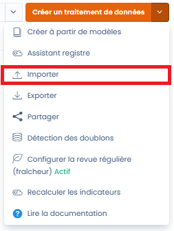
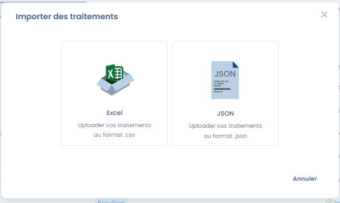
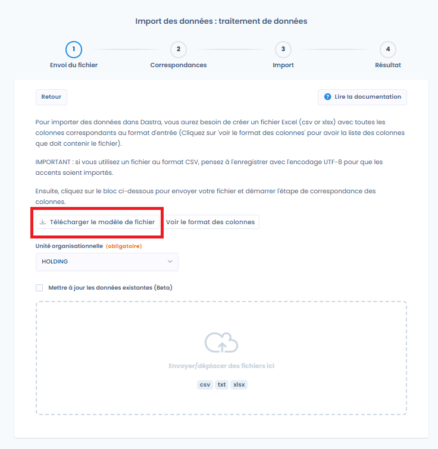
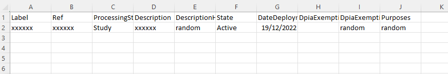
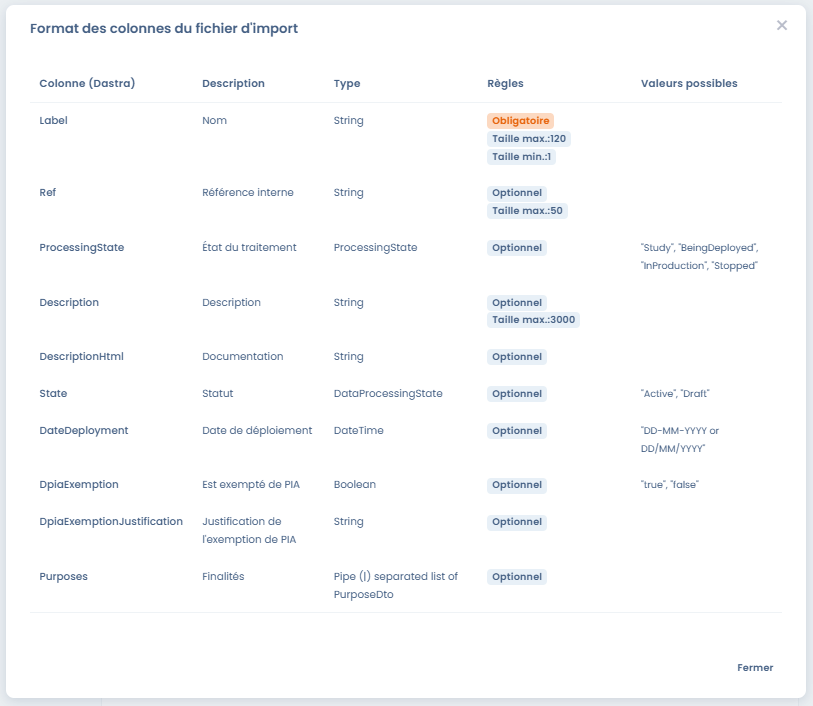
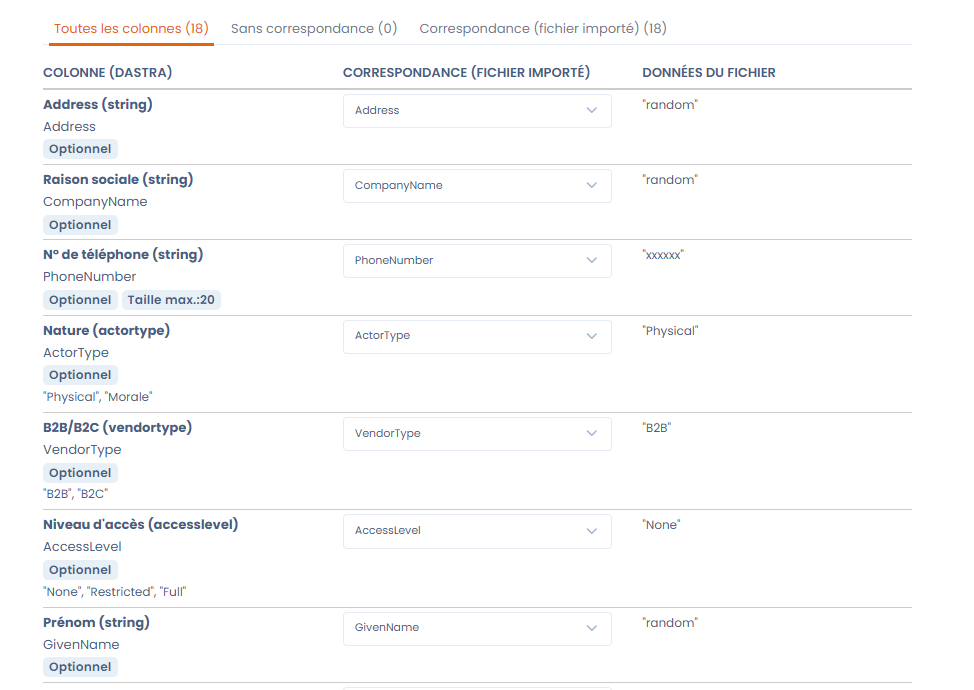
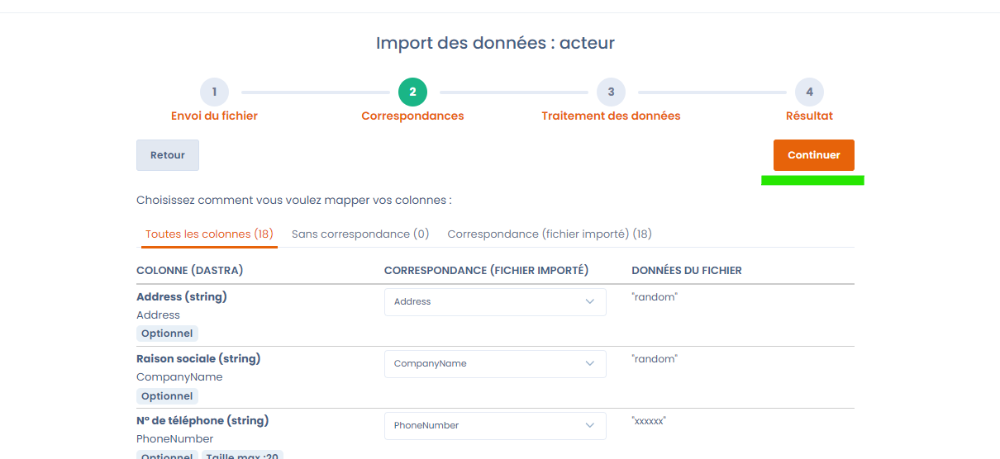

# Ihre Daten importieren (Excel, CSV)

## Der Datenimport in Dastra

Dastra ermöglicht es Ihnen, Ihre eigenen Daten im Tabellenformat ganz einfach direkt in die Anwendung zu importieren.

Importe sind in den folgenden Modulen möglich:&#x20;

* Import des Verarbeitungsverzeichnisses
* Import der Stakeholder
* Import der Assets
* Import der Datensätze
* Import der Felder
* Import der Sicherheitsmaßnahmen
* Import der Kategorien betroffener Personen
* Import der Audit-Antworten
* Import der Audit-Vorlagen (in Kürze)
* Import der Risikotypen
* Import der Betroffenenanfragen
* Import der Datenschutzvorfälle
* Import der Aufgaben

Bei jedem Import ist der Ablauf identisch.&#x20;

Er erfolgt in 4 Schritten:&#x20;

1. [Vorbereitung der Datendatei](importer-vos-donnees-excel-csv.md#1.-preparation-du-fichier-de-donnees)
2. [Hochladen der Datei](importer-vos-donnees-excel-csv.md#2.-charger-le-fichier)
3. [Überprüfung der Daten vor dem Import](importer-vos-donnees-excel-csv.md#3.-verifiez-vos-donnees)
4. [Import der Daten](importer-vos-donnees-excel-csv.md#4.-importez-les-donnees)

### 1. Vorbereitung der Datendatei

Dastra unterstützt nur die folgenden Datenformate:

* **Excel** (.xlsx)
* **Flache Dateien** (.csv, .txt) mit Trennzeichen ; und UTF-8-Kodierung (die Kodierung ist wichtig für Sonderzeichen)
* **JSON** (nur für den Import des vollständigen Verarbeitungsverzeichnisses und Verarbeitungsvorlagen)

Um das Datenimport-Menü aufzurufen, klicken Sie auf die Schaltfläche "Importieren" unter jedem Pfeil der Erstellungsschaltfläche.

<figure><figcaption></figcaption></figure>

Wählen Sie Excel, wenn Sie dazu aufgefordert werden:&#x20;

<figure><figcaption></figcaption></figure>

#### Herunterladen der Dateivorlage

Laden Sie dann eine Dateivorlage herunter, indem Sie auf die Schaltfläche "Dateivorlage herunterladen" klicken

<figure><figcaption></figcaption></figure>

Die Dateivorlage ist **eine Datei im CSV-Format**, die Sie einfach mit LibreOffice, Wordpad, Excel oder Google Sheets bearbeiten können.

Diese enthält alle erforderlichen Spalten mit Beispieldaten.

Beispieldatei (für das Verarbeitungsverzeichnis): &#x20;

<figure><figcaption>
Zeile 2 enthält Beispieldaten, die ersetzt werden müssen
</figcaption></figure>

#### Ausfüllen der Dateivorlage

Füllen Sie die heruntergeladene Datei mit Ihren Daten aus.

Für jede Datendatei können Sie die erwarteten Werte der Spalten anzeigen:&#x20;

<figure><figcaption>
Erwartete Werte für die Importdatei des Verarbeitungsverzeichnisses
</figcaption></figure>

Die Importe enthalten erwartete Werte auf Englisch. Das ist völlig normal. Es handelt sich um einen technischen Import in die Datenbank.&#x20;

Die englischen Werte entsprechen den Dropdown-Listen der Auswahlschaltflächen.&#x20;

Beispielsweise entspricht im Import des Verarbeitungsverzeichnisses das Feld "processing state" dem Feld "Status der Verarbeitung" in Dastra. Es handelt sich um das Feld, das im ersten Schritt "Allgemeines" angegeben wird.

Das Feld "State" entspricht dem Status der Verarbeitung ("brouillon" für "Draft" oder "veröffentlicht" für "Active").&#x20;

### 2. Datei hochladen

Sobald Ihre Datendatei bereit ist, müssen Sie in einigen Fällen eine Organisationseinheit angeben. Alle importierten Dateien werden in dieser Organisationseinheit abgelegt.&#x20;


Nur Importe von Objekten, die an Organisationseinheiten angehängt werden können, sind betroffen. Zum Beispiel das Verarbeitungsverzeichnis oder Datenschutzvorfälle. Stakeholder, Maßnahmen oder Datensätze sind nicht betroffen.


#### Daten über den Import aktualisieren

Es wird angeboten, ein Kontrollkästchen zu aktivieren, um bestehende Daten zu aktualisieren.&#x20;

Diese Funktion ermöglicht es, die Daten in Dastra anhand der Daten aus der Excel-Datei zu aktualisieren.&#x20;

Standardmäßig erstellt der Import neue Objekte. Wenn das Objekt bereits existiert (z. B. ein Stakeholder), wird der Import kein neues Objekt erstellen.&#x20;

Es ist möglich, ein bestehendes Objekt zu aktualisieren (z. B. einen Stakeholder).&#x20;

In diesem Fall müssen Sie das Kontrollkästchen "Bestehende Daten aktualisieren" auswählen und das Zuordnungsfeld wählen. Dieses Feld ist der Schlüssel zur Identifizierung der zu aktualisierenden Felder.&#x20;

<figure><figcaption>
Daten aktualisieren
</figcaption></figure>

Durch Klicken auf die Schaltfläche "Daten übereinstimmender Zeilen überschreiben" werden die entsprechenden Daten durch die Importdaten ersetzt.

#### Datei senden

Senden Sie die Datei, indem Sie in den Bereich klicken

<figure><figcaption></figcaption></figure>


Sie können Ihre Dateien auch per Drag-and-Drop in den Datei-Upload-Bereich ziehen


### 3. Überprüfen Sie Ihre Daten

Das folgende Hilfsprogramm ermöglicht es Ihnen, die Spalten Ihrer Excel-Datei zu validieren und gegebenenfalls den erwarteten Spalten im Importformat zuzuordnen.

<figure><figcaption></figcaption></figure>

Wenn alles korrekt erscheint, können Sie den Datenimport starten.

### 4. Daten importieren

Starten Sie den Datenimport, indem Sie auf die Schaltfläche "Fortfahren" klicken. Der Importprozess wird dann ausgelöst.

<figure><figcaption></figcaption></figure>

### 5. Fertig!

Herzlichen Glückwunsch! Sie haben das Ende dieser Anleitung erreicht! Wir empfehlen Ihnen zu überprüfen, ob die Daten korrekt in das Tool importiert wurden.
