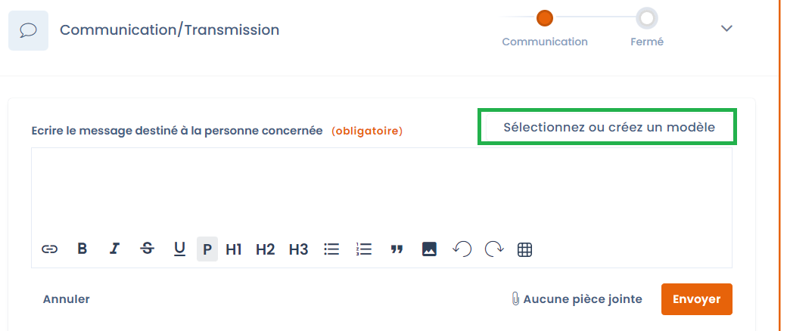
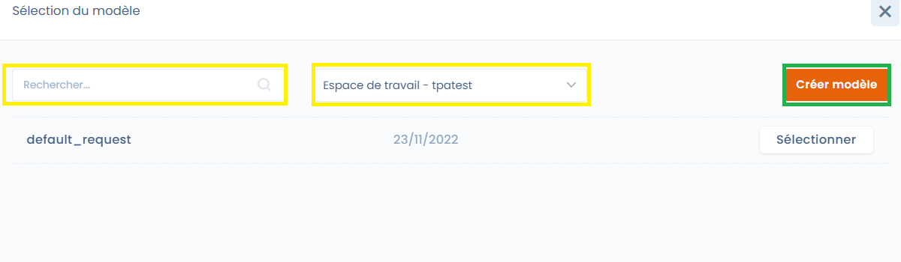
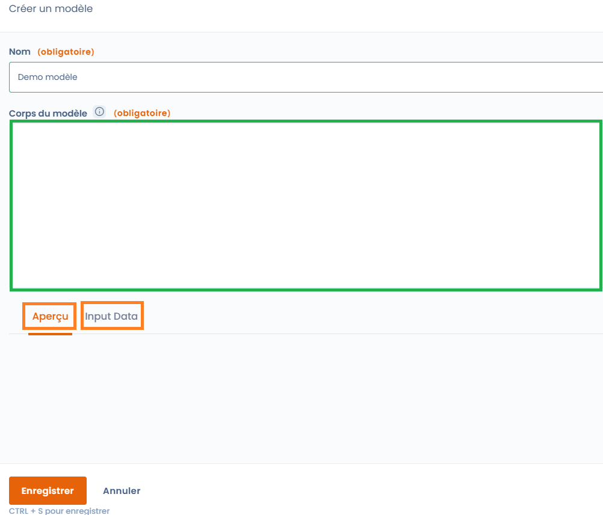
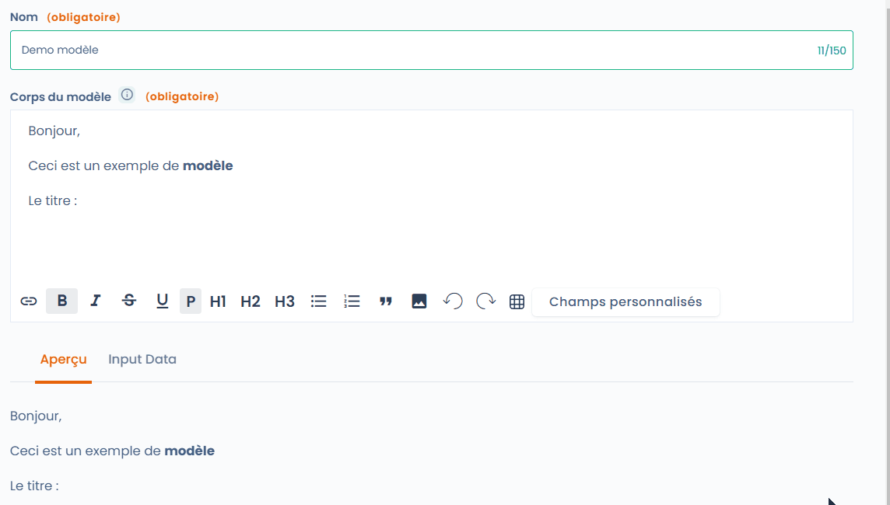
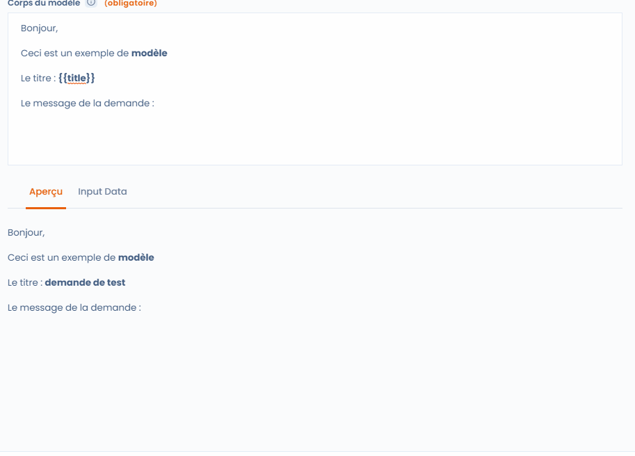
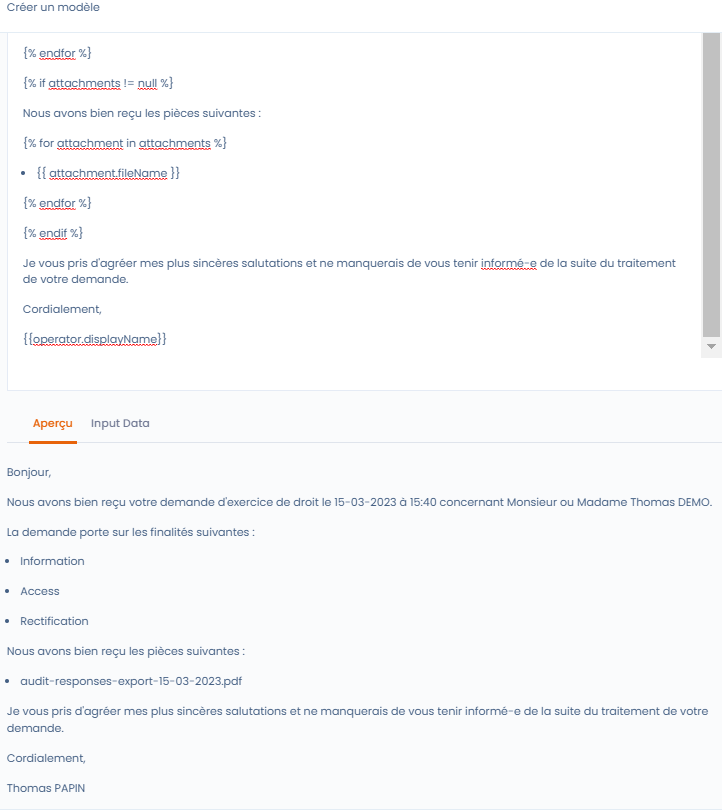

# E-Mail-Vorlagen

## Allgemeines

E-Mail-Vorlagen sind eine Funktion, die in Betroffenenanfragen, benutzerdefinierten Workflows sowie Audits verfügbar ist.

Einmal gespeichert, sind sie ein schnelles Mittel zur Kommunikation mit den Interessengruppen. Alle Daten eines Objekts können eingebunden werden, und es ist sogar möglich, Bedingungen und Schleifen einzurichten, um weitere Informationen abzurufen.

## Verwendung

Um eine Vorlage auszuwählen oder zu erstellen, klicken Sie auf "Vorlage auswählen oder erstellen"

<figure><figcaption><p>Vorlagenauswahl in einer Betroffenenanfrage</p></figcaption></figure>

Sie können dann eine bestehende Vorlage in der Liste oder über die Suchfunktion suchen, oder die verfügbaren Vorlagen in den Mandanten, auf die Sie Zugriff haben, oder die von Dastra erstellten Vorlagen durchsuchen.

Wenn keine Vorlage passt, klicken Sie auf "Vorlage erstellen"

<figure><figcaption><p>Auswahl oder Erstellung einer Vorlage</p></figcaption></figure>

Die Vorlagenerstellungsoberfläche umfasst 4 Elemente&#x20;

* Der Name (ermöglicht es, die Vorlage später wiederzufinden)
* Der Eingabebereich (Vorlagenkörper, grün umrandet)
* Ein Vorschau-Tab: ermöglicht die Anzeige der E-Mail-Darstellung in Echtzeit
* Ein Input-Data-Tab: ermöglicht es Ihnen, die Daten des von der Vorlage betroffenen Objekts einzusehen

<figure><figcaption><p>Vorlagenerstellungsoberfläche</p></figcaption></figure>

## Vorlage anpassen

Sie können die Vorlage bearbeiten und Stile anwenden, Bilder oder Tabellen nach Bedarf einfügen. Das Ergebnis sehen Sie im Vorschau-Tab. Wenn Sie auf "Benutzerdefinierte Felder" klicken, haben Sie Zugriff auf eine Liste von einzufügenden Feldern. Der Feldwert wird an der Position des Mauszeigers eingefügt. Selbstverständlich können Sie den Text nach Belieben formatieren.

<figure><figcaption><p>Verwenden Sie die benutzerdefinierten Felder</p></figcaption></figure>

## Weiterführendes zu benutzerdefinierten Feldern

Wie Sie in der obigen Animation sehen können, sind die von doppelten geschweiften Klammern umgebenen Felder "Variablen". Das heißt, sie werden durch die Werte des entsprechenden Objekts ersetzt (hier eine Betroffenenanfrage).

### Erstellen Sie neue benutzerdefinierte Felder aus den Input Data

Durch Klicken auf den Tab "Input Data" haben Sie Zugriff auf die Liste der Eigenschaften des verknüpften Objekts. Im folgenden Beispiel möchte ich die mit der Anfrage verknüpfte Nachricht anzeigen:&#x20;

* Ich suche das Feld in "Input Data"
* Ich gebe den Feldnamen im Nachrichtentext mit der Syntax \{{message\}} ein
* Ich überprüfe das Ergebnis mit dem Tab "Vorschau"

<figure><figcaption><p>Erstellen eines benutzerdefinierten Felds aus Input Data</p></figcaption></figure>

Fertig! Sie können jetzt Ihre eigenen benutzerdefinierten Felder erstellen. Aber das ist noch nicht alles! Sie können noch weiter gehen und Schleifen, Bedingungen erstellen und Formate anwenden, um Daten besser lesbar zu machen!

### Bedingungen

Es ist auch möglich, bedingte Blöcke zu erstellen, die nur unter bestimmten Bedingungen angezeigt werden.

Dazu müssen Sie das bedingte Tag-System verwenden, das mit \{% if qqch == true %\} beginnt und mit \{% endif %\} endet

&#x20;So kann ich die folgende Bedingung schreiben:&#x20;

> \{% if attachments != blank %\}
>
> Sie haben einen Anhang
>
> \{% endif %\}

Der Block wird nur angezeigt, wenn ein Anhang in der Anfrage vorhanden ist

### Schleifen

Schleifen funktionieren auf die gleiche Weise, nur dass diesmal eine interne Variable innerhalb der Schleife generiert wird.

Das funktioniert folgendermaßen:&#x20;

```liquid

  {{ purpose }}

```

Im obigen Beispiel erkläre ich, dass ich eine Schleife über die Liste "purposes" durchlaufen und jedem Element die Variable "_purpose_" zuweisen möchte, die ich direkt anzeige.

### Datumsformat

Sie werden schnell feststellen, dass die Daten, die Sie aus Input Data abrufen, in ihrem Rohzustand nicht darstellbar sind. Kein Problem, es ist möglich, ein Format auf das Datum anzuwenden.

> \{{dateCreation | date: "%d-%m-%Y à %H:%M"\}}
>
> Wird umgewandelt in 15-03-2023 à 15:40

### Ein komplexeres Beispiel

Der folgende Textkörper verwendet alle oben genannten Elemente

> Guten Tag,
>
> wir haben Ihre Betroffenenanfrage am \{{dateCreation | date: "%d-%m-%Y à %H:%M"\}} bezüglich Herrn/Frau \{{givenName\}} \{{familyName\}} erhalten.
>
> Die Anfrage betrifft die folgenden Verarbeitungszwecke:
>
> \{% for purpose in purposes %\}
>
> * \{{ purpose \}}
>
> \{% endfor %\}
>
> \{% if attachments != blank %\}
>
> Wir haben die folgenden Unterlagen erhalten:
>
> \{% for attachment in attachments %\}
>
> * \{{ attachment.fileName \}}
>
> \{% endfor %\}
>
> \{% endif %\}
>
> Mit freundlichen Grüßen, wir werden Sie über den weiteren Verlauf der Bearbeitung Ihrer Anfrage informieren.
>
> Freundliche Grüße,
>
> \{{operator.displayName\}}

Für die aktuell in Bearbeitung befindliche Anfrage wird es folgendermaßen umgewandelt:&#x20;

<figure><figcaption><p>Ein Beispiel einer vollständigen Vorlage</p></figcaption></figure>

### Sie haben weitere Anforderungen?

Sie können die Dokumentation unter folgender Adresse konsultieren: [https://shopify.github.io/liquid/](https://shopify.github.io/liquid/)
