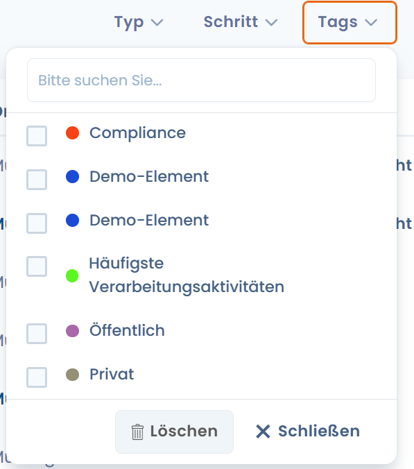

# Tags verwalten

## Wozu dienen Tags

Tags dienen dazu, Informationen nach Ihrer eigenen Methodik zu klassifizieren. Sie ermöglichen es, Verarbeitungen oder andere Elemente in Dastra hervorzuheben, um sie von der Masse abzuheben.

So können Sie beispielsweise einen Tag "prioritär" oder "Zu überprüfen" oder "sensible Verarbeitung" vergeben, um die betreffenden Verarbeitungen oder anderen Elemente leicht wiederzufinden. Die Tag-Liste ist unbegrenzt. Sie können mehrere Tags pro Verarbeitung vergeben. Durch Klicken auf einen Tag filtern Sie automatisch die Verarbeitungen, die diesen Tag tragen.

## Welche Tags gibt es?

Beginnen Sie im Tag-Eingabeformular, den Namen eines beliebigen Tags einzutippen. Es gibt zwei Möglichkeiten: Entweder existiert der Tag bereits, dann können Sie ihn auswählen.

<figure><figcaption></figcaption></figure>

## **Wie verwaltet man alle Tags der Anwendung?**

* Gehen Sie zu > **Einstellungen des Mandanten** 
* Klicken Sie auf das Menü **Tag-Verwaltung**
* **Hier können Sie auch weitere Tags erstellen**

<figure><figcaption></figcaption></figure>
