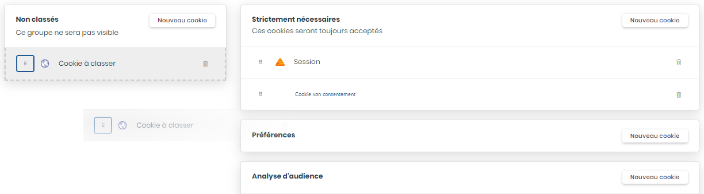
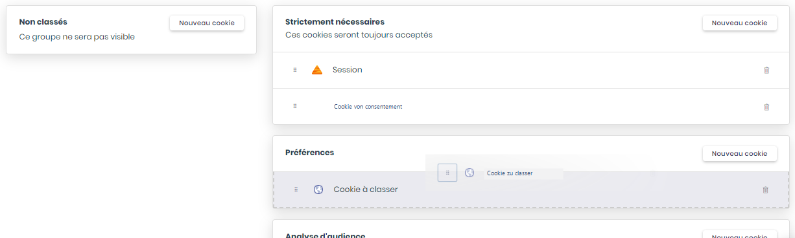

# Cookies nach Einwilligungskategorien klassifizieren

Die Aufsichtsbehörde empfiehlt die Cookies auf der eigenen Website zu erfassen und zu kategorisieren, je nachdem ob sie eine Einwilligung erfordern oder nicht.

Mit DASTRA können Sie die auf Ihrer Website gesetzten Cookies per einfachem „Drag and Drop" nach den großen Verarbeitungszweck-Kategorien klassifizieren:

* Die **„unbedingt erforderlichen"** Cookies: Es handelt sich um Cookies, die aufgrund ihrer Natur von der Einwilligung ausgenommen sind (z. B. Sitzungs- oder Einwilligungs-Cookies)
* Die Cookies vom Typ **„Präferenzen"**
* Die Cookies vom Typ **„Zielgruppenanalyse"**
* Die Cookies vom Typ **„Marketing und Nutzererfahrung"**
* Sonstige.


[les-finalites-des-cookies.md](les-finalites-des-cookies.md)


Wählen Sie dazu einfach den zu klassifizierenden Cookie über die Klassifizierungsoberfläche aus und verschieben Sie ihn per „Klicken und Ablegen" in die gewünschte Kategorie.


Sie können für jeden Cookie einzeln festlegen, ob eine Einwilligung eingeholt werden muss oder nicht.


Sobald alle Ihre Cookies nach Kategorien klassifiziert sind, können Sie das entsprechende Einwilligungs-Widget implementieren.


[implementez-un-widget-de-consentement-aux-cookies.md](implementez-un-widget-de-consentement-aux-cookies.md)

