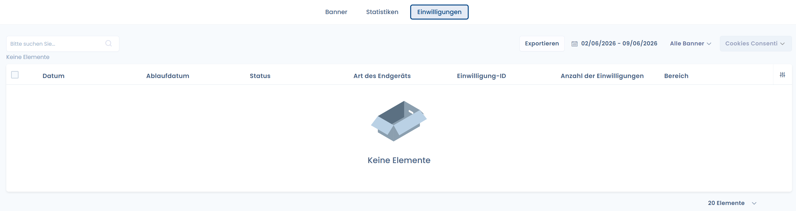

# Nachweise der Cookie-Einwilligung sammeln

Sobald das DASTRA Cookie-Einwilligungs-Widget auf Ihrer Website implementiert ist, ermöglicht Ihnen das DASTRA Cookie-Einwilligungsmodul außerdem, die **Cookie-Einwilligungsnachweise** zu **erfassen** und zu **exportieren**.

## Voraussetzungen

Dazu müssen Sie zuvor ein DASTRA Cookie-Einwilligungs-Widget auf Ihrer Website implementiert haben.


[implementez-un-widget-de-consentement-aux-cookies.md](implementez-un-widget-de-consentement-aux-cookies.md)


## Erfassen Sie die Cookie-Einwilligungsnachweise

Sobald das Widget implementiert ist, erfasst DASTRA automatisch für Sie die Einwilligungsnachweise der Besucher Ihrer Website.

Um diese einzusehen, navigieren Sie einfach zur Oberfläche „**Einwilligungen**" des DASTRA Cookie-Einwilligungsmoduls.


Von dieser Oberfläche aus können Sie auch die erfassten Einwilligungsnachweise anpassen, die Daten exportieren und insbesondere nach Datum oder Cookie-Widget filtern.


Herzlichen Glückwunsch, Sie erfassen jetzt die Cookie-Einwilligungsnachweise!

Die Aufbewahrungsdauer der Einwilligungsnachweise beträgt ein Jahr.

Um Ihre Website dynamisch zu gestalten und die Einwilligung des Besuchers wirklich zu berücksichtigen, besuchen Sie den nächsten Abschnitt „Weiterführende Informationen":


[allez-plus-loin-sur-le-consentement-des-cookies.md](allez-plus-loin-sur-le-consentement-des-cookies.md)

