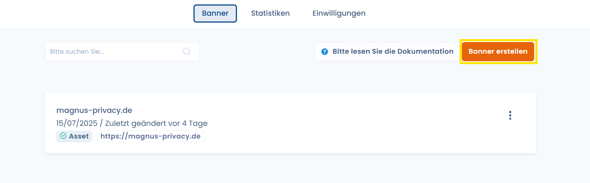
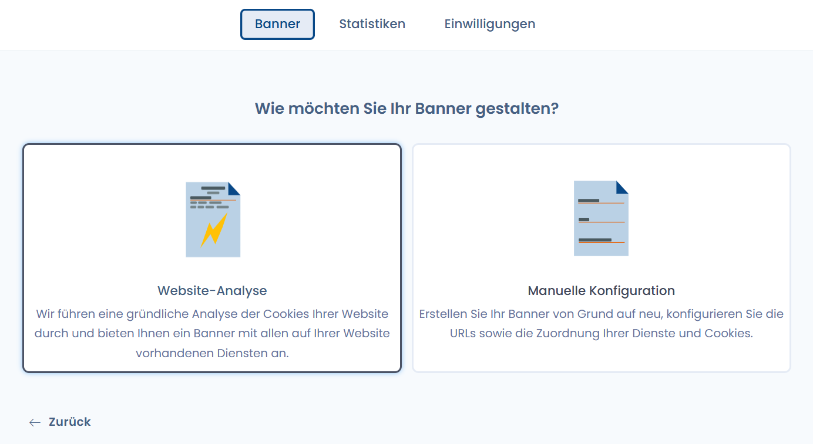
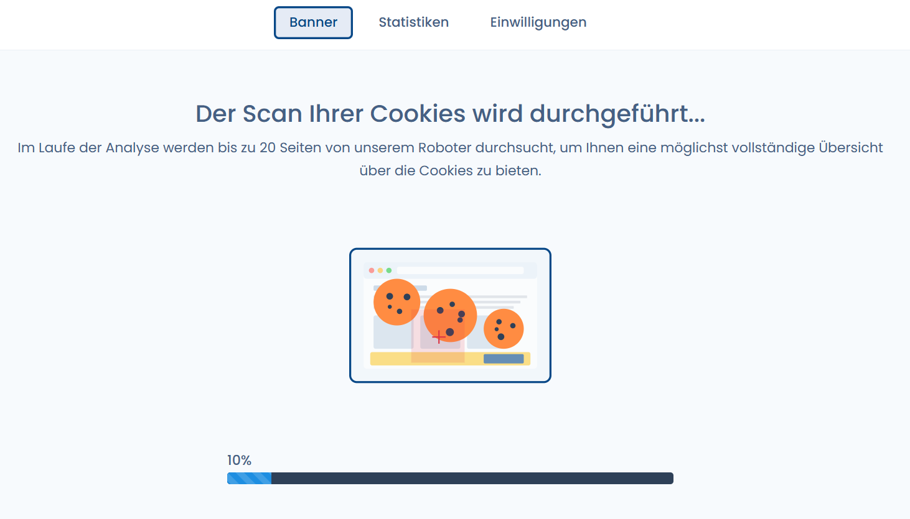
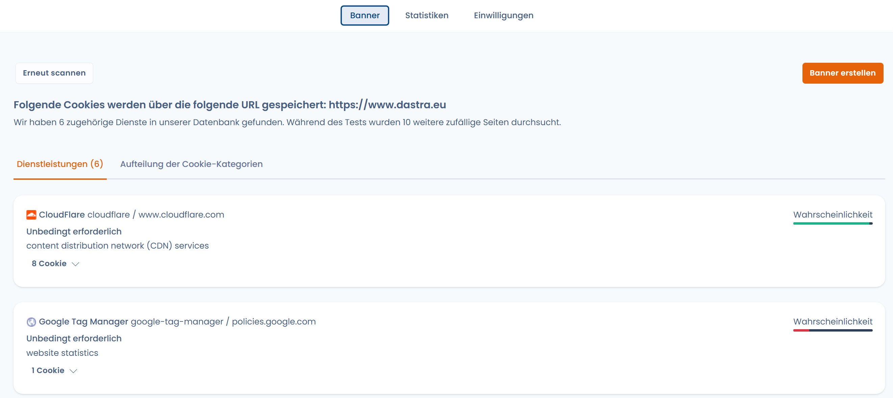

# Auf Ihrer Website gesetzte Cookies scannen

DASTRA ermöglicht es Ihnen, die auf Ihrer Website gesetzten Cookies zu scannen, dank der **Cookie-Scan-Funktion**, die direkt in das Modul „Cookie-Einwilligungs-Widget" integriert ist.

## Zugriff auf die Funktion „Cookie-Scan" von Dastra

Sie müssen sich zunächst bei Ihrem Dastra-Mandanten anmelden. Um zu erfahren, wie das geht, besuchen Sie die folgende Seite:


[tutoriel](../../../getting-started/tutoriel/)


Anschließend müssen Sie zum Modul „**Cookie-Banner**" navigieren und auf die Schaltfläche „**Banner erstellen**" klicken.

Ein neuer Bildschirm wird angezeigt. Sie befinden sich im Bereich „Cookie-Scan".

## Scannen Sie die auf Ihrer Website gesetzten Cookies

Sobald Sie sich im Bereich „Cookie-Scan" befinden, geben Sie einfach den Domainnamen Ihrer Website in das dafür vorgesehene Feld ein und klicken Sie auf „Bestätigen".


Ihr Domainname muss das vollständige Präfix „https://www." enthalten, damit er von unserer Engine erkannt wird.


Warten Sie einige Sekunden – fertig, die auf Ihrer Website gesetzten Cookies sind identifiziert!

Sobald die auf Ihrer Website gesetzten Cookies gescannt sind, können Sie mit deren Klassifizierung fortfahren.


[classifiez-les-cookies-par-categories-de-consentement.md](classifiez-les-cookies-par-categories-de-consentement.md)

