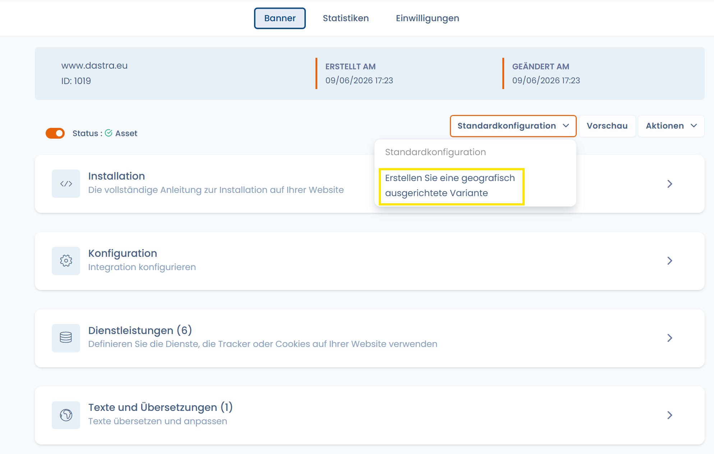

# Geo-Targeting-Varianten

### Vorstellung

Das Dastra-Einwilligungsmodul ermöglicht es, **geo-zielgerichtete Varianten** Ihres Cookie-Banners zu erstellen. Jede Variante ist eine angepasste Version des Widgets – Erscheinungsbild, Texte, angezeigte Dienste – die automatisch basierend auf dem **geografischen Standort des Nutzers** angezeigt wird, der über seine IP-Adresse ermittelt wird.

Diese Funktion ist besonders nützlich für Organisationen, die in mehreren Ländern oder Regulierungszonen tätig sind, da die Pflichten in Bezug auf die Cookie-Einwilligung je nach lokaler Gesetzgebung erheblich variieren (DSGVO/ePrivacy in Europa, CCPA in Kalifornien, LGPD in Brasilien usw.).


**Warum dies rechtlich wichtig ist**

Das in Deutschland konforme Banner ist nicht unbedingt konform für einen kalifornischen Nutzer (Opt-out statt Opt-in) oder einen britischen Nutzer (nach dem Brexit hat die ICO eigene Richtlinien). Geo-zielgerichtete Varianten ermöglichen es Ihnen, Ihre CMP präzise an jeden rechtlichen Kontext anzupassen, ohne die Widgets zu vervielfachen.


***

### Eine geo-zielgerichtete Variante erstellen

#### 1. Auf die Konfiguration zugreifen

Wählen Sie im Modul **Cookies** Ihr Widget aus und navigieren Sie dann zum Tab **Varianten**.

Klicken Sie auf **„Geo-zielgerichtete Variante erstellen"**.

<figure><figcaption></figcaption></figure>

#### 2. Die Variante benennen

Geben Sie ein beschreibendes **Label** ein (maximal 80 Zeichen). Wählen Sie einen aussagekräftigen Namen, um die Verwaltung zu erleichtern, z. B.: `Banner – Kalifornien (CCPA)` oder `Banner – EWR-Zone`.

#### 3. Die Zielregionen auswählen

Wählen Sie die **Länder oder Regionen** aus, für die diese Variante gelten soll. Die Suche ist in der Liste verfügbar.

Dastra bietet zwei Schnellauswahlen:

* **EU/EWR**: wählt automatisch alle Länder des Europäischen Wirtschaftsraums vor.
* **All adequate country**: wählt die von der Europäischen Kommission im Sinne von Artikel 45 DSGVO als angemessen anerkannten Länder vor.

Die Liste ist nach Ländern organisiert, mit der Möglichkeit, **subnationale Regionen** anzusteuern (z. B. französische Regionen, US-Bundesstaaten). Dies ermöglicht es beispielsweise, eine spezifische Variante nur für Kalifornien innerhalb eines allgemeineren Widgets für die USA zu erstellen.


**Prioritätsreihenfolge der Varianten**

Wenn mehrere Varianten auf denselben Nutzer zutreffen könnten (z. B. ein Nutzer in Île-de-France mit einer Variante „Frankreich" und einer Variante „Île-de-France"), hat die **spezifischere** Variante (Region) Vorrang vor der allgemeineren Variante (Land).


#### 4. Die Variante anpassen

Sobald die Variante erstellt ist, können Sie sie **vollständig unabhängig** vom Haupt-Widget konfigurieren:

* **Erscheinungsbild**: Farben, Layout, Schaltflächen
* **Texte & Übersetzungen**: an den lokalen rechtlichen Kontext angepasste Beschriftungen
* **Angezeigte Dienste**: Sie können die Liste der angezeigten Tracker einschränken oder erweitern
* **Auslöser**: spezifische Anzeigebedingungen

#### 5. Die Anzeige des Banners deaktivieren (optional)

Eine Option ermöglicht es, **kein Banner** für Nutzer der Zielzone anzuzeigen.

Wenn aktiviert, wird für die betreffenden Besucher kein Einwilligungsfenster angezeigt. Alle Cookies werden dann mit ihrer **Standardeinwilligung** ausgelöst, wie sie auf Ebene jedes Dienstes im Widget konfiguriert ist.


**Nur für Zonen ohne Pflicht zur vorherigen Einwilligung**

Diese Option ist für Länder geeignet, in denen die lokale Gesetzgebung keine aktive Einholung der Einwilligung vor dem Setzen von Cookies vorschreibt (z. B. bestimmte Länder außerhalb des EWR ohne entsprechende ePrivacy-Gesetzgebung). Sie darf **niemals** für Nutzer in der EU/dem EWR, im Vereinigten Königreich oder in einer anderen Rechtsordnung verwendet werden, die ein Opt-in vorschreibt.



Die „Standardeinwilligung" jedes Dienstes ist in der Widget-Konfiguration im Bereich **Dienste** einstellbar. Überprüfen Sie diese Werte, bevor Sie diese Option aktivieren.


***

### Typische Anwendungsfälle

| Situation                                                  | Empfohlene Konfiguration                                                                    |
| ---------------------------------------------------------- | ------------------------------------------------------------------------------------------- |
| Europäische Website mit amerikanischem Traffic             | EWR-Variante (striktes Opt-in) + USA/Kalifornien-Variante (CCPA Opt-out)                    |
| Französische Website mit deutscher Niederlassung           | Frankreich-Variante + Deutschland-Variante mit an die BfDI-Anforderungen angepassten Texten |
| Globale Website mit minimaler Compliance außerhalb des EWR | Standard-Widget weltweit + EWR-Variante DSGVO-konform                                       |

***

### Technische Funktionsweise

Die geografische Erkennung wird automatisch vom Dastra-SDK anhand der **IP-Adresse** des Nutzers durchgeführt, ohne dass Ihrerseits eine zusätzliche Konfiguration erforderlich ist.

Es werden keine Standortdaten im Einwilligungsprofil des Nutzers gespeichert: Die Geolokalisierung dient ausschließlich zur Auswahl der anzuzeigenden Variante.


Um die Anzeige einer bestimmten Variante in Ihrem Browser zu testen, können Sie ein VPN verwenden oder den Dastra-Support kontaktieren, um einen Vorschaumodus nach Zone zu aktivieren.

