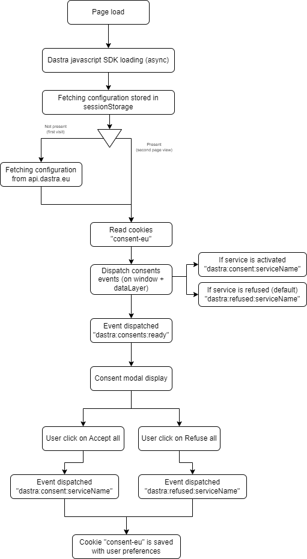

# Cookie-Blockierung

Um eine effektive Cookie-Blockierung zu realisieren, gibt es mehrere mögliche Methoden: das Löschen von Cookies, das Blockieren eines Snippets, benutzerdefiniertes JavaScript oder Google Tag Manager.

## Löschen von Cookies

Diese Methode ist die schnellste in der Umsetzung, aber auch die am wenigsten zuverlässige. Im Konfigurationspanel des Dastra-Widgets können Sie, wenn Sie die Namen der mit jedem Dienst verbundenen Cookies angeben, die betreffenden Cookies bei jedem Seitenaufruf automatisch löschen.&#x20;

.png>)

Diese Funktionsweise kann in bestimmten Fällen wirksam sein, birgt aber das Risiko, die Zuverlässigkeit der verwendeten Drittanbieter-Tools erheblich zu beeinträchtigen (insbesondere Web-Analyse-Tools). Es ist sehr oft vorzuziehen, ergänzend eine der folgenden Methoden zu verwenden.

## Ein Code-Snippet auf der Seite blockieren

Diese Methode ermöglicht es, ein Tracking-Code-Snippet auf der Seite vollständig zu deaktivieren.

Ersetzen Sie dazu im HTML-Code Ihrer Seite das folgende Code-Snippet:

```markup
<script >
  alert("hello, I'm a tracking javascript tag");
</script>
```

Durch:

```markup
<script data-consent="{your-service-slug}" type="dastra/script">
   alert("hello, I'm a tracking javascript tag");
</script>
```

Ersetzen Sie „{your-service-slug}" durch die Kennung Ihres Dienstes, die bei der Konfiguration Ihres Widgets eingegeben wurde:

.png>)

Wenn der Client die Cookies akzeptiert hat, wird der Inhalt des Skripts automatisch ausgeführt.


Diese Funktionsweise kann mehrere Nebeneffekte haben: insbesondere Probleme mit der Syntaxhervorhebung in den meisten IDEs.&#x20;

Das Skript-Snippet wird im Falle eines Implementierungsfehlers des Dastra-Widgets überhaupt nicht ausgeführt.


### Blockierung in reinem JavaScript

In reinem JavaScript können Sie die auf dem Window ausgelösten Ereignisse verwenden, um die Einwilligung zu erfassen und je nach Akzeptanz oder Ablehnung der Cookies ein bestimmtes Verhalten zu steuern. Diese Funktionsweise bietet Ihnen mehr Flexibilität:

```javascript
<script>
  (function(){

      /* 
      * Trigger  a custom servicve tag with expected cookies
      */
      function customTagsTrigger () {
        /* If the vendor provide a specific function for making the service work cookie-less, pull it here.
        * Else copy the default code snippet provided by the tag vendors*/
      }

      /*
      * Handle the global scope consent event
      * If the user has consented to custom vendor's tag cookies, this event will be fired on each page load where the cookie consent widget is installed
      */
      window.addEventListener('dastra:consent:{your-service-slug}', function () {
        /* The client is optin to the custom vendor's cookies here */
        customTagsTrigger();
        console.log('{your-service-slug} accepted')
      });

      /* Uncomment this if you want to handle the refused event
      *  Handle global scope refused event event (Optional) 
      */
        window.addEventListener('dastra:refused:{your-service-slug}', function () {
         // The custom's services cookies are refused 
         console.log('{your-service-slug} cookies refused')
       });
      
  });
  </script>
```

### Google Tag Manager

Siehe nächste Seite:


[google-tag-manager.md](google-tag-manager.md)


### Erinnerung an den Lebenszyklus der Einwilligung:&#x20;

<figure><figcaption><p>Lebenszyklus des Cookie-Widgets</p></figcaption></figure>

### JavaScript-Ereignisse

Standardmäßig sendet das Widget mehrere Ereignisse an das Window-Element der Seite:&#x20;

| Ereignisname                      | Anmerkungen                                                                                                                                                                                                                     |
| --------------------------------- | ------------------------------------------------------------------------------------------------------------------------------------------------------------------------------------------------------------------------------- |
| dastra:consent:\<Dienst-Slug>     | Wird ausgelöst, wenn der Dienst vom Nutzer akzeptiert wurde (erforderliche Cookies sind nicht betroffen). Wenn der Dienst im Modus „standardmäßig eingewilligt" ist, wird dieses Ereignis beim ersten Laden der Seite ausgelöst |
| dastra:refused:\<Dienst-Slug>     | Wird ausgelöst, wenn der Dienst vom Nutzer nicht aktiviert wurde (standardmäßig, wenn keine Einwilligung erteilt wird) oder wenn eine explizite Ablehnung erfolgt ist.                                                          |
| dastra:consents:ready             | Wird ausgelöst, wenn das Einwilligungs-Cookie (consent-eu) gelesen und decodiert wurde.                                                                                                                                         |
| dastra:consents:updated           | Wird ausgelöst, wenn die Einwilligungen vom Nutzer aktualisiert wurden (akzeptiert, abgelehnt oder konfiguriert)                                                                                                                |
| dastra:consents:any\_refused      | Wird ausgelöst, wenn mindestens ein Cookie vom Nutzer über das Modal explizit abgelehnt wurde                                                                                                                                    |
| dastra:consents:all\_accepted     | Wird ausgelöst, wenn alle Dienste vom Nutzer über das Modal akzeptiert wurden                                                                                                                                                    |
