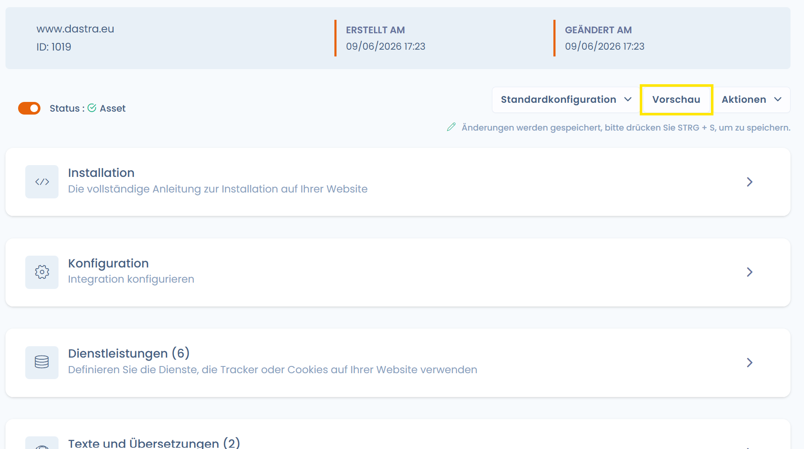
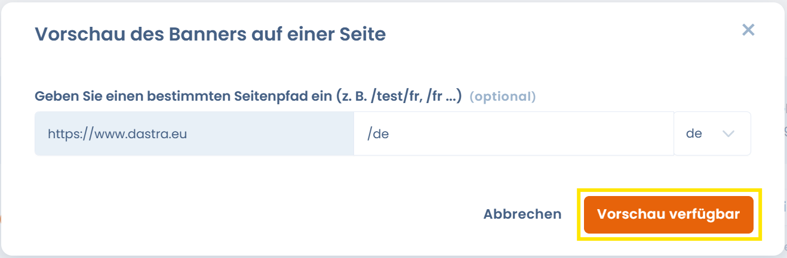

# Widget-Integration testen

## Vorschaumodus aktivieren



<figure><figcaption></figcaption></figure>

Der Vorschaumodus deaktiviert den Widget-Cache und ermöglicht es Ihnen, Ihre Konfigurationsänderungen live zu sehen. Domains auf localhost werden ebenfalls zugelassen.

## Sie können den folgenden API-Schlüssel verwenden

```
dastra00-0testing1-key
```


Dieser Schlüssel zeigt ein Beispiel-Einwilligungs-Widget an. Es ist nicht möglich, dessen Konfiguration zu ändern. Der Zweck dieses Schlüssels besteht darin, Integrationstests durchzuführen (z. B. in einem jsFiddle).

