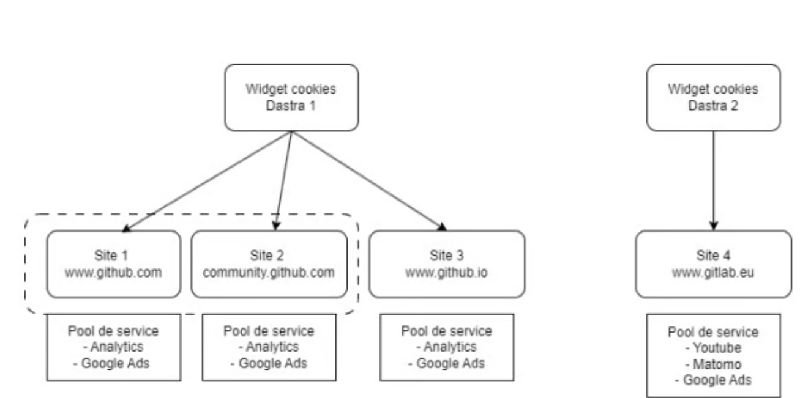
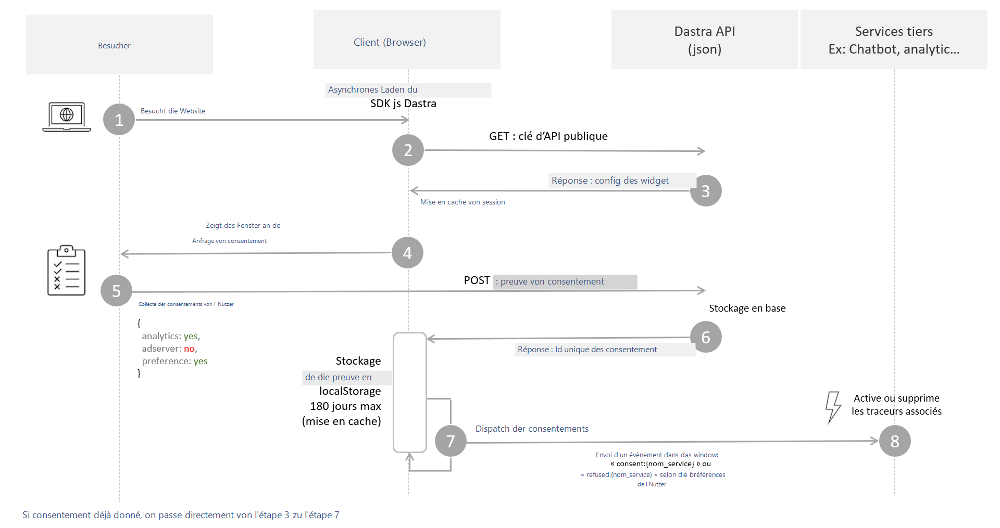

# Funktionsweise des Banners

### Funktionsweise der Lizenz&#x20;

Im Gegensatz zu anderen Lösungen, die Einwilligungsbanner pro Domain vermarkten, basiert die Dastra-Lizenz auf zwei Kriterien:&#x20;

* **Der maximale monatliche Traffic**: die Gesamtzahl der Nutzersitzungen (oder Besuche) auf Ihren Websites während eines Monats.
* **Die Anzahl der Banner**: Sie können ein Banner mit einer bestimmten Anzahl von Cookies/Diensten konfigurieren, das auf mehreren Websites oder Subdomains wiederverwendet werden kann. Das Einwilligungs-Cookie kann auf mehreren Subdomains funktionieren (z. B.: \*.subdomain.com).

Die Anzahl der **Domains und Subdomains ist daher pro Widget unbegrenzt**.

<figure><figcaption></figcaption></figure>

## Globale Funktionsweise:

Global funktioniert das Einwilligungsbanner in 3 großen Schritten:

1. Die **Anzeige** des Einwilligungsfensters
2. Die **Erfassung** der Einwilligung (Speicherung der Nachweise)
3. Die **Ausführung** der tatsächlichen Einwilligung des Nutzers


Das Dastra-Banner ermöglicht es, die ersten beiden Schritte teilweise automatisch abzudecken. Für den dritten Schritt, der die tatsächliche Anwendung der Nutzer-Cookie-Präferenzen betrifft, müssen Sie das Einwilligungssystem technisch in die Drittanbieterdienste integrieren, die potenziell Cookies setzen können. Weitere Informationen finden Sie im [Leitfaden zur Cookie-Blockierung](blocage-des-cookies/).


Das JavaScript-SDK des Widgets muss auf allen Seiten der Website aufgerufen werden, die Cookies verwenden.



### 1. Besuch auf der Kundenwebsite

Der Internetnutzer besucht die Website, auf der das JS-Code-Snippet installiert ist. Um die Leistung und das SEO der Webseiten nicht zu beeinträchtigen, wird das SDK vollständig asynchron mit einer Caching-Dauer von einem Tag geladen.

### 2. und 3.: Erfassung und Caching der Widget-Konfiguration

Damit das Widget auf der Website korrekt funktioniert, benötigt es eine aktuelle Client-Konfiguration, die von den Dastra-Servern abgerufen wird. Um die aktuellste Version zu erhalten, führt es eine GET-Anfrage des Widgets mit dem öffentlichen API-Schlüssel durch, um die Zugehörigkeit des Widgets zum Client zu überprüfen.


Wenn der Client seine Domain im Widget-Editor nicht korrekt angegeben hat, wird die Anfrage nicht autorisiert und es ist unmöglich, das Widget korrekt anzuzeigen. Um dies zu beheben, gehen Sie [auf diese Seite](https://app.dastra.eu/workspace/19/cookie-widget/list), wählen Sie Ihr Widget aus und fügen Sie die fehlende Domain hinzu.


### 4. Einholung der Einwilligung des Nutzers

Wenn das Cookie „eu-consent" (Sie können den Cookie-Namen bei Bedarf ändern) fehlt, wird das Einwilligungsfenster angezeigt. Um die korrekte Anzeige des Widgets zu testen, können Sie dieses Cookie in Ihrem Browser löschen.&#x20;

### 5. Die Erfassung der Einwilligung

Die Einwilligungen werden automatisch über eine POST-Anfrage im JSON-Format an die Dastra-API übermittelt.&#x20;

Obwohl im Widget die Einwilligung nach Verarbeitungszweck erfolgt, wird die Speicherung nach Dienst durchgeführt.

So sieht der Einwilligungsnachweis aus, wie er in unseren Datenbanken gespeichert wird:

```javascript
{
    "id": "6185fe65-0924-410d-9132-3cde838c4627",
    "sessionId": "0b93b823-ff36-4d61-8959-e9e8deee5ef8",
    "date": "2020-05-19T16:54:03.272Z",
    "dateExpiration": "2020-11-19T16:54:03.272Z",
    "type": 2,
    "widgetId": 43,
    "typeDevice": 2,
    "workSpaceId": 19,
    "consentId": "8a5e89c4-2243-4598-97c5-ba3cfb35a138",
    "consents": {
        "lang": "fr-FR",
        "versionKey": null,
        "cookieConsents": [
            {
                "id": "584ffef3-251c-4e9a-efb8-08d7fbfbee92",
                "tenantId": 0,
                "name": "Drift",
                "slug": "drift",
                "consent": true,
                "version": "6f65cb1d-85eb-4a64-976d-519679189f8d",
                "date": "2020-05-19T16:53:59.511Z",
                "purpose": 3
            }, {
                "id": "1c3baa61-0d05-44e4-da3d-08d7eeadee05",
                "tenantId": 0,
                "name": "Google Analytics (universal)",
                "slug": "analytics",
                "consent": true,
                "version": "6f65cb1d-85eb-4a64-976d-519679189f8d",
                "date": "2020-05-19T16:54:00.568Z",
                "purpose": 2
            }
        ]
    }
}
```

&#x20;Als Antwort gibt die API eine Zeichenkette namens „consentId" zurück, die anschließend im localStorage des Browsers für maximal 180 Tage gespeichert wird. Diese Zeichenkette ist die eindeutige Kennung des Einwilligungsnachweises. Im Falle eines Rechtsstreits ist es diese Kennung, die im Browser des Kunden gesucht werden muss.

### 6. Die Ausführung der Einwilligung

Nachdem wir die Einwilligung des Nutzers erfasst haben, ist es nun notwendig, seinen Wunsch tatsächlich umzusetzen, indem die Einwilligungsinformationen an alle Dienste der Website übermittelt werden.

Für diese Phase empfehlen wir Ihnen den Leitfaden zur Cookie-Blockierung:


[blocage-des-cookies](blocage-des-cookies/)



Mit Ausnahme der unbedingt erforderlichen Cookies müssen alle Drittanbieterdienste, die Tracking durchführen, standardmäßig blockiert werden.&#x20;


Herzlichen Glückwunsch, Sie sind bereit, mit der technischen Integration des Widgets zu beginnen:


[integration-dans-les-cms](integration-dans-les-cms/)

