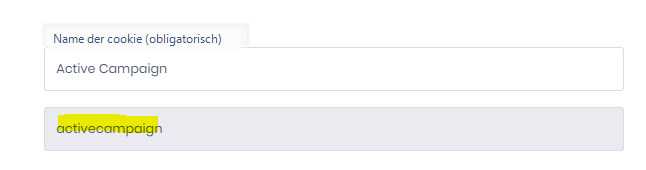

# Einwilligung programmatisch verwalten

## Wo werden die Einwilligungen gespeichert?

Der vollständige Einwilligungsnachweis des Nutzers wird im localStorage des Browsers gespeichert (der Speicherschlüssel heißt dastra-consents) im JSON-Format. Die Weiterleitung der Einwilligungen hängt davon ab, weshalb es nicht empfohlen wird, die Daten dieses Schlüssels direkt zu ändern


&#x20;Es wird nicht empfohlen, die Daten im localStorage direkt zu ändern. Verwenden Sie vorzugsweise das Dastra JavaScript-SDK.


### Zugriff auf den Einwilligungsdienst

Der Dastra-Einwilligungsdienst ist folgendermaßen zugänglich

```javascript
<script>
  window.dastra = window.dastra || [];
  window.dastra.push(['cookieReady',function(manager)
  {console.log(manager.consent)}]);
</script>
```

### Liste der verfügbaren Methoden im Einwilligungsmanager

In manager.consent stehen Ihnen folgende Methoden zur Verfügung:

- open() : öffnet das Einwilligungs-Widget
- close() : schließt das Einwilligungs-Widget
- getAllConsents() : ruft alle Einwilligungen ab
- hasConsented() : gibt `true` zurück, wenn der Nutzer bereits eine explizite Einwilligung gespeichert hat
- getPurposeConsent(purposeLabel:string) : ruft die Einwilligung einer Cookie-Kategorie ab
- setPurposeConsent(purposeLabel:string, consent:bool): legt die Einwilligung für eine Kategorie fest
- getServiceConsent(serviceShortName:string): ruft die Einwilligung eines bestimmten Dienstes ab.
- setServiceConsent(serviceShortName:string, consent:bool): legt die Einwilligung eines bestimmten Elements fest

### Liste der Nutzer-Einwilligungen abrufen (getAllConsents)

Sobald Sie auf den Einwilligungsmanager zugreifen, ist es sehr einfach, die Einwilligungen des aktuellen Nutzers abzurufen:

```javascript
<script>
dastra = dastra || []
dastra.push(['cookieReady', function(manager){
    // Get the complete consent services list
    var consents = manager.consent.getAllConsents()
});
</script>
```

Die obige Methode gibt die Liste aller Nutzer-Einwilligungen zurück

```javascript
[
  {
    "id":"000000-0000000-000000",
    "name": "Service name",
    "purpose": 1,
    "logoUrl": "https://logo-url/img.jpg",
    "privacyPolicyUrl":"",
    "description": "Short description",
    "defaultConsent": true,
    "requiredConsent":true
  },
  ...
]
```

### Einwilligungen nach Kategorie abfragen (getPurposeConsent/setPurposeConsent)

Die Cookie-Kategorien werden durch folgende Labels identifiziert:

| Kategorie           | Label          |
| ------------------- | -------------- |
| Erforderlich        | `Necessary`    |
| Präferenzen         | `Preference`   |
| Analytisch          | `Analytical`   |
| Marketing           | `Marketing`    |
| Sonstige            | `Other`        |
| Nicht klassifiziert | `Unclassified` |


Verwenden Sie die **Labels als Zeichenketten** (z. B. `'Analytical'`) und nicht die numerischen Werte, die von der API nicht unterstützt werden.


```javascript
<script>
window.dastra = window.dastra || [];
window.dastra.push(['cookieReady',function(manager){
    let consents = manager.consent.getPurposeConsent('Analytical');
    manager.consent.setPurposeConsent('Analytical', false);

    // persist consent in cookies
    manager.consent.save();
});
</script>
```

### Einwilligungen nach Dienst verwalten

Um die Einwilligungen nach Dienst zu verwalten, benötigen Sie den vereinfachten Namen des Dienstes, der in der Dienstverwaltungsoberfläche Ihres Widgets verfügbar ist.


**Wie finden Sie den vereinfachten Dienstnamen?**\
Gehen Sie zur Dienstverwaltungsoberfläche. Beim Bearbeiten eines Dienstes erscheint der vereinfachte Name (Slug) des Dienstes unterhalb des Cookie-Namens.




```javascript
<script>
dastra = dastra || []
dastra.push(['cookieReady',function(manager){
    let cookieService = 'google-analytics';
    let consents = manager.consent.getServiceConsent(cookieService);
    manager.consent.setServiceConsent(cookieService, false);

    // sauvegarder le consentement
    manager.consent.save();
});
</script>
```

### Vollständiges Beispiel

Das folgende Beispiel zeigt, wie eine globale Ablehnung programmatisch angewendet wird – zum Beispiel wenn der Nutzer auf eine benutzerdefinierte Schaltfläche „Alle ablehnen" klickt oder um ein Browser-Datenschutzsignal zu beachten.

```javascript
<script>
window.dastra = window.dastra || [];
window.dastra.push(['cookieReady', function(manager) {

  // N'agir que si l'utilisateur n'a pas encore fait de choix explicite
  if (!manager.consent.hasConsented()) {

    // Refuser toutes les catégories non essentielles
    manager.consent.setPurposeConsent('Preference',   false);
    manager.consent.setPurposeConsent('Analytical',   false);
    manager.consent.setPurposeConsent('Marketing',    false);
    manager.consent.setPurposeConsent('Other',        false);
    manager.consent.setPurposeConsent('Unclassified', false);

    // Sauvegarder le choix dans le navigateur
    manager.consent.save();
  }

}]);
</script>
```

Es ist auch möglich, selektiv bestimmte Kategorien zu akzeptieren – zum Beispiel nur Analytik akzeptieren:

```javascript
<script>
window.dastra = window.dastra || [];
window.dastra.push(['cookieReady', function(manager) {

  manager.consent.setPurposeConsent('Analytical', true);
  manager.consent.setPurposeConsent('Marketing',  false);
  manager.consent.save();

}]);
</script>
```
