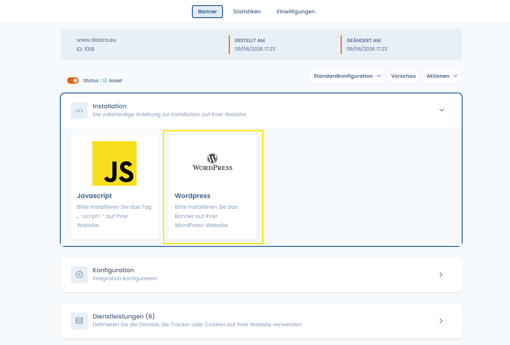
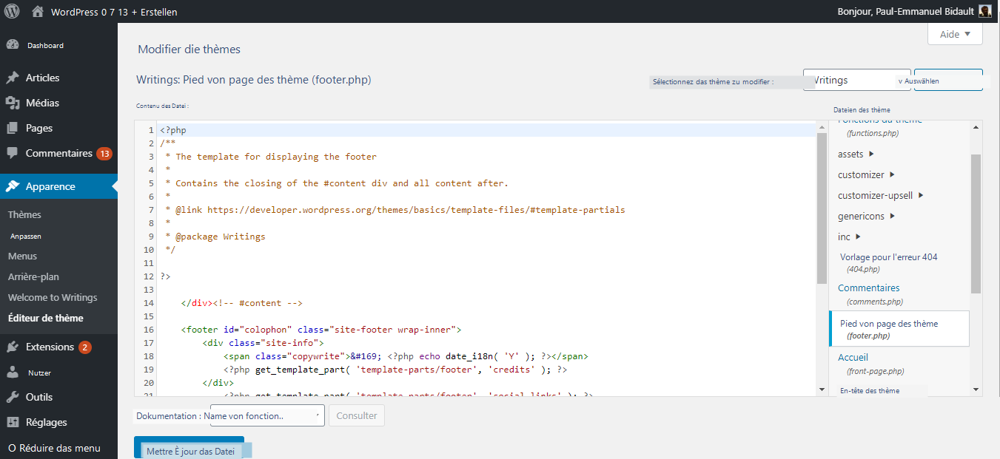

# Wordpress

## 1. Abruf des SDK

Sobald Sie die Konfiguration und das Design des Dastra Cookie-Einwilligungs-Widgets abgeschlossen haben, können Sie das SDK im Bereich „Code" abrufen.


Sie können dieses Code-Snippet hier finden und kopieren/einfügen:\
Cookie-Einwilligung > Bearbeiten > Code


## 2. Kopieren und Einfügen im WordPress-Editor

Sobald der Code abgerufen ist, gehen Sie in die Administrationskonsole Ihrer WordPress-Website.

Klicken Sie auf die Schaltfläche „Design" in der vertikalen Seitenleiste links und dann auf die Schaltfläche „Theme-Editor".

Wählen Sie die Datei „Footer.php" auf der rechten Seite des angezeigten Bildschirms aus und fügen Sie den zuvor abgerufenen Dastra-Code am Ende des \<body>-Tags ein (direkt vor \</body>).

Speichern Sie, indem Sie auf „Datei aktualisieren" klicken, und aktualisieren Sie dann die Seite Ihrer Website. Fertig – das Banner erscheint!
