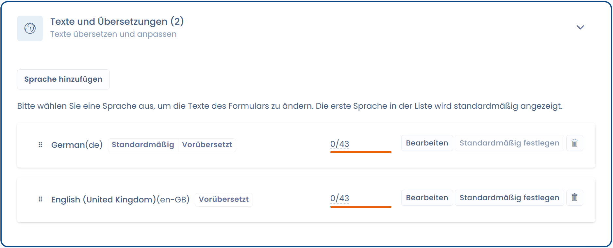

# Sprachverwaltung

## Wie verwaltet man mehrere Sprachen für das Widget?

Gehen Sie auf die Einstellungsseite des gewünschten Widgets und dann auf den Tab „Texte und Übersetzungen". Sie können eine oder mehrere Sprachen hinzufügen.



## Wie wird die Sprache des Widgets erkannt?

Standardmäßig wird die Sprache automatisch anhand der Browsersprache erkannt

## Wie erzwingt man die Sprache des Widgets?

Um die Sprache des Widgets zu erzwingen, fügen Sie einfach ein Attribut data-lang="" zum Widget-div hinzu

```markup
<div id="cookie-consent" data-lang="fr"></div>
```
