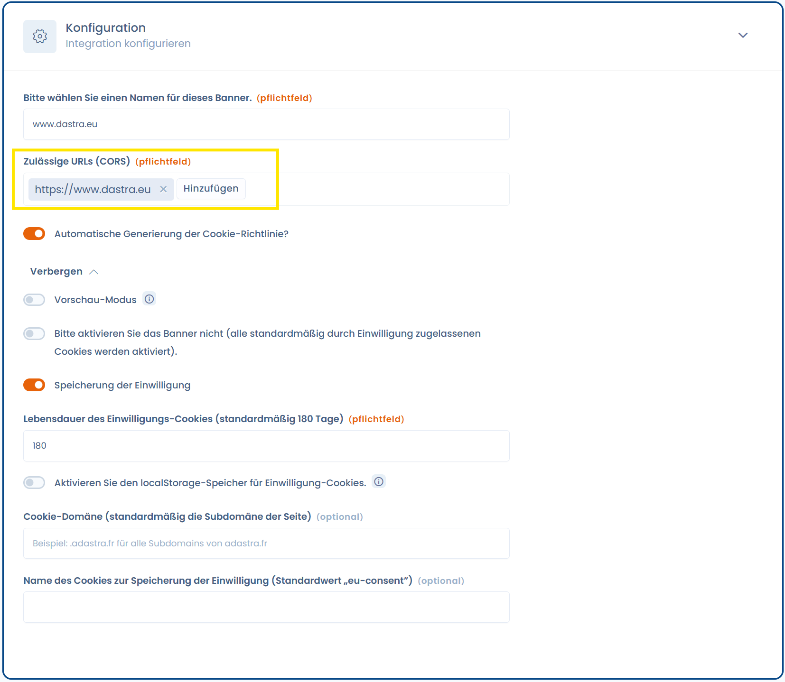
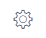

# Fehlerbehebung

In bestimmten Fällen wird das Cookie-Widget nicht angezeigt. Hier sind die Lösungen für dieses Problem:

1.  Überprüfen Sie die dem Widget zugeordneten Domains. Gehen Sie dazu zu **Cookies** > **Widget auswählen** > **Konfiguration**\
    Ändern Sie die autorisierten Domains folgendermaßen, wobei Sie das Format _https://www.meineurl.com_ einhalten: 

    <figure><figcaption></figcaption></figure>
2.  **Überprüfen Sie die Gültigkeit Ihres öffentlichen API-Schlüssels** (Verwenden Sie nicht den privaten Schlüssel!). Gehen Sie dazu zu **Organisationseinstellungen (Die Schaltfläche oben rechts**) > **Entwicklung / API-Schlüssel**. Überprüfen Sie dann, ob der API-Schlüssel existiert und gültig ist. 

    <figure><figcaption></figcaption></figure>
3. **Überprüfen Sie, ob Sie nicht versehentlich einen Anzeige-Auslöser konfiguriert haben.** Wenn beispielsweise das Banner so konfiguriert ist, dass es bei einer zu hohen Scroll-Höhe in % angezeigt wird, werden Sie das Widget beim Aufrufen der Seite nicht sehen.
4. **Überprüfen Sie Ihr Abonnement**: Um das Cookie-Einwilligungs-Widget frei nutzen zu können, müssen Sie über ein gültiges Abonnement für diese Funktion verfügen. Kontaktieren Sie Ihren Organisationseigentümer, wenn dieser die Cookie-Schaltfläche nicht in der Navigation sieht – wahrscheinlich ist die Funktion nicht in Ihrem Abonnement enthalten. Sie können sich an den [Support-Service](mailto:support@dastra.eu) wenden, um weitere Informationen zu erhalten.
5. Für alle anderen Probleme [kontaktieren Sie den Support](https://doc.dastra.eu/commencer/le-support/faire-une-demande-de-support?cacheBust=1676909428068).
