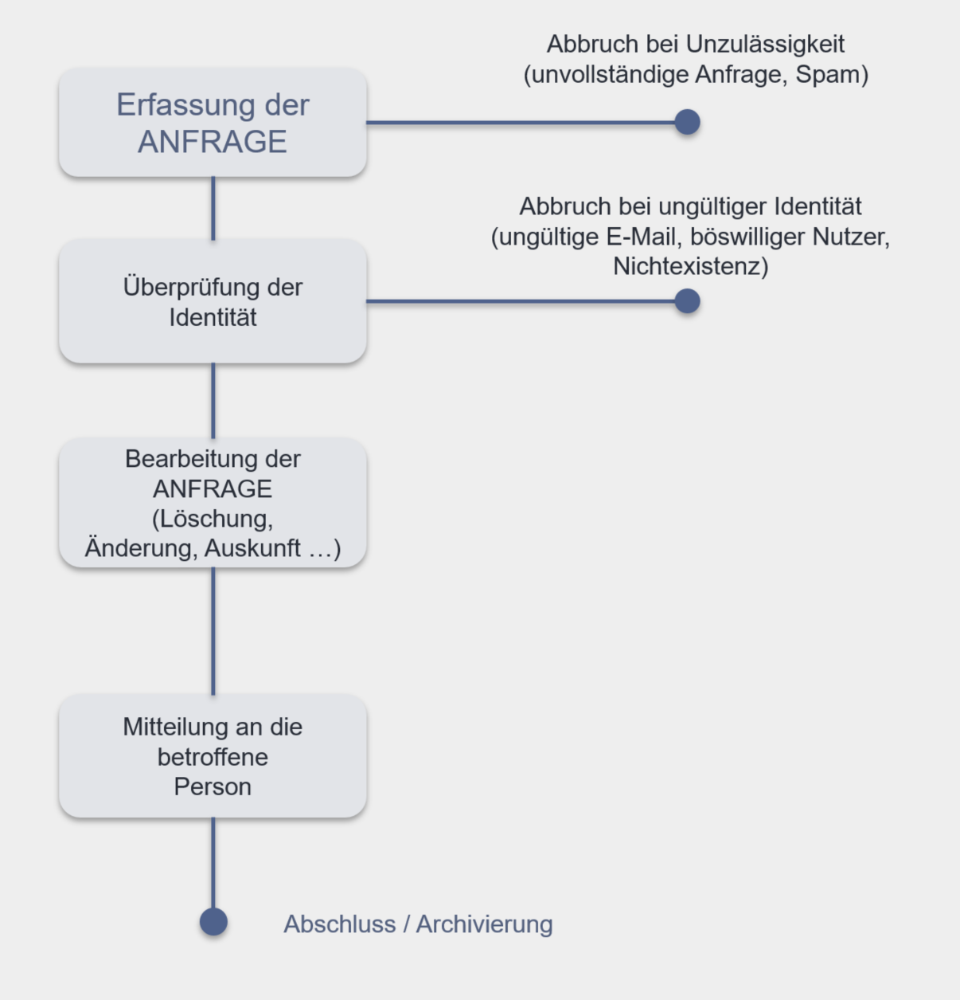
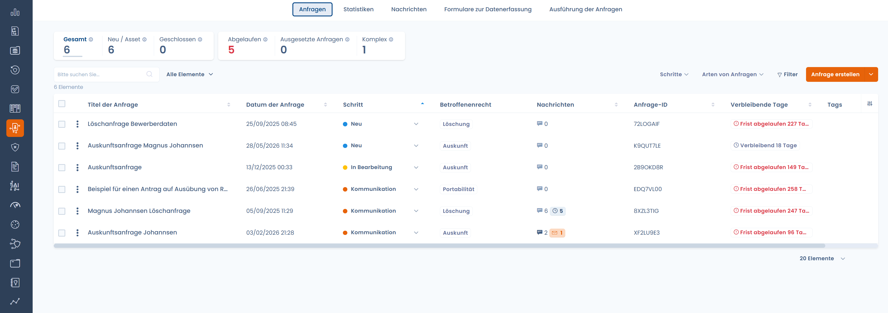
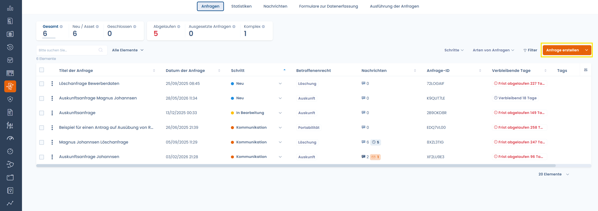
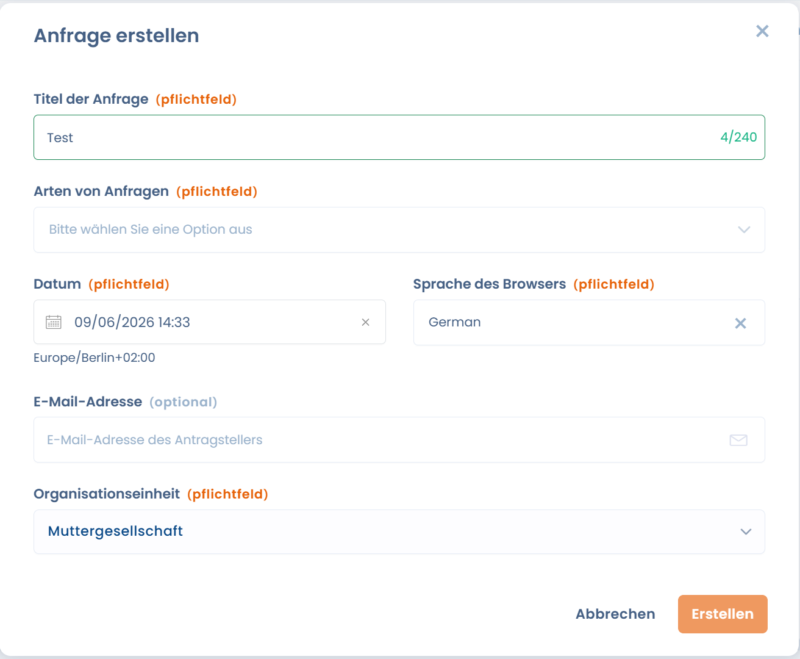
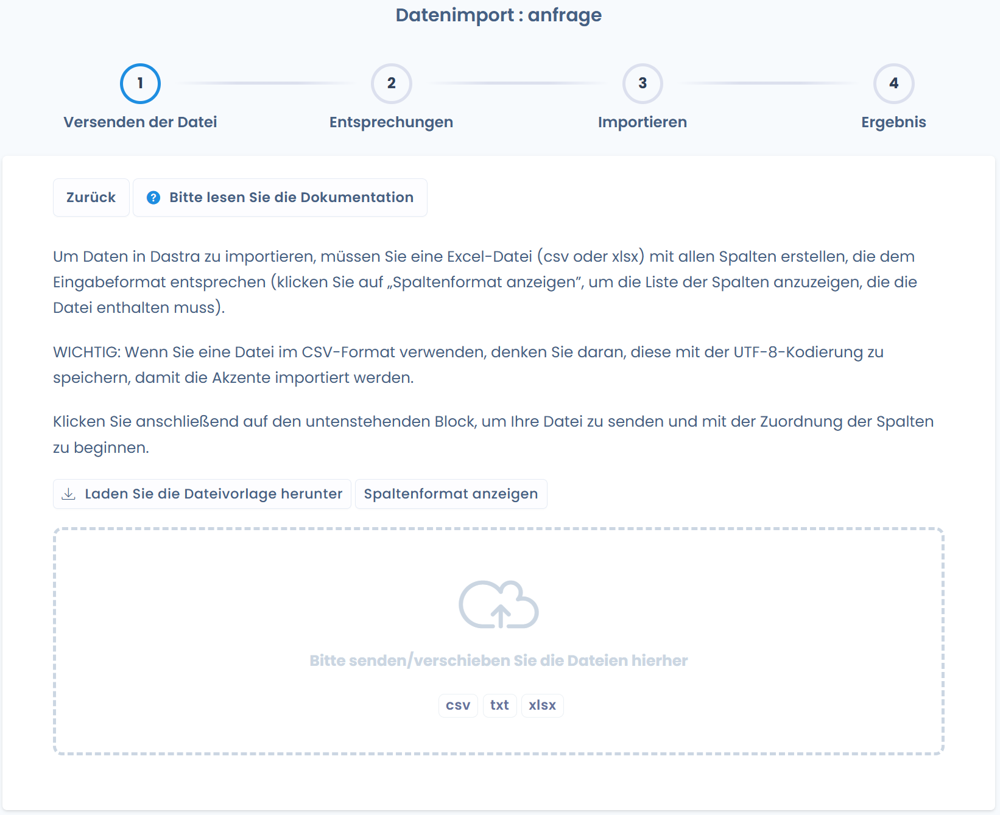

# Betroffenenanfragen

Mit der DSGVO sind europäische Bürger in der Lage, von einem Unternehmen oder einer Organisation, die sie betreffende personenbezogene Daten verarbeitet, die Ausübung ihrer Rechte zu verlangen. Diese sind verpflichtet, die Ausübung der Rechte zu erleichtern.


[droits-des-personnes.md](../../rappels-utiles/rgpd-en-bref/droits-des-personnes.md)


Dazu muss das Unternehmen oder die Organisation Verfahren einrichten, die es ermöglichen, auf Betroffenenanfragen zu antworten und den Nachweis dafür zu erbringen. Dies umfasst insbesondere einzuhaltende Schritte und eine Dokumentation in einem Verzeichnis.

## Der Prozess zur Verwaltung einer Betroffenenanfrage

Die Verwaltung einer Betroffenenanfrage kann in 4 große Schritte zusammengefasst werden:

<figure><figcaption></figcaption></figure>

Für weitere Details zur Verwaltung von Betroffenenanfragen siehe die folgende Seite:


[gestion-des-demandes-dexercices-de-droits.md](gestion-des-demandes-dexercices-de-droits.md)


## Das Verzeichnis der Betroffenenanfragen

Dastra ermöglicht es Ihnen, ein Verzeichnis der Betroffenenanfragen aufzubauen, das alle vergangenen, aktuellen und zukünftigen Anfragen zentralisiert. Dieses ist verfügbar, indem Sie auf den Reiter "Betroffenenanfragen" in der linken Seitenleiste klicken.

<figure><figcaption></figcaption></figure>

## Eine neue Betroffenenanfrage erfassen

Es gibt 3 Möglichkeiten, eine neue Betroffenenanfrage in DASTRA zu erfassen:

1. [Die neue Betroffenenanfrage direkt im Tool erfassen](gestion-des-demandes-dexercices-de-droits.md)
2. Die Anfragen per Excel-, CSV- oder Textdatei importieren. Besuchen Sie [unseren Leitfaden zum Datenimport in Dastra](../generalites/importer-vos-donnees-excel-csv.md)
3. [Ein Widget für Betroffenenanfragen einrichten](implementez-un-widget-dexercice-des-droits.md)

### Manuelle Erstellung einer Betroffenenanfrage

Durch Klicken auf die Schaltfläche "**Anfrage erstellen**" erscheint ein Fenster, in dem Sie die Betroffenenanfrage detailliert beschreiben und zuordnen können. Klicken Sie anschließend auf "**Erstellen**".

<figure><figcaption></figcaption></figure>

<figure><figcaption></figcaption></figure>

Geschafft, Sie haben Ihre erste Betroffenenanfrage manuell erstellt!

### Import / Export des Verzeichnisses der Betroffenenanfragen

Das gesamte Anfragenverzeichnis ist importier- und exportierbar. Um eine Anfrage zu importieren, klicken Sie auf den **Pfeil** neben der Schaltfläche "Anfrage erstellen".

<figure><figcaption></figcaption></figure>

Es erscheint ein Fenster für den Datenimport. Laden Sie sich die Dateivorlage herunter und befüllen Sie diese. Anschließend klicken Sie auf "Weiter". Nach dem Import ist die Anfrage direkt im Anfragenverzeichnis verfügbar.

### Einrichtung eines Widgets für Betroffenenanfragen

Betroffenenanfragen können auch über ein spezifisches Widget erfasst werden, das über die Dastra-Plattform konfigurierbar ist.

Konsultieren Sie [unseren Leitfaden zur Einrichtung des Widgets für Betroffenenanfragen](./#mise-en-place-de-widget-de-demande-dexercice-de-droits)


[implementez-un-widget-dexercice-des-droits.md](implementez-un-widget-dexercice-des-droits.md)

