# Bearbeitung und Verarbeitung der Anfragen

Dastra ermöglicht es Ihnen, den gesamten Lebenszyklus einer Betroffenenanfrage (DSAR) zu verwalten.\
Über die Oberfläche können Sie:

* **Die Anfrage qualifizieren**: betroffener Rechtstyp, Organisationseinheit, Fristenverwaltung.
* **Die Identität** des Antragstellers überprüfen, indem Sie die erfassten Informationen vervollständigen oder anpassen.
* **Die zugehörigen Daten verarbeiten**, indem Sie die verknüpften Datensätze einsehen, Nachweise hochladen und die Verantwortlichen benachrichtigen.
* **Direkt dem Antragsteller antworten** mithilfe des KI-Assistenten, mit vollständiger Nachverfolgbarkeit des Austauschs.

Jeder Schritt wird dokumentiert und historisiert, was die rechtliche Konformität und eine klare Antwort an die betroffenen Personen gewährleistet.

***

### Qualifizierung der Anfrage

Wenn eine Anfrage erfasst wird, erscheint sie im Anfragenverzeichnis.\
Über den Bildschirm zur **Qualifizierung** können Sie:

1. Den betroffenen **Rechtstyp** festlegen (Auskunft, Berichtigung, Löschung, Widerspruch usw.).
2. Die Anfrage einer **Organisationseinheit** zuweisen.
3. Die **Bearbeitungsfristen** verwalten:
   * Gesetzliche Frist von 30 Tagen.
   * Möglichkeit, die Anfrage als komplex zu kennzeichnen (90 Tage).
   * Die Frist bei Bedarf vorübergehend aussetzen.

<figure>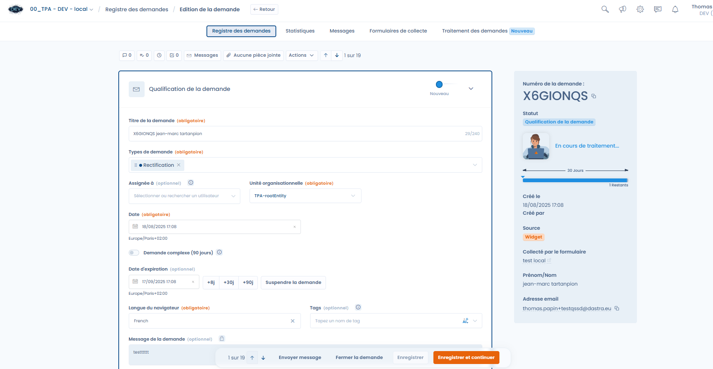<figcaption>
Die Oberfläche zur Verwaltung einer Anfrage
</figcaption></figure>

***

### Identitätsprüfung

Dastra ermöglicht die Überprüfung der Identität der Person, die die Anfrage gestellt hat.\
Sie können die über das ursprüngliche Formular erfassten Informationen vervollständigen oder ändern:

* E-Mail-Adresse, Vorname, Nachname.
* Zusätzliche Daten: Land, Postadresse, Telefon, Nutzer-ID usw.
* Kategorie der betroffenen Person (z. B. Newsletter-Abonnenten, Kunden, Mitarbeiter).

<figure>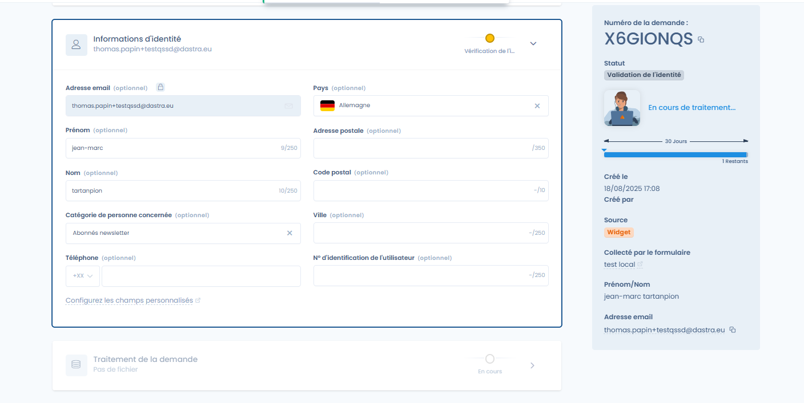<figcaption>
Abschnitt zur Identität des Antragstellers
</figcaption></figure>

***

### Bearbeitung der Anfrage

Der Reiter **Bearbeitung der Anfrage** fasst alle mit der Ausführung verbundenen Aktionen zusammen.

#### Anhänge

Sie können Nachweisdateien oder Exporte mit den Daten des Antragstellers hochladen.\
Diese Dateien können anschließend bei der Antwort beigefügt werden.

<figure>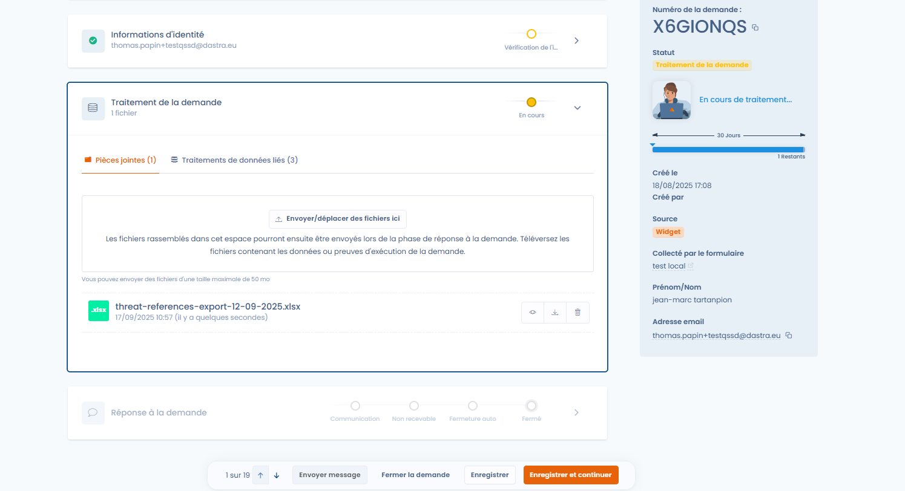<figcaption>
Dateien zur Anfrage hinzufügen
</figcaption></figure>

***

#### Verknüpfte Datenverarbeitungen

Dastra identifiziert automatisch die Datensätze, die mit der **Kategorie der betroffenen Personen** verknüpft sind.\
Jeder Datensatz muss einzeln bearbeitet werden.

* Verfügbare Status: **Ausstehend** / **Bearbeitet**.
* Anzeige des Gesamtfortschritts (Fortschritt in Prozent).

<figure>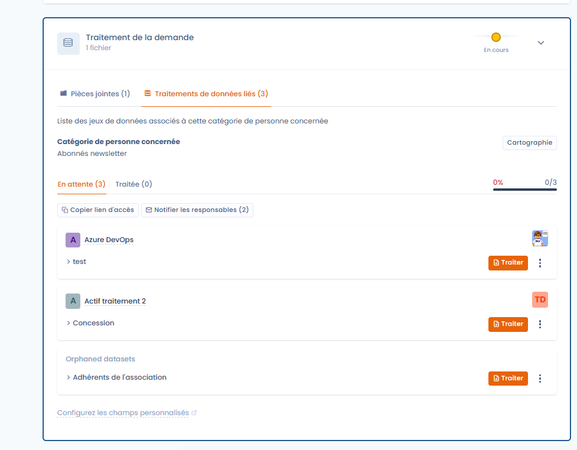<figcaption>
Erweiterte Bearbeitung pro Datensatz
</figcaption></figure>

***

**Details eines Datensatzes**

Sie können die Verbindungen zwischen dem Datensatz und den Assets direkt einsehen, indem Sie auf die Schaltfläche **Kartografie** klicken.

<figure>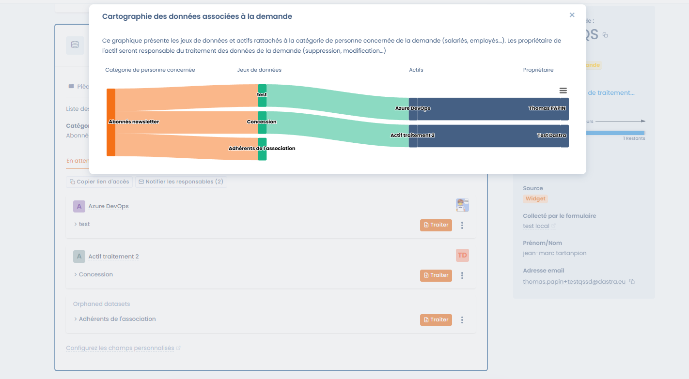<figcaption>
Visualisieren Sie die Verbindung zwischen der Personenkategorie und dem zu kontaktierenden Verantwortlichen
</figcaption></figure>

Durch Klicken auf **Bearbeiten** gelangen Sie zu den detaillierten Informationen:

* Betroffene Datenkategorien (Berufsleben, Privatleben, Identität usw.).
* Rechtsgrundlage und Speicherdauer.
* Löschmodalitäten nach Ablauf der Speicherdauer.

<figure>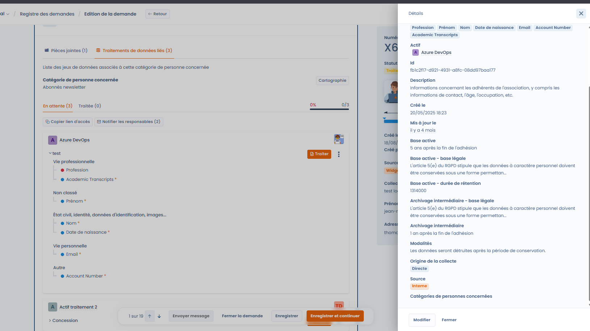<figcaption>
Schnellzugriff auf die Asset-Details
</figcaption></figure>

***

**Eine Verarbeitung als bearbeitet markieren**

Für jeden Datensatz:

1. Sehen Sie die Informationen ein.
2. Begründen Sie die durchgeführte Verarbeitung (z. B. Löschung, Berichtigung).
3. Fügen Sie bei Bedarf Nachweisdateien hinzu.
4. Klicken Sie auf **Als bearbeitet markieren**.

<figure>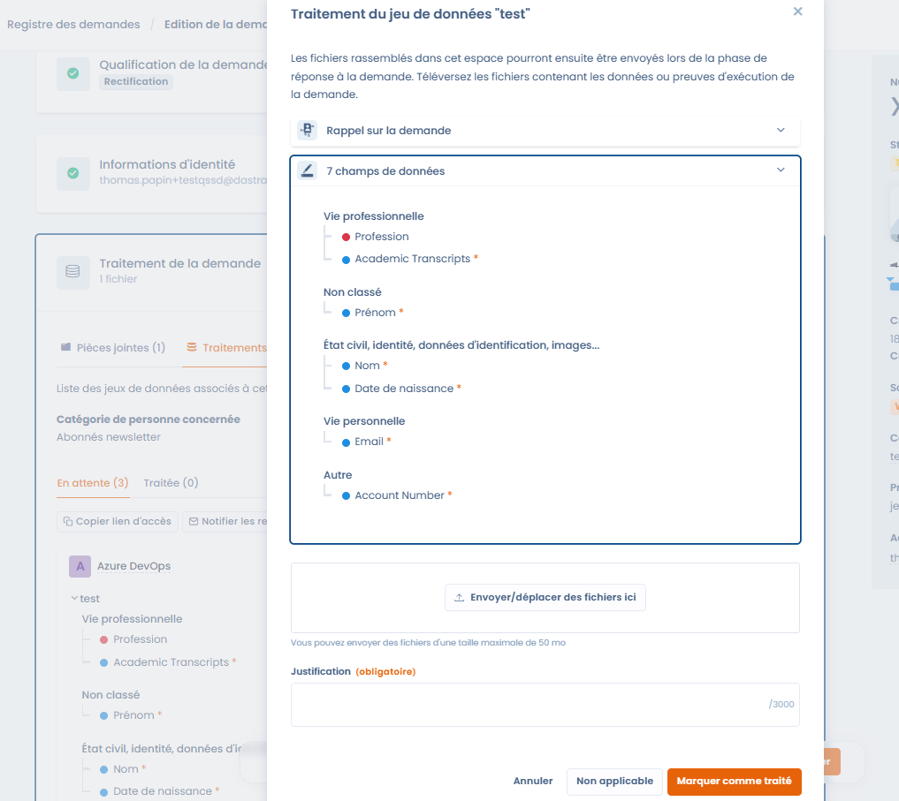<figcaption>
Bearbeitungsoberfläche der Anfrage spezifisch für das Asset
</figcaption></figure>

Sobald als bearbeitet markiert, wird der Status aktualisiert und ein Kommentar kann hinzugefügt werden.

<figure>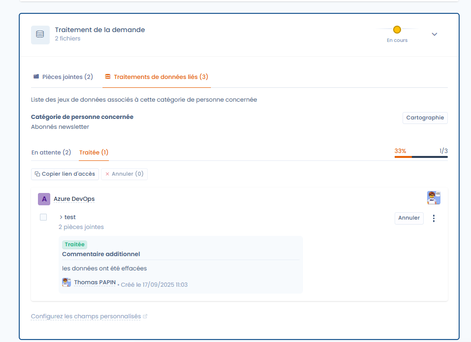<figcaption></figcaption></figure>

***

#### Zusammenarbeit und Benachrichtigungen

Sie können die Verantwortlichen der betroffenen Assets automatisch benachrichtigen.\
Ein Fenster ermöglicht die Auswahl der Personen, die per E-Mail benachrichtigt werden sollen.

<figure>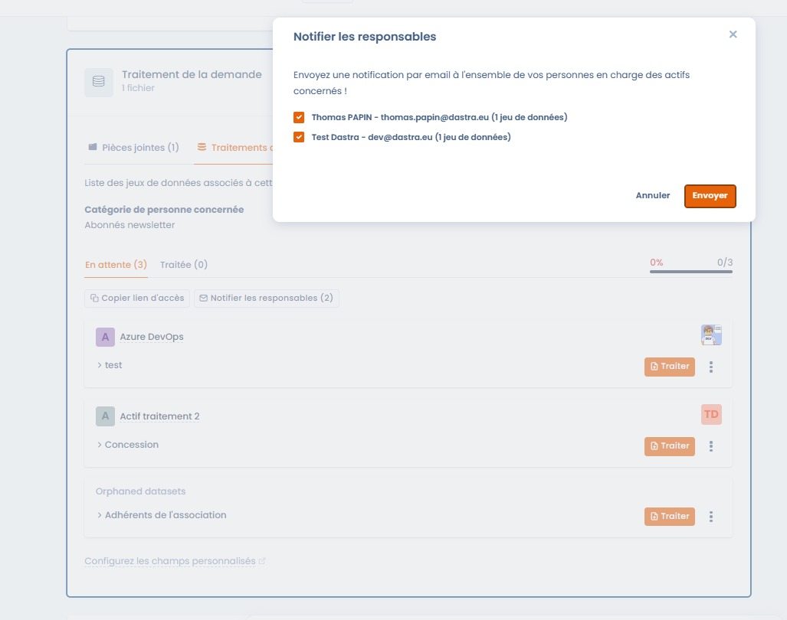<figcaption>
Benachrichtigen Sie schnell die Inhaber der Assets
</figcaption></figure>

***

### Antwort auf die Anfrage

Sobald die Bearbeitung abgeschlossen ist, kann direkt an den Antragsteller geantwortet werden.

* Der **KI-Assistent** schlägt Ihnen eine konforme und anpassbare Nachricht vor.
* Sie können den Ton anpassen: formeller, kürzer, länger, mit Emojis.
* Die endgültige Nachricht kann direkt aus Dastra versendet werden.

<figure>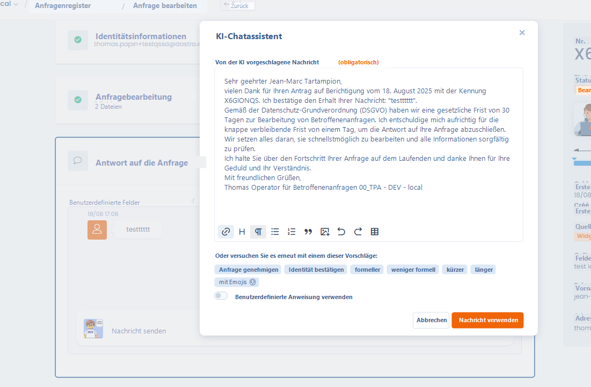<figcaption>
Tauschen Sie Nachrichten mit dem Antragsteller aus, unter Verwendung von KI, wenn gewünscht
</figcaption></figure>

***

### Zusätzliche Aktionen für eine Anfrage

Zusätzlich zu den Hauptschritten (Qualifizierung, Überprüfung, Bearbeitung und Antwort) bietet Dastra ein Menü **Aktionen**, mit dem erweiterte Operationen für eine Anfrage durchgeführt werden können.

<figure>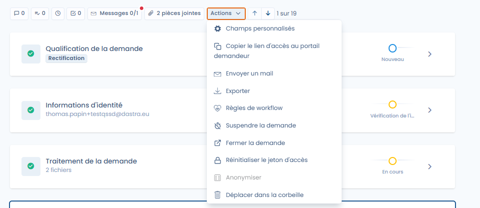<figcaption>
Greifen Sie schnell auf die zahlreichen verfügbaren Zusatzaktionen zu
</figcaption></figure>

Zu den verfügbaren Aktionen gehören insbesondere:

* **Benutzerdefinierte Felder**: spezifische Felder hinzufügen oder bearbeiten, um die Anfrage anzureichern.
* **Link zum Antragstellerportal kopieren**: einen direkten Link mit der betroffenen Person teilen.
* **E-Mail senden**: eine mit der Anfrage verbundene Nachricht direkt von der Plattform aus senden.
* **Exportieren**: die Informationen der Anfrage exportieren.
* **Workflow-Regeln**: eine Automatisierungsregel anwenden oder auslösen.
* **Anfrage aussetzen**: die gesetzliche Bearbeitungsfrist pausieren (siehe unten).
* **Anfrage schließen**: die Anfrage manuell als abgeschlossen markieren.
* **Zugangstoken zurücksetzen**: einen neuen sicheren Link für den Antragsteller erstellen.
* **Anonymisieren**: die identifizierenden Daten der Anfrage löschen.
* **In den Papierkorb verschieben**: die Anfrage archivieren oder löschen.

***

#### Aussetzung einer Anfrage

In bestimmten Fällen ist es notwendig, eine Anfrage **vorübergehend auszusetzen** (zum Beispiel in Erwartung einer Identitätsprüfung).\
Die Aussetzung unterbricht die gesetzliche Frist, die erst nach Aufhebung der Aussetzung weiterläuft.

<figure>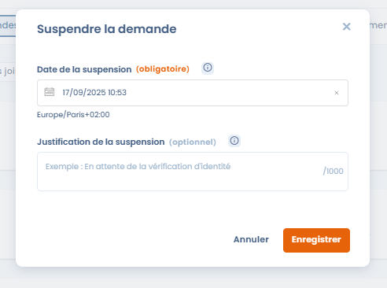<figcaption>
Setzen Sie eine Anfrage aus, z. B. in Erwartung einer Antwort des Antragstellers
</figcaption></figure>

* **Datum der Aussetzung**: obligatorisch.
* **Begründung**: Freitextfeld zur Dokumentation des Grundes (z. B. in Erwartung von Nachweisdokumenten).

Sobald die Anfrage ausgesetzt ist, zeigt die Oberfläche den Status deutlich an und bietet eine Schaltfläche zum Aufheben der Aussetzung.

<figure>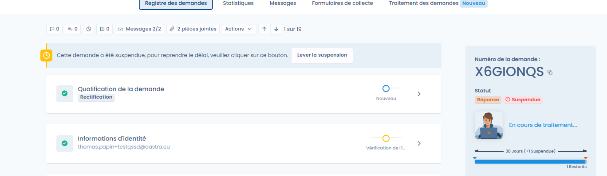<figcaption></figcaption></figure>

Der Zähler der verbleibenden Tage wird automatisch unter Berücksichtigung der Aussetzungsdauer neu berechnet.

***

### Gesamtübersicht

Jede Anfrage bewahrt die vollständige Historie:

* Ausgetauschte Nachrichten.
* Hinzugefügte Anhänge.
* Status und Fortschritt der Bearbeitung.

Dies ermöglicht die Gewährleistung der Nachverfolgbarkeit und Konformität im Falle einer Kontrolle.
